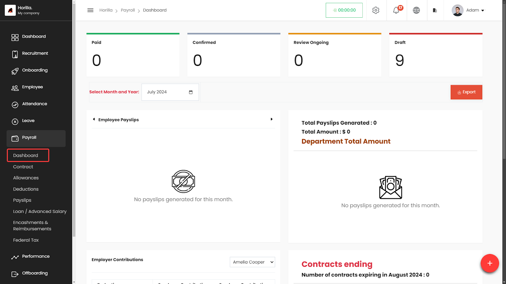
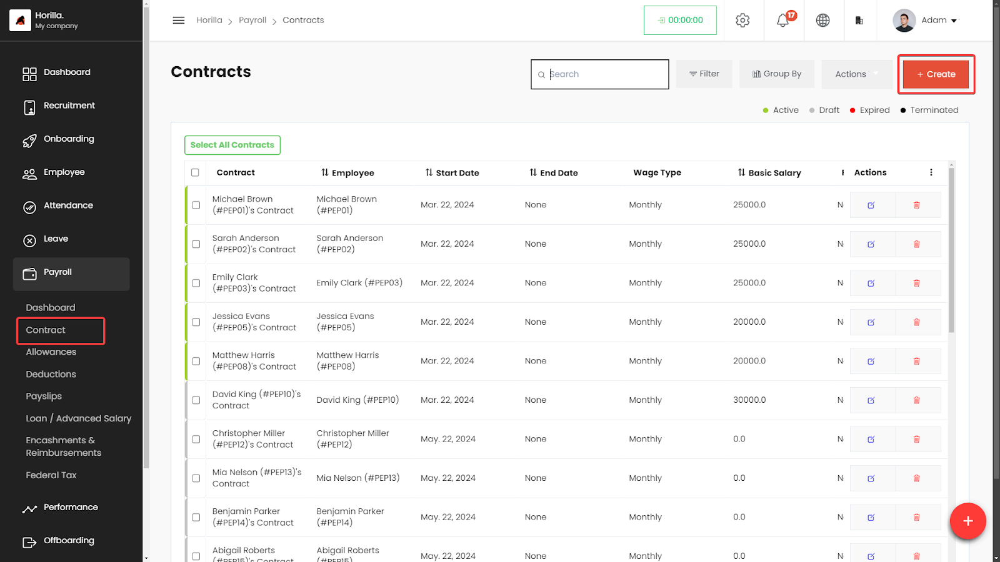
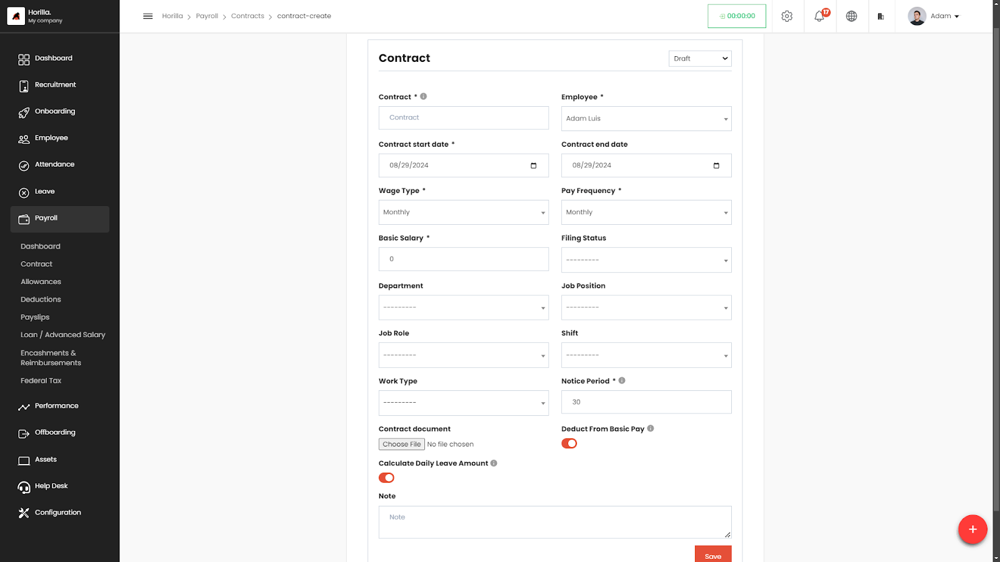
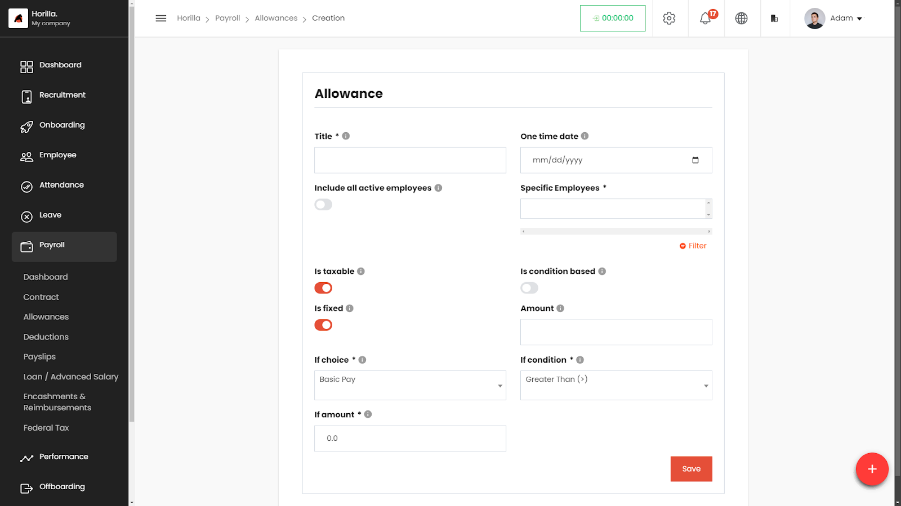
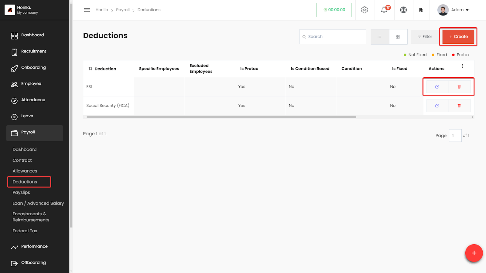
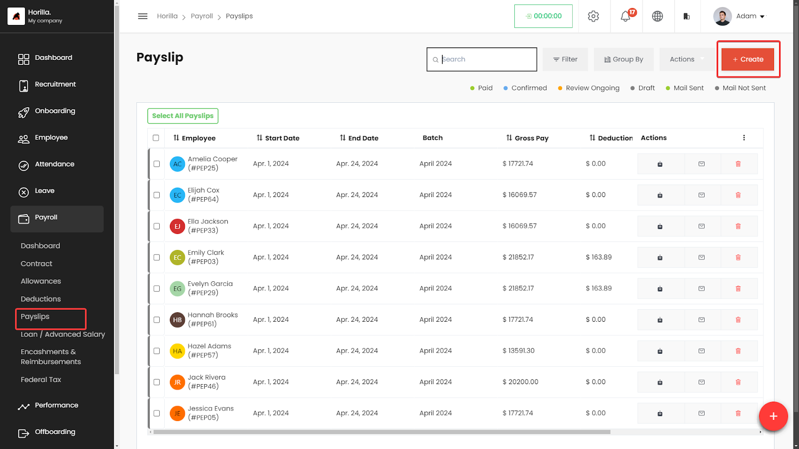
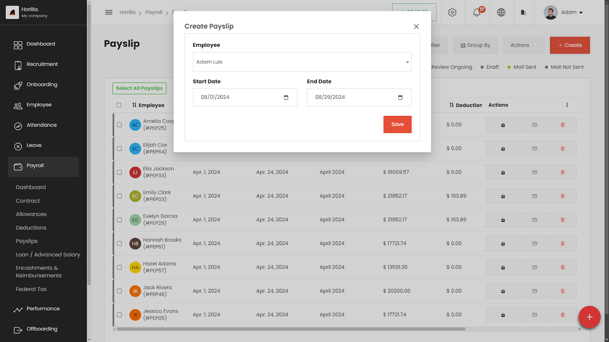
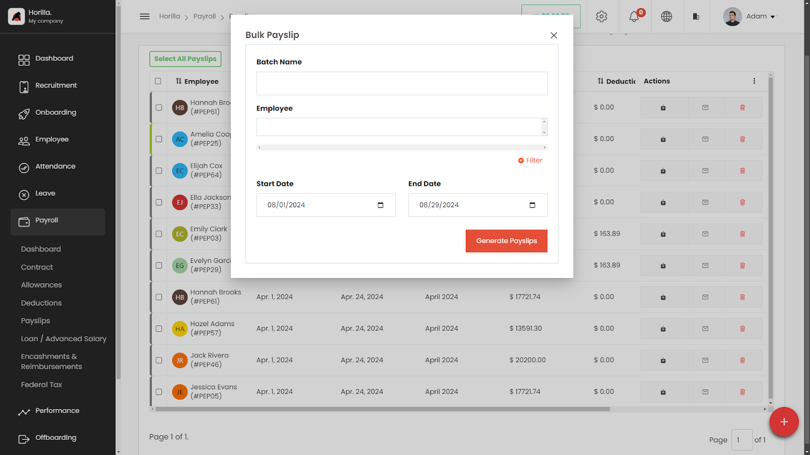
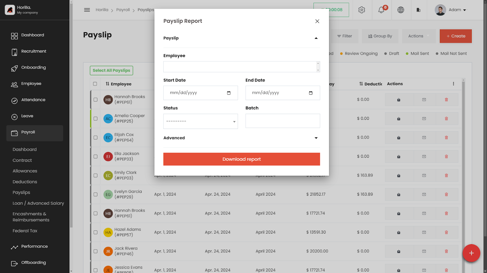
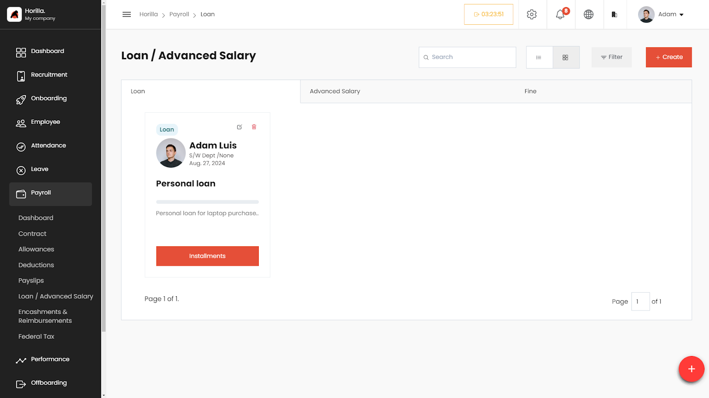

# Payroll

Horilla HRMS Software offers a comprehensive and efficient payroll management system within its suite of features. The payroll software module in Horilla enables businesses to effectively manage employee allowances, deductions, taxes, and the generation of accurate payslips. With Horilla’s payroll software, you can streamline your payroll processes and ensure timely and accurate salary calculations for your employees.

    <iframe width="840" height="500" src="https://www.youtube.com/embed/NOI5UGXeAFc" title="How to Manage Payroll in Horilla HRMS Software? | Open Source Payroll Management Software" frameborder="0" allow="accelerometer; autoplay; clipboard-write; encrypted-media; gyroscope; picture-in-picture; web-share" referrerpolicy="strict-origin-when-cross-origin" allowfullscreen></iframe>

## **Dashboard** 
The Dashboard of the payroll module gives a visual representation of crucial payroll-related data within an organization. The dashboard streamlines the workflow of HR managers and accountants by presenting comprehensive and real-time insights into payroll processes. It includes various charts that depict payslips generated, contract details, and information about department-wise payslips generated. It allows managers to download the necessary details as Excel files from the dashboard.

## **Contract Management**
Horilla’s Contract Management offers a user-friendly solution for managing employment agreements. You can effortlessly create contracts, define compensation options, set contract duration, and manage leave settings. The platform supports various wage types, allowing for easy customization of work arrangements for employees.

## **Allowance Management**
Horilla offers a user-friendly interface to manage various types of allowances. It allows you to create and customize different types of allowances, set conditions for eligibility, and specify whether allowances are fixed or variable. You can easily target allowances to specific employee groups and define maximum limits for certain allowances. Horilla simplifies the process of managing employee allowances, helping you follow your organization’s policies and ensure fairness in compensation.

## **Deduction Management**
Horilla provides an intuitive interface for efficiently managing various types of deductions. You can create and personalize deductions, set conditions for eligibility, and choose between fixed or variable amounts. Easily target deductions to specific employee groups and set maximum limits as needed. Horilla simplifies employee deductions, streamlines policy adherence, and ensures fair compensation practices.

## **Loan / Advance Salary**
Horilla’s Loan and Advance Salary module offers a user-friendly and efficient solution for seamlessly managing employee loans, installments, and advance salary transactions. Tailored to streamline financial processes, this module empowers organizations to effortlessly handle various types of financial assistance provided to employees. Whether it’s a traditional loan, advanced salary disbursement, or penalty/fine management, Horilla’s solution ensures accuracy and transparency in financial dealings.

## **Encashments & Reimbursements**
Horilla’s Encashments & Reimbursements feature offers a robust solution for employees seeking reimbursement for expenses incurred during company-related activities. This versatile module covers various reimbursement types, including standard reimbursements, leave encashment, and bonus point encashment. Designed with user convenience in mind, this feature streamlines the reimbursement process while providing flexibility for diverse employee needs.

## **Federal Tax**
Horilla simplifies tax calculations with its intuitive interface. You can define tax brackets for different filing statuses, set tax rates based on income ranges, and customize descriptions. The system automates tax calculations, ensuring accurate withholdings for employees. With Horilla, handling taxes becomes hassle-free, enabling compliance and smooth payroll processing.

## **Payslip Generation**

Generate professional and detailed payslips effortlessly with Horilla. The software automatically calculates employee salaries, including allowances, deductions, and taxes, and generates accurate and comprehensive payslips for each pay period.
