# **Performance Managment System**

A Performance Management System (PMS) within Horilla software is a comprehensive tool designed to streamline and optimize the process of managing employee performance. By centralizing Objectives, performance evaluation, feedback, and development planning. Horilla helps HR teams to efficiently track progress, provide timely feedback, and foster a culture of continuous improvement.

    <iframe width="840" height="500" src="https://www.youtube.com/embed/6OXNrZhFkeY" title="What is Performance Management System Software? | Performance Management System in Horilla" frameborder="0" allow="accelerometer; autoplay; clipboard-write; encrypted-media; gyroscope; picture-in-picture; web-share" referrerpolicy="strict-origin-when-cross-origin" allowfullscreen></iframe>

## **Dashboard**

The Dashboard provides an overview of performance metrics, including Objectives, Feedback, and Key Results. It displays data through graphs and summary counts.

Image.1

- **Objectives At risk:** Displays objectives that need attention (objectives status at risk), with normal employees seeing their own data, while managers can view all objectives at risk.

## **Objectives**

The objectives of a Performance Management System (PMS) encompass several key goals aimed at enhancing employee performance and aligning it with organizational objectives.

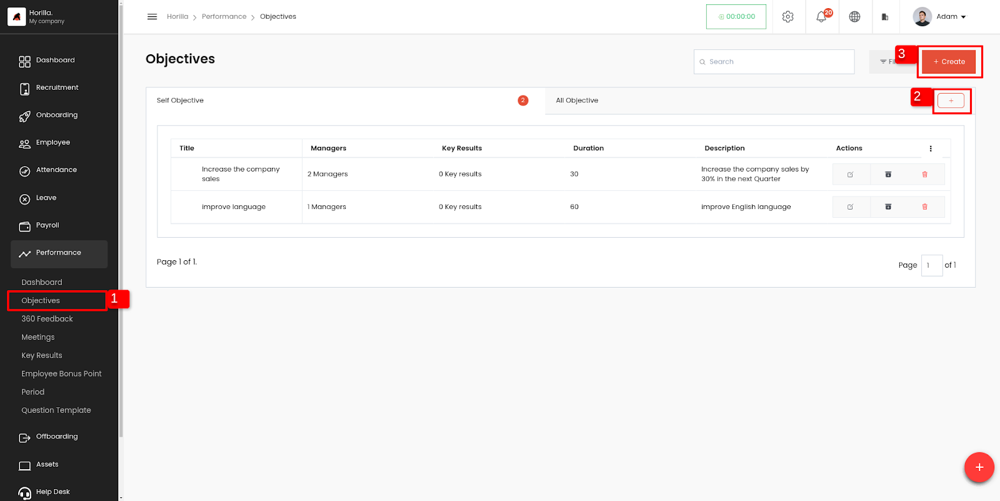
Image.2

- From the Performance submenu, you can access objectives, _(1 from image.1)_. This provides an overall view of the objectives, allowing for easier monitoring and management.
- In Horilla, objectives are categorized into two main groups: self objectives and all objectives.
- Self Objectives: For regular employees, the self objectives tab displays the objectives assigned to them, allowing them to focus on their individual goals and progress.
- All objectives: This tab is designed for HR or managerial personnel, providing them with a comprehensive overview of all objectives across the organization. This tab enables HR and managers to monitor and manage objectives at a broader level, facilitating strategic decision-making and alignment with organizational goals.

- **Generate Objectives button**

Image.3

- This "Generate Objectives" button _(2 from image.2)_ is accessible only for Hr peoples.To create Objectives that is useful for the organization as well as for individuals.

This form contains the following:

- Title: Name of the objective.
- Managers: Responsible employees for managing the objective.
- Duration unit: Measuring unit for the objective's duration

      Options include

- Days
  - Months
  - Years
- Duration: Duration count.
- Key results: Default key results for the objective.
- Description: Description About the objective
- Add assignees: Enable this for adding employees as assignees.
- Assignees: Employees responsible for achieving the objective.
- Start date: Start date for the employees to achieve their objective.
- Archive: Option to archive the objective.

1. **Create button**

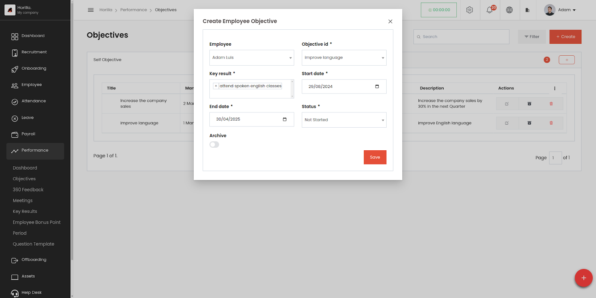
Image.4

- This "Create" button _(3 from image.2)_ is to assign individual employees to an Objective who needs to achieve them, As well as to create a self objective in case of a normal employee.

  This form contains the following:

- Employee: The Employee who need to achieve this objective
- Objective: The specific objective to be achieved.
- Key results: Key results for this objective.(Default key results related to the objective will automatically assigned)
- Start date: Start date to achieve the objective.
- End date: End date to achieve the objective.
- Status: Status of objective to address the progres.

  options include

  - On Track
  - Behind
  - Closed
  - At risk
  - Not Started

- Archive: Option to archive the record.

### **Detailed view of Objectives**

Clicking on an objective will display a view that shows all the assigned employees under that objective, along with the status and progress of each key result for each employee. Additionally, it provides an overview of the overall progress of each employee toward that objective.

Image.5

- **Update Progress**  
  Employees can update their progress by inputting the current value _(1 from image.5)_. Then, Horilla automatically compares this value with the target value and updates the progress _(2 from image.5)_ of both the key result and the overall objective. When the task is completed, employees can achieve a progress percentage of 100%.

- ### **Add Key result for employee’s objective**

  Managers have the capability to add key results for employees, which then become associated with their respective objectives. This allows managers to monitor the progress of key results and overall objectives in a single, consolidated view, ensuring timely tracking and management of employee performance.

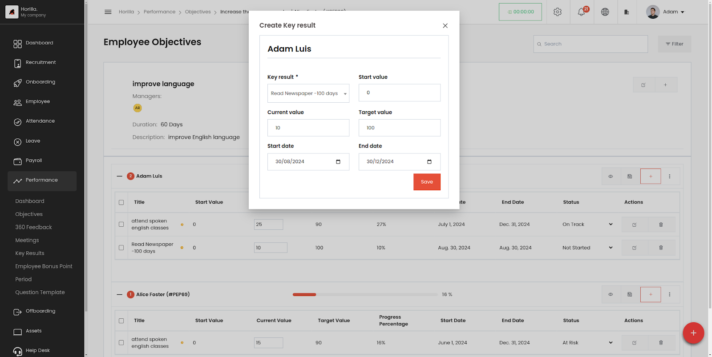
Image.6

- ### **Activities**

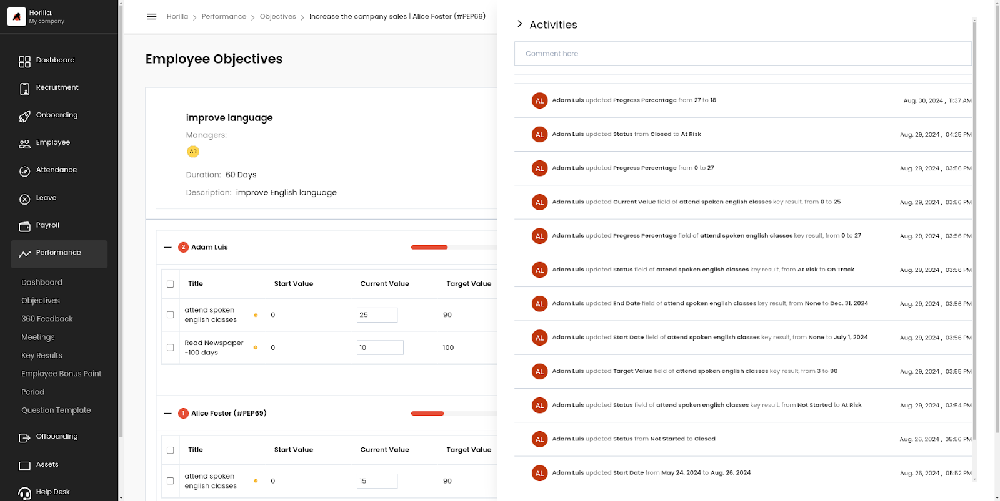
Image.7

By clicking on the activity button _(4 from image.5)_, an activity box will appear, displaying all the changes and their details made to the objective. Additionally, users can provide comments or notes to the assignee within this activity box, facilitating communication and collaboration regarding the objective.

- ### **Add Assignees to objective**

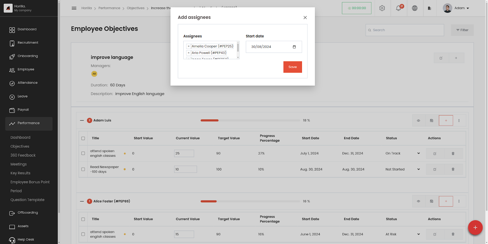
Image.8

Managers have the capability to add employees as assignees, and can provide a start date.Then those employees records can be monitored on the objective detailed view.

## **360 Feedback**

360-degree feedback, is a multi-rater assessment tool that collects feedback from various sources about an employee's performance, including peers, supervisors, subordinates,self and even clients or customers.  
It offers a comprehensive view of an individual's strengths, weaknesses, and areas for development, providing a well-rounded perspective on their performance. Horilla facilitates the administration, collection, and analysis of this feedback, allowing organizations to gain valuable insights into employee performance, foster self-awareness and growth, and make informed decisions about training, development, and performance management.

- ### **Feedback view**

  The 360 feedback option on the Performance submenu redirects the user to the feedback view, where feedback is categorized and organized into Self Feedback, Requested Feedback, All Feedback, and Anonymous Feedback. The All Feedback tab is exclusively accessible to responsible managers, displaying all feedback except for anonymous submissions. This ensures managers have comprehensive visibility into feedback while respecting the anonymity of contributors.

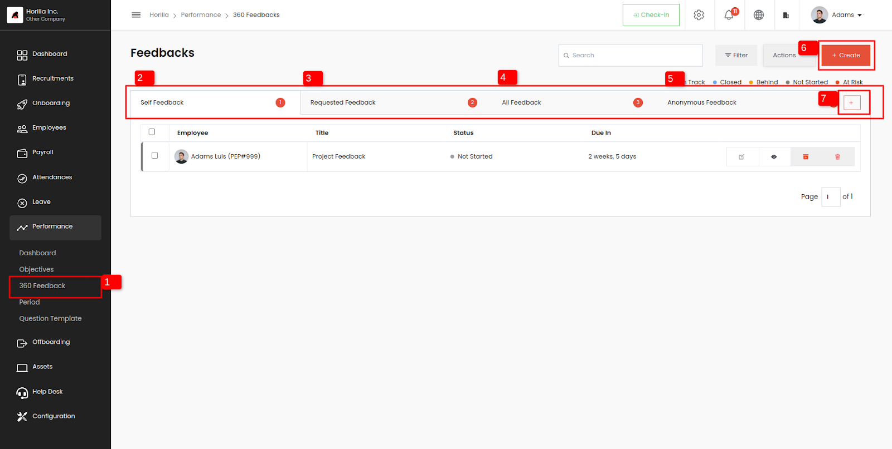
Image.9

- **Self-feedback**  
  This tab _(2 from image.9)_ shows the feedback provided by the individual who is receiving the feedback.
- **Requested feedback**  
  This tab _(3 from image.9)_ shows feedback that has been requested by the individual from their colleagues, peers, or superiors.
- **All feedback**  
  The all feedback tab _(4 from image.9)_ shows all of the feedback that has been collected, including self-feedback and requested feedback from others.
- **Anonymous feedback**  
  The anonymous feedback tab _(5 from image.9)_ shows all the anonymous feedback related to the employee.

- ### **Create Button**

  By clicking the create button _(6 from image.9)_, users access a form to generate feedback. Here, they can specify subordinates, supervisors, colleagues, and all necessary details. Once the feedback is created, Horilla automatically displays it on the requested feedback tab of the mentioned employees and notifies them accordingly. This streamlined process facilitates easy and seamless feedback collection from all relevant parties.

Image.10

This form contains the following:

- Title: Name for the feedback.
- Employee: The Employee requesting for feedback.
- Manager: Employee’s manager
- Subordinates: Subordinates of the employee.
- Colleagues: Colleagues of the employee.
- Period: Period for the feedback request.
- Start date: Start date for feedback.
- End date: End date for feedback.
- Question Template: Set of questions for feedback.
- Key result: Key results to validate and provide feedback on.
- Is Cyclic Feedback: Enable for repeating this feedback,By enabling this will show the fields for cyclic period.
- Cyclic Period: Frequency for repeating feedback. Can mention the count and the unit  
  Options include

  - Days
  - Months
  - Years

- ### **Feedback Answer**

Feedback can be provided by completing the questions created by the employee.

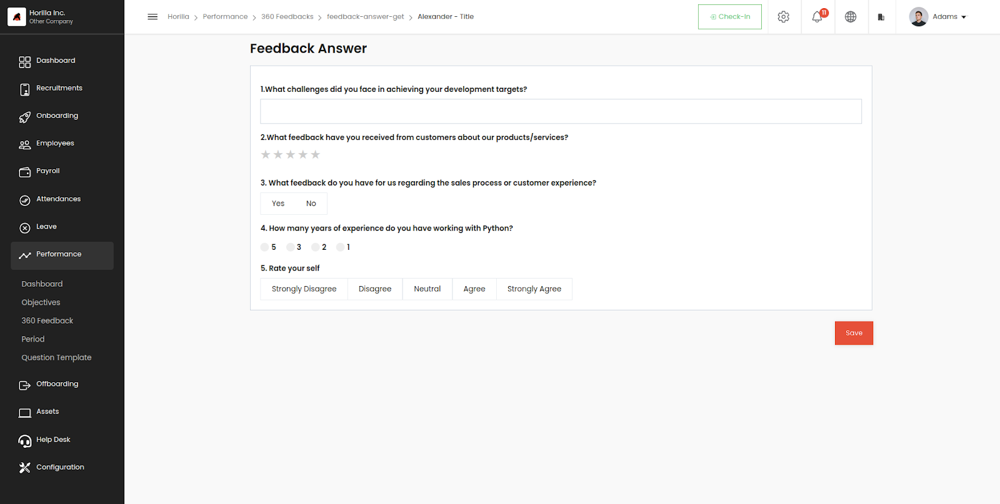
Image.11

Once feedback is submitted, Horilla notifies the creator and provides access to view the responses. This enables the creator to evaluate themselves based on the feedback received.

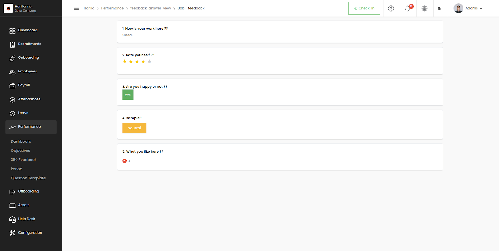
Image.12

- ### **Anonymous feedback**

  Anonymous feedback serves several important purposes in organizations. Firstly, it encourages honest and candid input from employees, as they feel more comfortable expressing their thoughts and concerns without fear of reprisal. This enables organizations to gather valuable insights into employee experiences, perceptions, and areas for improvement that may otherwise go unnoticed. Secondly, anonymous feedback promotes trust and transparency within the workplace. Horilla provides all privacy on the anonymous feedback.

  Employees can anonymously provide feedback on any topic by utilizing the dedicated create button _(7 from image.9)_ on the anonymous feedback tab. The anonymous creation form includes a "Based on" field where employees can specify the subject or context of their feedback.

  1.General: Feedback related to all  
  2.Employee: Feedback about an individual  
  3.Department: feedback about a department  
  4.Job position: Feedback about a particular job position.

Image.13

Horilla will display the feedback to the responsible employee(s) without revealing any details about the creator, ensuring anonymity and confidentiality.

## **Meetings**

Horilla's meeting feature is designed to enhance workplace communication by providing options for both one-on-one and team meetings with employees. Whether you need to conduct performance reviews, project discussions, or collaborative brainstorming sessions, this feature ensures your meetings are organized, efficient, and effective. With built-in scheduling and notification tools, Horilla helps you manage meetings seamlessly, keeping everyone on the same page and driving better results across your team.

- To access the meetings page, click on the meetings tab under performance in sidebar (1 from image 1).

Users can view all created meetings and manage them here.

To create a new meeting,

- Click on the create button (2 from image 1\)
- Fill out the form, the fields are:
  - Title : Title of the meeting
  - Date: Date and time of the meeting
  - Employees: Employees for the meeting
  - Manager: managers of the meeting
  - Answerable Employees: Employees present the meeting who can answer the question template
  - Question template: Template containing the questions and important topics for the meeting
  - Show response: whether show the response or not

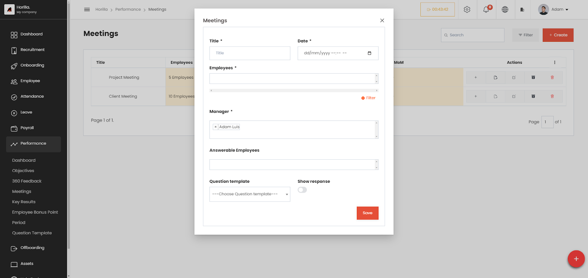

- Users can add MoM (Minutes of meeting) by clicking on the “+” (3 from image 1\) button
- To answer the meeting question template, answerable employees and managers can click on the button (4 from image 1\)
- To edit the meeting users can click on the edit button (5 from image 1\)
- To archive the meeting users with permission can click on the archive button (6 from image 1\)
- To delete the meeting users with permission can click on the delete button (6 from image 1\)

## **Employee Bonus Point**

Horilla includes a reward system where employees earn bonus points for achievements or completing duties  
Managers can set up criteria for awarding bonus points under **Settings \-\> Performance \-\> Bonus Point Setting**.

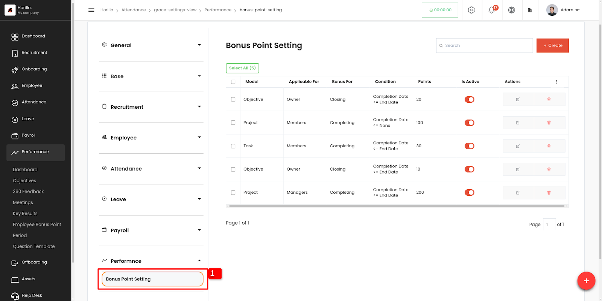
Image.14

- By toggling “Is Active” button can enable or disable the employee bonus point setting

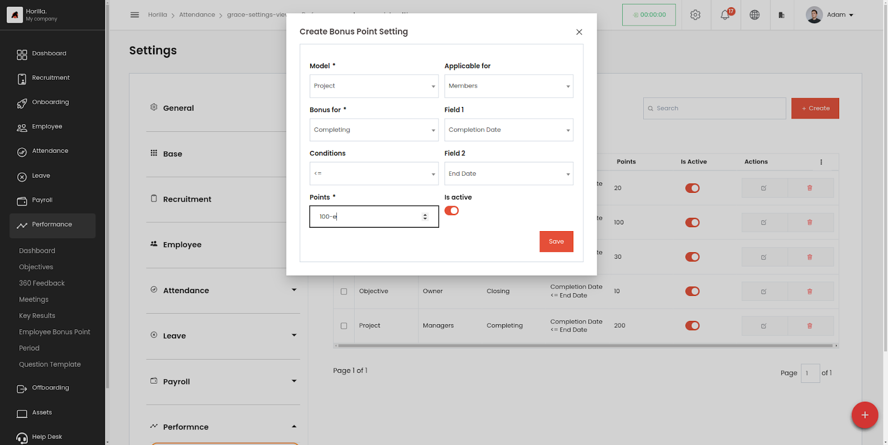
Image.15

- Bonus point setting Form contains:

  - Model: The record or model for awarding bonus points.
  - Applicable for: Recipient of the bonus

    Options include

- Owner
  - Members
    - Managers
  - Bonus for: Status of the model (e.g., Completion, Closing).
  - Field 1: Model Field for checking the “Bonus For” e.g., Completion date
  - Field 2: Model Field for checking the “Bonus for”. e.g., End date
  - Conditions: Conditions for awarding bonus points based on model fields.  
    Choices contains
    - \=
    - \>
    - \<
    - \<=
    - \>=
  - Points: Number of points awarded.
  - Is Active: Toggle to activate the bonus point setting.

**Employee Bonus Point**

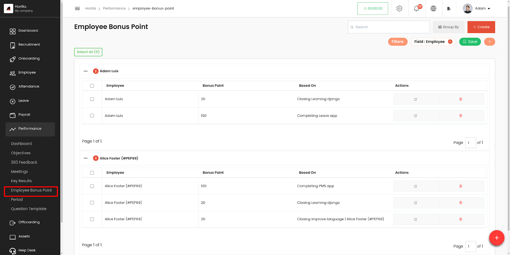
Image.16

All the Bonus points achieved by the employee will show here. It will show Bonus point and how the employee got the bonus point

## **Period**

In summary, this view provides a centralized way to manage and track periods of time, which can be used to automate certain HR and performance management tasks. By setting the start and end dates for each period, you can ensure that feedback and OKRs are aligned with your organization's goals and objectives. The update and delete buttons make it easy to make changes to existing periods or remove them as needed. Overall, this view can help streamline your HR and performance management processes by providing a clear framework for setting and managing time periods.

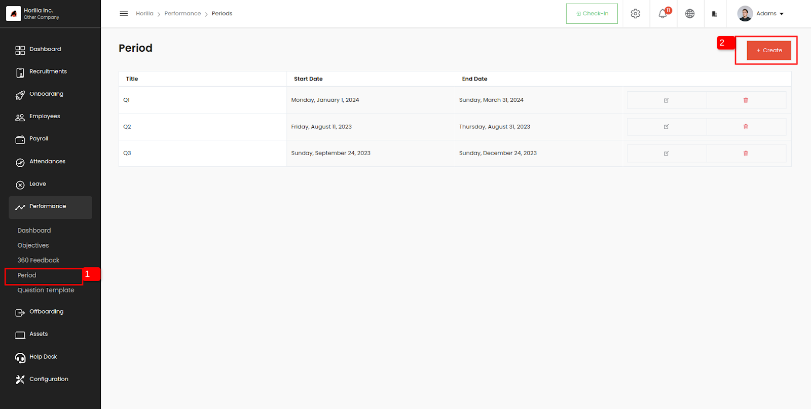
Image.17

- **Create button**  
  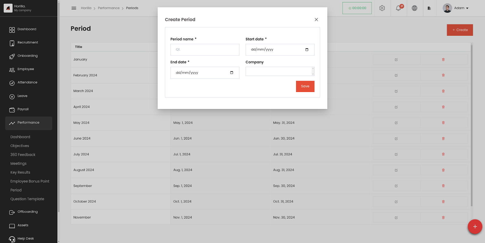
  Image.18

      This form contains the following:

- Period name: Name for period.
- Start date: Period start date.
- End date: End date for period
- Company: Company which will affect the period.

## **Question Template**

Here you have the ability to create your own question template and add questions based on your specific needs or requirements. A question template provides a structure or framework for asking questions in a particular context, such as during a feedback. By creating your own template, you can tailor the questions to suit your specific goals.

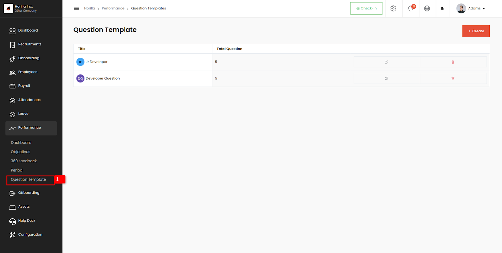
Image.19

Horilla offers various types of questions designed for ease of use and enhanced visual representation, catering to diverse feedback needs and preferences.

Image.20

Creators can select from different question types such as Text, Rating, Boolean, Multi-choice, and Likert, allowing them to tailor questions according to their specific requirements and preferences within Horilla.
