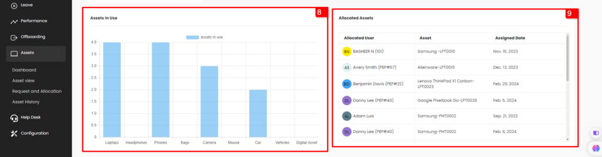
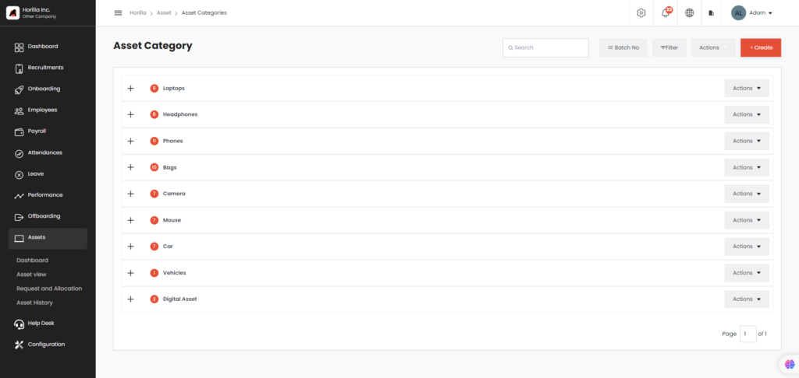
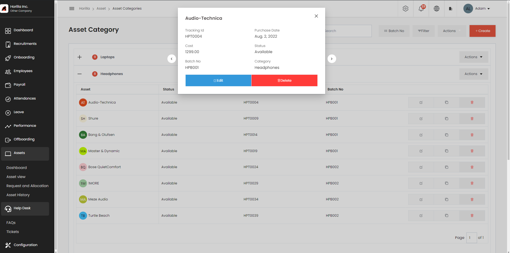
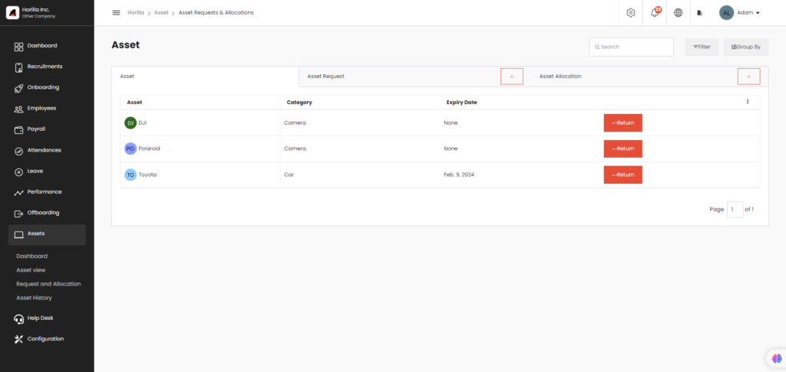
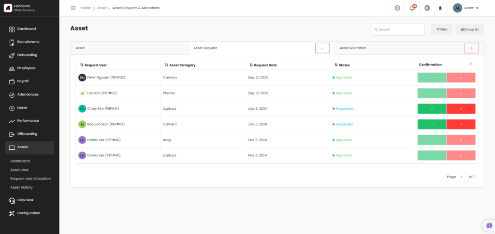
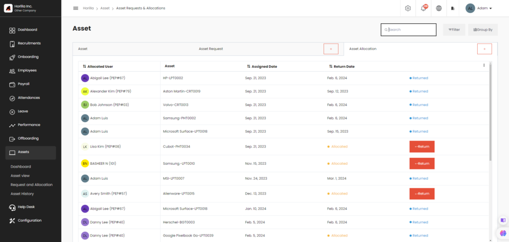
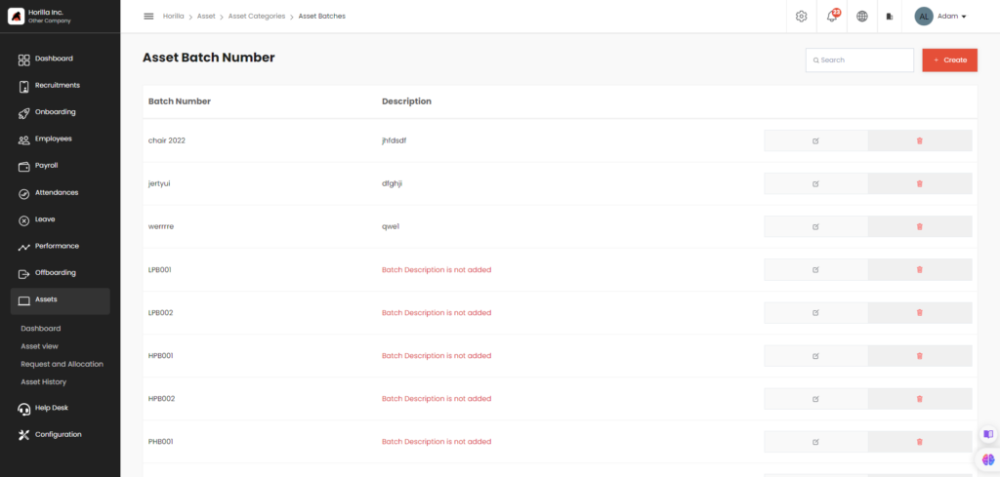
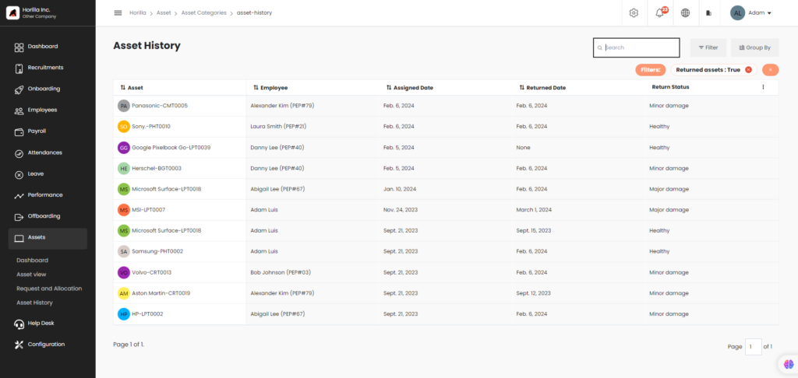
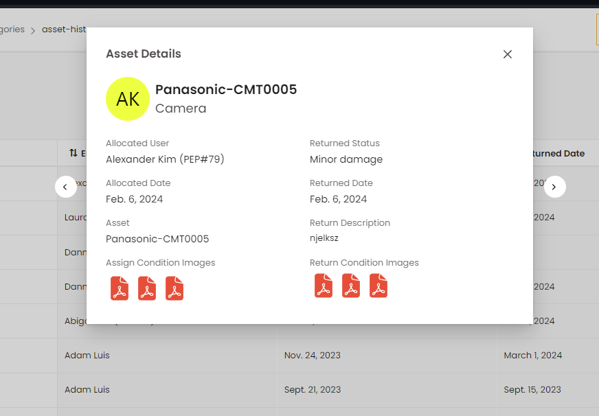

# Assets
Asset Management System is a key feature of our HRMS that enables employees to request and manage assets, such as computers or equipment, needed for their work. The system categorizes assets by type and tracks requests until they are approved and made available to the employee. With easy asset categorization, employees can quickly find the resources they need, and administrators can manage and allocate resources more efficiently. Overall, our Asset Management System is a powerful tool for organizations to manage and track assets in a streamlined and effective manner.

   
    <iframe width="1006" height="566" src="https://www.youtube.com/embed/QwrfCg40qZQ" title="How to Manage Employee Assets in Horilla HRMS | Free HR Software | An Overview of Assets Management" frameborder="0" allow="accelerometer; autoplay; clipboard-write; encrypted-media; gyroscope; picture-in-picture; web-share" referrerpolicy="strict-origin-when-cross-origin" allowfullscreen></iframe>

## Dashboard

Clicking on the asset and clicking on the dashboard will open the Asset dashboard. This view is restricted to only employees with permission.Here an admin can easily find the details related to the Asset module.

The Asset tab shows the total number of assets (marked as 3). The asset request tab shows the number of asset requests that are yet to be processed (marked as 4).The assets in use tab shows the number of assets that are currently being used by the employees.

The asset chart (marked as 6) shows the pie chart displaying the details of available not-available and in-use assets.The asset request to approve (marked as 7) shows all the asset requests to approve in the dashboard and the admin can allocate the asset from the dashboard itself.The assets in use chart (marked as 8) shows the the assets used by employees in each category.

The allocated asset table (marked as 9) shows the employees and their allocated assets and the assigned date.

## Asset category     

### Accordion-style category 
One of the key features of our Asset Management System is the accordion-style category feature, which allows users to easily navigate and find the assets they need.

With this feature, each asset category is displayed as a separate accordion tab. When a user clicks on a category tab, a table opens that displays all assets associated with that category. This layout is designed to improve the efficiency of asset management processes by organizing assets by category and making it easier for users to locate specific assets or groups of assets. Each asset has an individual view showing its details and edit or delete the asset as shown below,

### Efficient Asset Management with Asset Import
The Asset Import feature in our Asset Management System allows users to upload large amounts of asset data, such as asset name, purchase date, description, batch number, and category, from an external source, such as an Excel file. This feature streamlines data processing and makes it easy to add large numbers of assets to the system at once, improving the efficiency of asset management processes. In this functional blog post, we will explore the benefits of the Asset Import feature and how it can help organizations maximize productivity in managing their assets.”

### Streamlining Asset Management with Asset Export
The Asset Export feature in our Asset Management System allows users to download asset data, such as asset name, purchase date, description, batch number, and category, from the system into an Excel file. This feature is useful for generating reports or for exporting data to external systems, such as accounting for inventory management software. In this functional blog post, we will explore the benefits of the Asset Export feature to maximize productivity in managing their assets.

## Asset request and allocation
It contains 3 tabs in your Asset Management System view

- Own assets
- Asset requests
- Asset allocations

### Own Asset Tab

This tab contains a list of assets that the user currently owns or is responsible for managing. The user can view asset information, user can also  return the asset 

### Asset Requests 

This tab contains a list of asset requests that have been submitted by users to request new assets or to request changes to existing assets. The user can view and approve or reject asset requests based on the availability and suitability of the requested assets. Asset requests can be created by clicking on the plus button. The columns can be toggled by clicking on the 3 dots at the end of the table. And data can be sorted by clicking on the arrow.

### Asset Allocation

This tab contains a list of allocated assets, which are assets that have been assigned to specific users for their use. The user can view and manage asset allocations, such as approving allocation requests, re-assigning assets, and tracking asset usage. user can also return the asset 

## Asset batch number 
Asset Management System view with the asset batch number feature:

The Asset Batch Number view in our Asset Management System allows users to create, edit, and update asset information with a unique batch number for easy tracking and management.

In summary, the Asset Batch Number view in our Asset Management System provides users with a powerful tool for tracking and managing their assets, with a user-friendly interface and advanced filtering capabilities.

## Asset History

This view tracks the history of the asset.

Asset history helps the users to track the assets, default returned asset filter is applied for view. By clicking on the asset, users can further details as shown in the image below. Users can filter and group and sort the results according to their needs.

