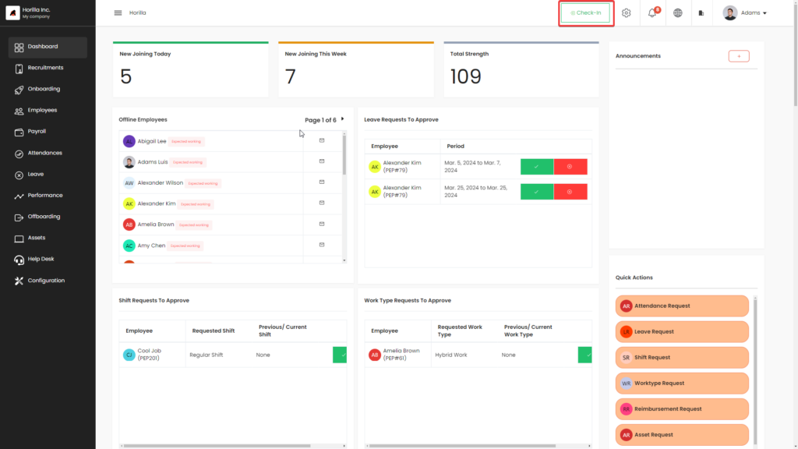
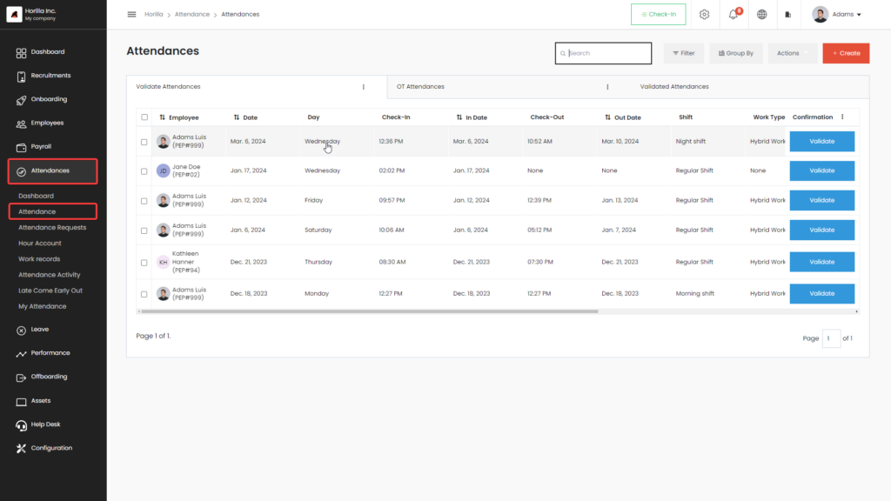
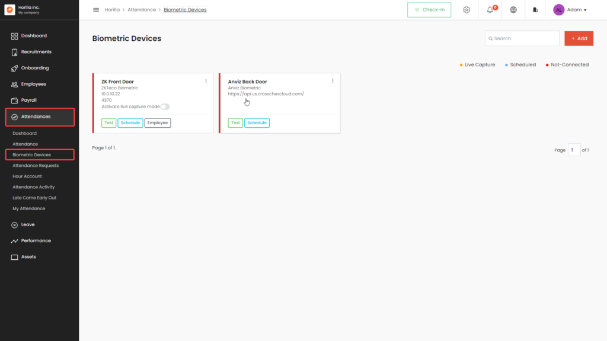
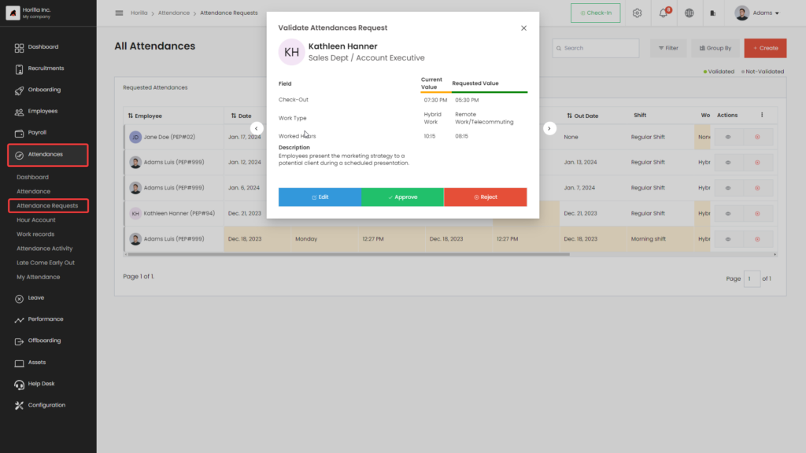
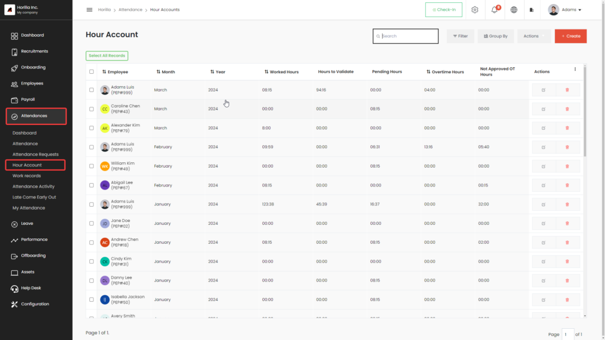
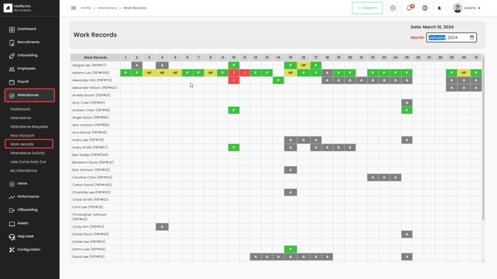
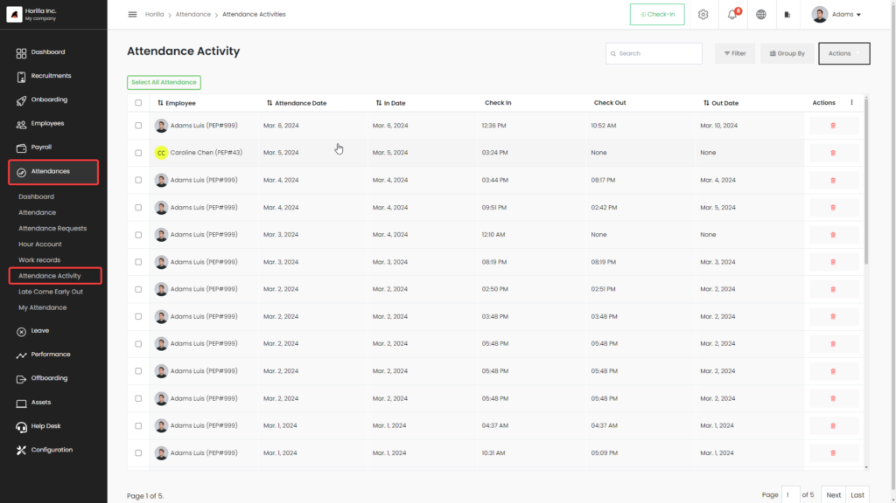
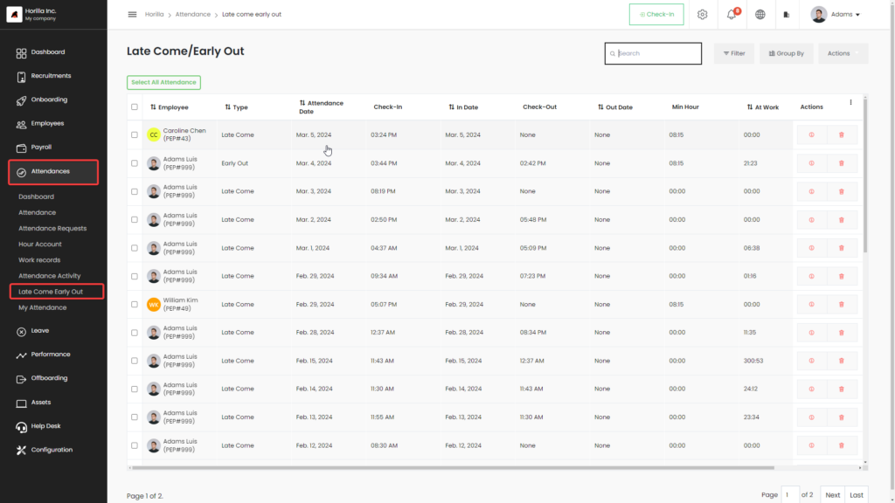
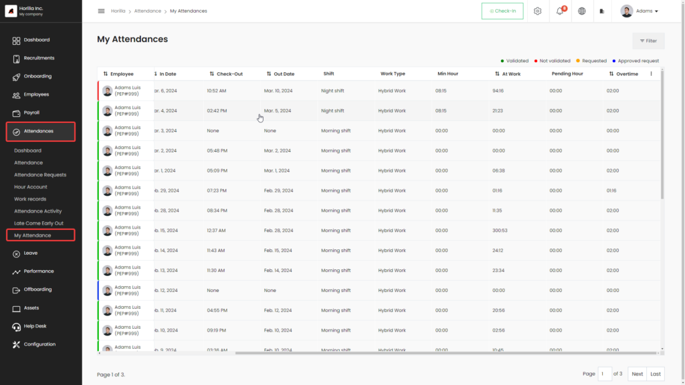

# Attendance

The attendance software module is the main tool to track and manage employee attendance. By utilizing the attendance module, employees can seamlessly mark their attendance, incorporating secure and accurate biometric attendance integration alongside the check-in/out system. The module tracks overtime, identifies late arrivals and early departures, and allows for verification of mistaken attendance entries, such as forgetting to check out or exceeding attendance validation conditions defined in the settings.

    <iframe width="840" height="500" src="https://www.youtube.com/embed/KuumiMA_1xU" title="How to Manage Attendance in Horilla | Attendance Management System in Horilla #opensource" frameborder="0" allow="accelerometer; autoplay; clipboard-write; encrypted-media; gyroscope; picture-in-picture; web-share" referrerpolicy="strict-origin-when-cross-origin" allowfullscreen></iframe>

## **Check-In Check-Out**
Check-in/out is the system that marks attendance activity, used to calculate how much duration the employee works, and from the activities, attendances are created. It tracks all the in-out activities of the employees.

## **Attendance View**
The attendance view manages unvalidated attendance and attendance that contains overtime. The **Validate Attendance** tab shows attendance that needs to be verified, where there may be errors or mistakes. The **Validated Attendance with Overtime** tab shows attendance that has been verified and includes overtime hours. Approving overtime will update the employee's attendance record. The **Validated Attendance** tab contains all the attendance that has been verified.

## **Biometric Devices**
Horilla HRMS seamlessly integrates with biometric devices to efficiently manage attendance records. Users can connect and synchronize attendance data from popular biometric devices, such as ZKTeco and Anviz. Additionally, users can add employees directly to the biometric devices through the Horilla HRMS interface. This process ensures a seamless and sophisticated attendance management system for companies.

## **Attendance Requests**
The **Attendance Request** feature handles requests to edit employee attendance records. Employees can submit requests to modify existing attendance entries, such as when they forget to mark attendance or need to create new attendance entries. This functionality empowers employees to manage their attendance records more efficiently within the Horilla system.

## **Hour Account**
The **Hour Account** manages the employee's total worked hours. From this view, you can track the total hours worked by an employee on a monthly or yearly basis.

## **Work Records**
The **Work Records** feature manages employee monthly attendance data, capturing daily statuses such as present, absent, validated, half-day, and half-day validated. These statuses are then compiled into monthly records.

## **Attendance Activity**
Attendance activities are generated during check-in or check-out events, as well as when attendance is fetched from biometric devices. This page provides a useful tool to manage all employee activities related to attendance.

## **Late Come Early Out**
Late come and early out are identified by the check-in/check-out system based on the shift schedules for the day. If an employee checks in after the scheduled shift start time, the attendance is marked as "late come." If an employee leaves before the shift ends, the attendance is marked as "early out."

## **My Attendance**
The **My Attendance** page is used by individual employees who do not have access to the attendance software module, allowing them to view their past attendance records.

