# Employee

The Employee Management Software module allows HR professionals to manage the employee database which includes employee’s personal, bank, and work details.

    <iframe width="840" height="500" src="https://www.youtube.com/embed/0lowB3awogs" title="How to Manage Employee Database in Horilla HR Software? #opensource" frameborder="0" allow="accelerometer; autoplay; clipboard-write; encrypted-media; gyroscope; picture-in-picture; web-share" referrerpolicy="strict-origin-when-cross-origin" allowfullscreen></iframe>

---

## Profile

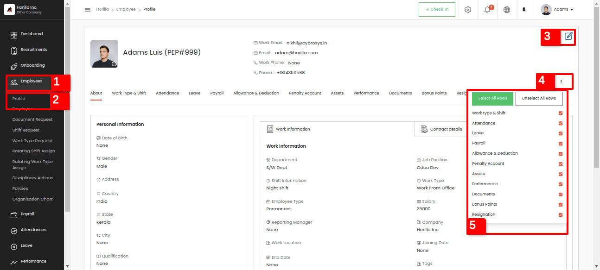

This is the first view of Horilla’s Employee section. In the above picture marked as 1 is the main section **Employee module**, and in the sidebar marked as 2 is the **profile view** of an employee. Here a logged-in user can see all the details from this view. At the right top, the **edit button** marked as 3 will lead us to another form view for updating the employee's personal information and bank information. By clicking the **3 dots** marked as 4 in the picture, a small tabular view of all the tabs available for employee view will appear, along with a checkbox marked as 5. Employees can decide which tabs should appear in the profile view; if we disable the tick of a particular tab, it will disappear from the view.

So, let’s go through the tabs. The first one is the **About** tab, which shows the employee's personal, work, and bank information along with the contract details. 

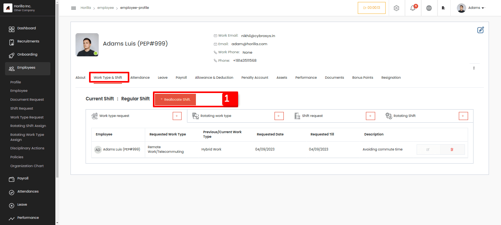

The next one is **Worktype & Shift**. In this view, an employee will get a tabular view of all his **Work type requests**, **Rotating work type**, **Shift requests**, and **Rotating shift requests**. From that view, employees can request all mentioned actions. There is a feature called **shift reallocation** for employees available inside this view. There is a button named **“Reallocate shift”** marked as 1 for shift reallocation. If an employee needs to change his shift for a short period, he/she can request reallocation by including the employee who is reallocating and to which shift, along with the start and end date with a description. The request will then go to the reallocated employee and the admin. The reallocated employee can show some response on whether he is available for this shift change or not, and the admin can approve or reject the request. After approval, both employees’ shifts will interchange at the start date of the request.

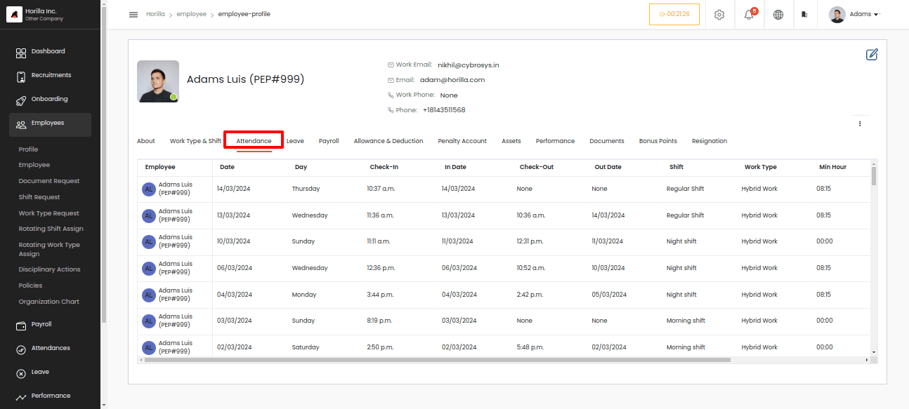

The next tab is **Attendance**, which shows all of the employee's attendance details in a tabular view. By clicking the row, it will display an individual view of that attendance.

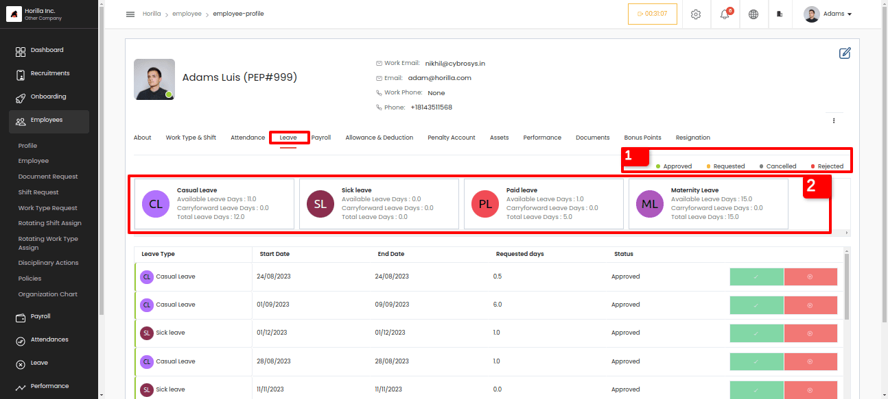

The **Leave** tab provides a view of all leave request details and shows the available leave types for the employee. The employee can request leave from this view. At the right top, the **tag** marked as 1 shows the status of the requests, indicated by color at the left side of the data row. The **leave type** marked as 2 shows the available leave types for the employee. By clicking each, the employee can request leave in that particular leave type.

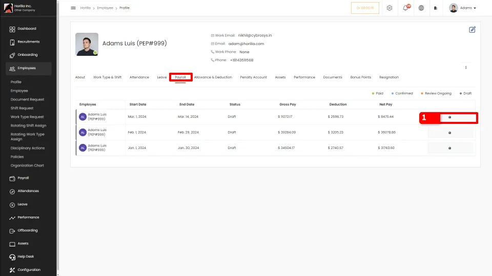

The **Payroll** tab shows the payslips generated for that employee. By clicking a single row, it will redirect to a detailed view of that payslip. The **download button** marked as 1 allows the user to download the corresponding payslip in PDF format.

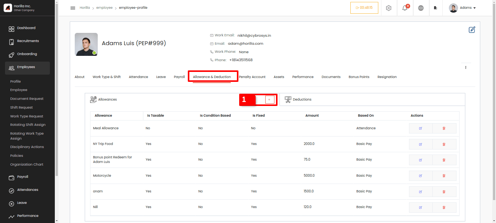

The **Allowance & Deduction** tab displays all allowances and deductions available for that employee. If the user is an admin, he can create new allowances and deductions by clicking the **+ button** marked as 1 in the table.

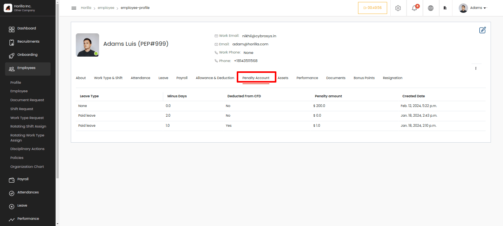

The **Penalty Account** tab shows the penalties that the employee has incurred. If an employee takes extra leaves or has LOP days, the admin can add penalties, either as an amount or leave days. If a payslip is generated during the penalty period, the amount will be deducted accordingly.

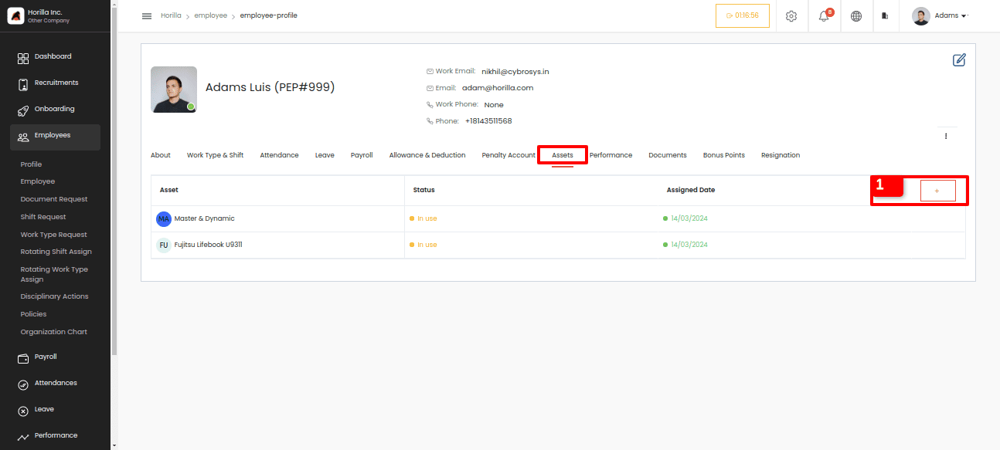

The **Asset** tab provides a detailed view of the assets that the employee is currently using. The employee can request a new asset by clicking the **button marked as 1**. In the individual view, by clicking the row, there is an option to **return the asset**.

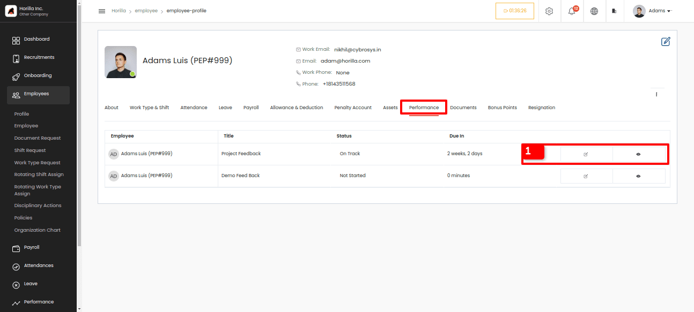

The **Performance** tab displays the feedback the employee is involved in. If the employee’s feedback has already been answered, he can view the answers by clicking the **eye button**. If not answered, the employee can provide their response by clicking the icon beside the eye button, marked as 1.

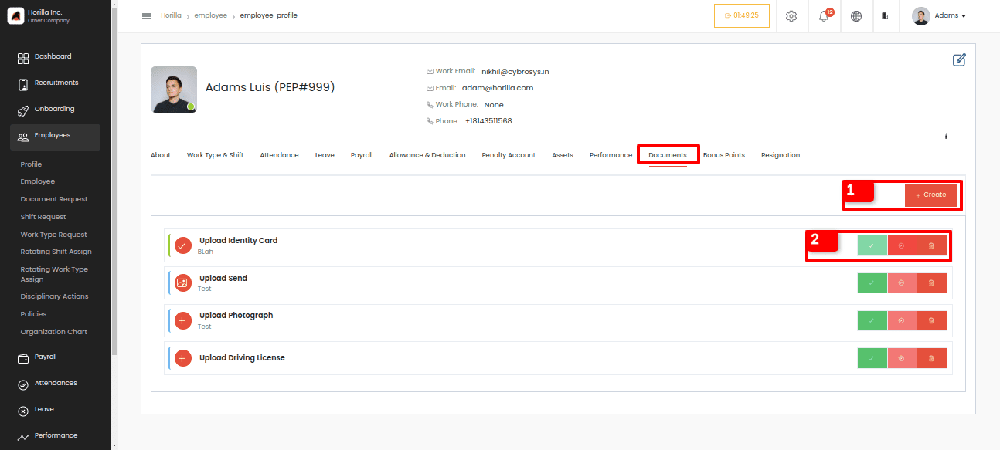

The **Documents** tab is for storing the employee's documents in their profile. By using the **create button** marked as 1, the user can upload documents to this tab. If any document is requested by the admin, the request will be visible in the tab, and the employee should upload the requested file. The **action buttons** are visible because the employee is an admin; for normal employees, the buttons marked as 2 are not available. These buttons allow actions like **approve**, **reject**, or **delete** the files uploaded by the employee. This will be explained in the Document request section.

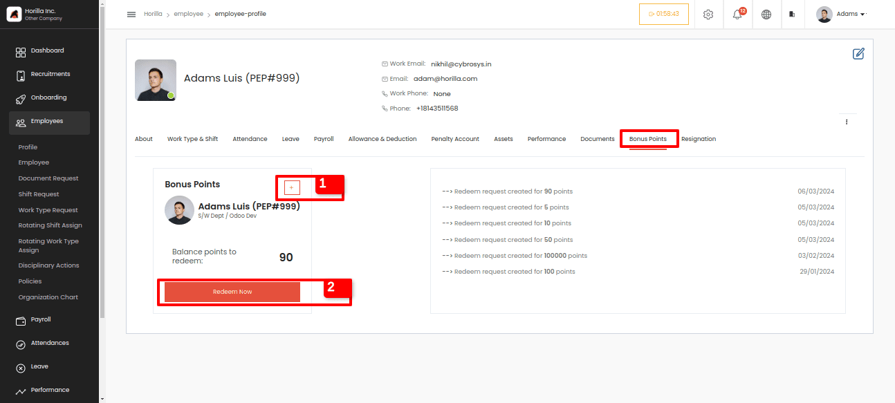

The **Bonus Points** tab is for redeeming the bonus points given to the employee by his manager or admin. In the admin view, the **adding button** appears marked as 1. Admin can add bonus points to employees through their profiles. Bonus points can be redeemed by clicking the **Redeem Now** button marked as 2, and entering the points to convert. The redeemed bonus points will appear as the amount in the month’s generated payslip. The bonus point per amount can be set in the settings page (Settings → General Settings → Encashment Redeem Condition).

If an employee wants to **resign** from the company, he can request resignation by clicking the **create button** marked as 1 from the **Resignation** tab available in the profile view. Other options are visible only for the admin view. The top of the card view, marked as 2, has options to **send mail**, **edit the request**, and **delete** respectively. The **approve** and **reject** buttons marked as 3 approve or reject the resignation request. If the request is approved, the employee will be moved to the off-boarding section.

## Employee Directory

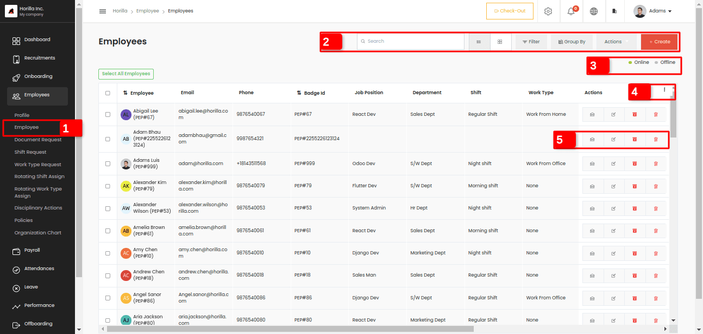

By clicking **Employee** under the main tab **Employees** marked as 1, you can view the **employee directory** or the **employee database** view. There are mainly two views available for now: **card** and **list**. From here, you can view all the details of the employee or create a new employee by clicking the button on the right of the page after the search bar, marked as 2. There are options for filter, group-by view, etc. In the **Action** menu, there are several options like **import**, **export**, **bulk archive**, **bulk unarchive**, **bulk update**, and **bulk delete**. You can select and apply these actions to bulk-selected data. The **quick filters** marked as 3 allow you to filter employees by their online or offline status. The **Select all** button at the top of the table is common in all list views of the software. This button allows you to select all data with a single click, and the selected count will also be shown beside the button. **Export** and **unselect** options are also available. The **3 dots** marked as 4 allow you to select which columns should be visible in the table. 

## Document Request

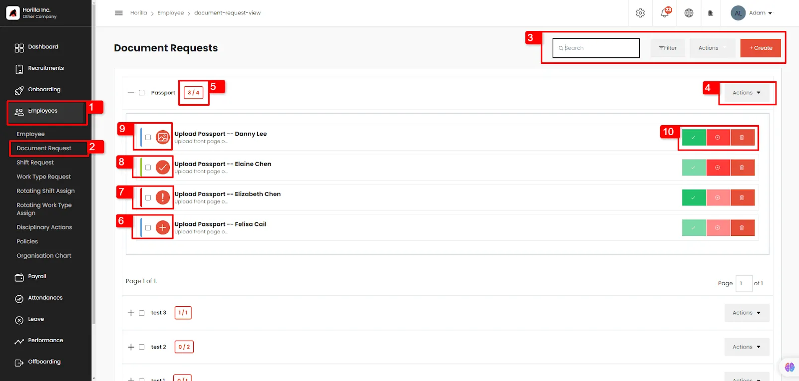

The document request view can only be accessed by administrators, employees with permission, and reporting managers. To open the document request view, click on **Employees** (marked as 1) → **Document Request** (marked as 2). The image shown above displays the document request view.

The user can search or filter the data using the search and filter options. The **action button** will show a drop-down list for **bulk approving** and **bulk rejecting** the documents. 

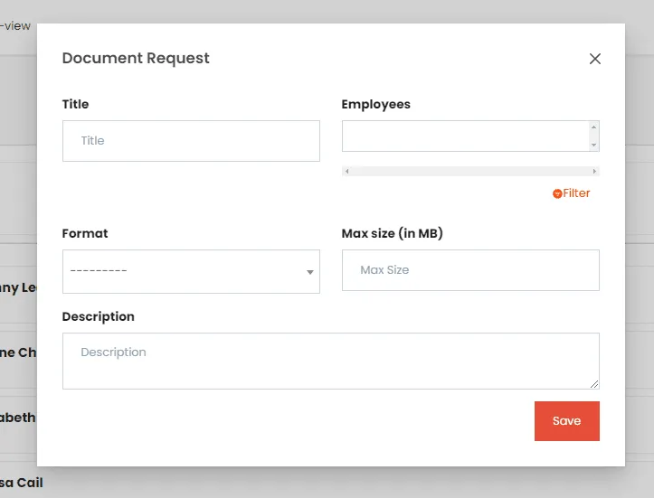

This is the form for creating a document request. The fields in the title are:

- **Title**: The title of the document request.
- **Employees**: The employees for whom the document is needed. Employees can be chosen by filtering using the filter widget near the input field.
- **Format**: The format in which the document is needed (PDF, TXT, DOCX, XLSX, JPG, PNG, JPEG).
- **Max Size**: The maximum size (in megabytes) of the document an employee can upload.
- **Description**: A description for the document request.

By creating a document request here, each employee will get a notification, and they can upload the document from their profile.

The **action button** (marked as 4) can be used to **edit** or **delete** the document request.

The **count** of total requested employees vs employees who uploaded the document is shown in the box near the title (marked as 5).

The **buttons marked from 6 to 9** show the different stages of document upload:
- Icon 6: Document needs to be uploaded.
- Icon 9: Document uploaded and waiting for approval.
- Icon 8: Approved document.
- Icon 7: Rejected document.

The admin or reporting managers can approve, reject, or delete the documents uploaded by employees using the corresponding buttons.

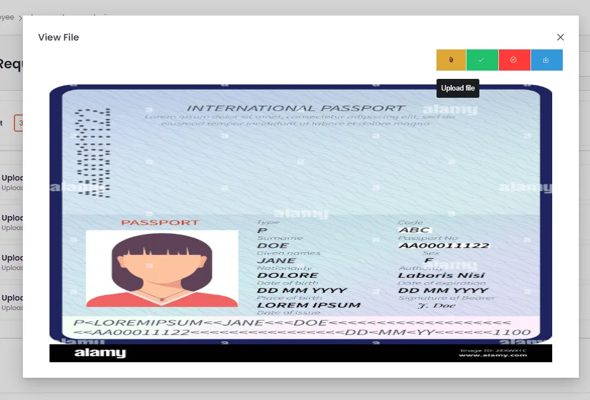

This modal allows managers to verify and approve or reject the document. The document can be re-uploaded using the **Upload file** button and downloaded by clicking the **download** button.

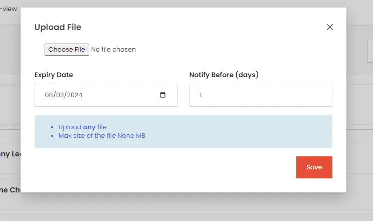

From this form, employees can upload the document and if the document has any expiry date (like visa documents) expiry date can be mentioned in the field and can provide the days before the employee needs to get an expiration notification in the notify before field. The notify before field will only be available if the expiry date is set. The expiration field is optional and can be left blank for no expiration.

In each document request batch, 10 employees are shown on each page and pagination can be used for accessing others.

## Shift Request

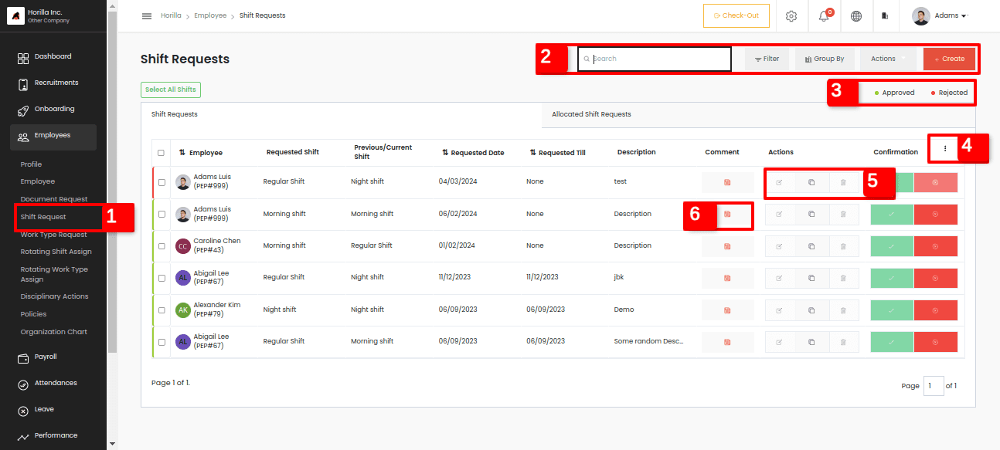

The **Shift request** page can be accessed by clicking the "Shift Request" option (marked as 1) from the sidebar under the **Employee** tab. Here, we have a tabular view of all shift requests. For the employee view, it will show their own requests, while for managers, it will display their subordinates' requests as well. At the top of the navbar (marked as 2), there are options for filter, group by, and actions like export, bulk approve, bulk reject, and bulk delete.

Shifts represent the schedules for an employee to work on a particular day. For example, if a night shift employee needs a regular shift for a period, they can request it using this feature. The system automates the process of updating the employee's work schedule, removing the need to manually update the work information. When the requested period ends, the previous shift is automatically restored. Managers or administrators can approve, cancel, or delete the requests. Employees can cancel their own requests as well. For changes to the employee shift on the requested day, approval from the administrator or manager is required first.

To create a shift request, click on the **Create** button on the same page.

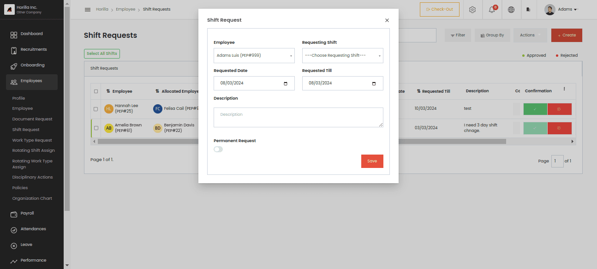

This is the form for creating a shift request. Notifications will be sent for all requests and approvals. The form allows the employee to request a shift, specify the start and end dates, and even request a permanent shift with no end date.

The table provides a clear overview of all requests, and clicking on a row will give an individual view of that request. The table headings indicate sorting options, allowing you to arrange the data in ascending or descending order by clicking on the headings.

Each request in the table has a **Comment** option (marked as 6), where the employee and manager can add comments regarding specific requests. The three actions (marked as 5) available for each request are **Update**, **Duplicate**, and **Delete**. The **Duplicate** option allows you to create a new request with the same data.

Quick filters (marked as 3) are available to filter by **Approved** and **Rejected** shift requests. The three dots (marked as 4) allow the employee to select which columns should be displayed in the table.

The table has two tabs: **Shift Request** and **Allocated Shift Requests**. We previously discussed shift reallocation in the employee profile section, and any requests made there will appear under the **Allocated Shift Requests** tab.

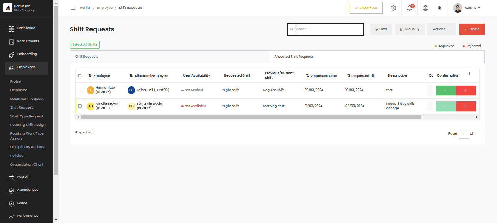

This view shows shift requests from employees who wish to reallocate their shifts to another employee. If the allocated employee is available for the shift change, they can show their response by clicking the check or cross mark next to the request.

In the admin or manager's view, an additional field called **User Availability** will show whether the allocated employee is **Not Marked**, **Available**, or **Not Available**. The admin can approve or reject the request based on this availability. Once approved, the shifts will be interchanged between the requested employee and the allocated employee, starting on the specified date.

To create an allocated shift request, go to **Employee > Profile > Work Type & Shift**, where the button for creating requests is available.

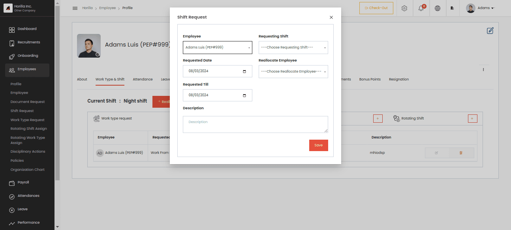

In this form, the employee selects the requesting shift and the allocated employee, along with the start and end dates. Once approved, the shifts of the requesting employee and the allocated employee will be swapped.

## Work Type Request

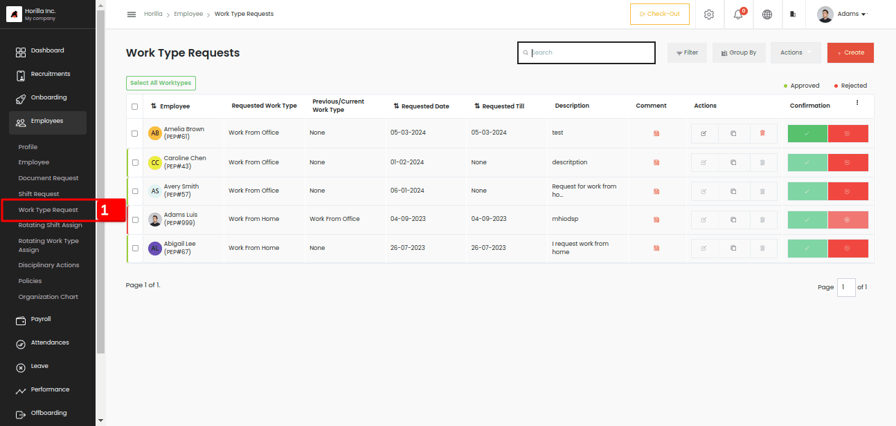

The **Work Type Request** view can be accessed by clicking the "Work Type" option (marked as 1) under the **Employees** view. Work types refer to the nature of the work arrangement, such as working from the office, from home, etc. Similar to shift requests, employees can request a different work type if they wish to work under a different arrangement for a specific period. Once the requested period ends, the previous work type is automatically reinstated.

Just like shift requests, these work type requests require approval from the administrator or manager before they are implemented. The work type request is displayed in a tabular view, with the same features as the shift request view, including filters, actions, and sorting options.

## Rotating Shift Assign

**Rotating Shift Assign** is used to manage frequently changing shift information for employees. You can create rotating shift assignments based on several conditions. The primary options are:

- **After**: Updates the shift information with fixed intervals of days.
- **Weekend**: Updates the shift information on any chosen weekday.
- **Monthly**: Updates the shift information on specific dates each month.

This feature helps automate the management of employees who frequently change shifts.

## Rotating Work Type Assign

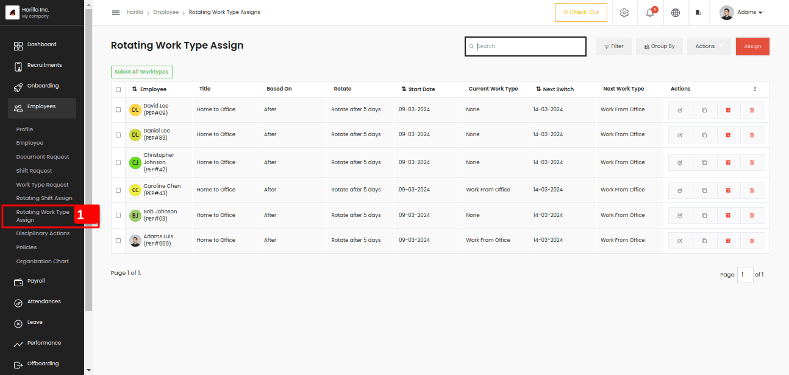

**Rotating Work Type Assign** is used to manage frequently changing work types, such as rotating shifts. You can create rotating work type assignments based on similar conditions to the rotating shift assignments:

- **After**: Updates the work type information with fixed intervals of days.
- **Weekend**: Updates the work type information on any chosen weekday.
- **Monthly**: Updates the work type information on specific dates each month.

### Disciplinary Actions
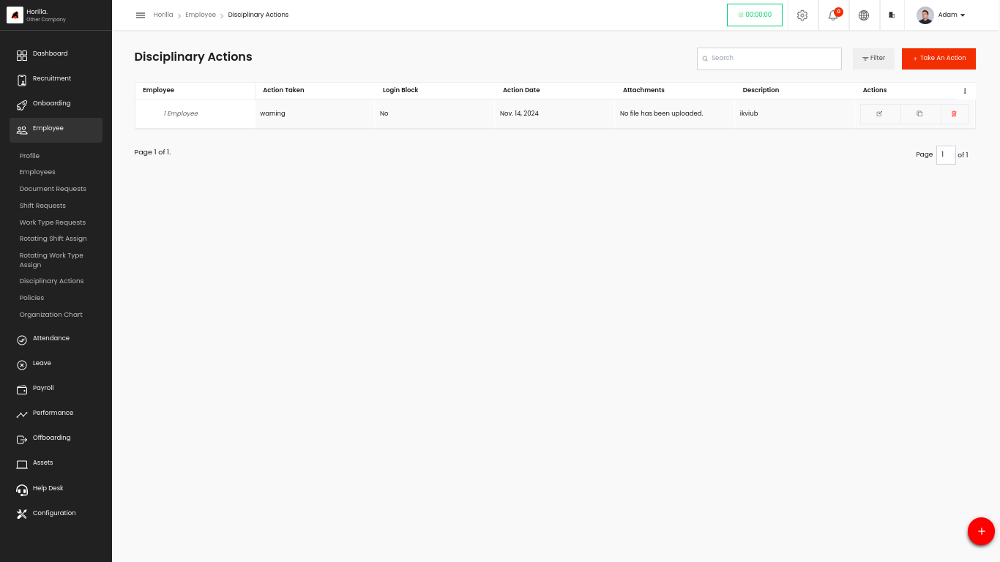

Disciplinary actions are implemented when an employee misbehaves or violates company policies. In such cases, the admin can take appropriate actions, such as issuing a **warning**, placing the employee on **suspension**, or even **dismissal**.

In the settings page, the admin must first define the type of disciplinary action to be taken. Additionally, the admin can decide whether the employee's login should be blocked during the action period. If this option is enabled, the employee’s login credentials will be blocked, preventing access to the system for the duration of the action (whether it's a suspension or dismissal).

The **Disciplinary Action** menu can be accessed from the submenu under **Employees**, providing a tabular view of all actions taken, including the reason for the action and the affected employee.

For suspensions, there are two options regarding the suspension type:
- **Day-based**: Suspension is applied for a set number of days.
- **Hour-based**: Suspension is applied for a specific number of hours.

If the login block is activated, the employee’s login credentials will automatically be reinstated once the suspension or dismissal period ends.

## Policies

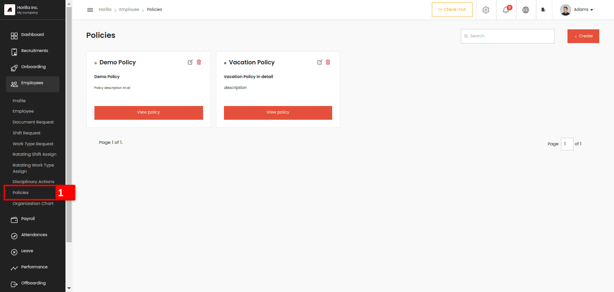

**Company Policies** are a set of guidelines and rules established by an organization to govern employee behavior, actions, and decision-making. These policies ensure compliance with laws and regulations, promote a safe work environment, protect company assets, and maintain fairness within the organization.

The admin can create company policies, and all employees can access these policies by clicking the **Policies** menu (marked as 1) under the **Employees** menu. Employees can read the company policies to understand their rights and responsibilities.

## Organization Chart

The **Organization Chart** provides a simple view of the employees within the organization and their reporting structure. This view can be accessed by clicking the **Organization Chart** option (marked as 1) in the menu.

At the top of the view, there is a selection field where you can choose the managers of the company. Selecting a manager will filter the employees working under them, making it easier to understand the organizational hierarchy.
