# Leave

Leave management is a critical module that tracks employee time off, including sick leave, vacation, and other types of leave. The leave management software module enables managers to manage and approve employee leave requests, track employee attendance, and monitor leave balances. This module automates leave-related tasks, including leave requests, approvals, and notifications, ensuring that organizations comply with their leave policies and regulations. Automating leave management, Improves efficiency, reduces paperwork, and saves time and money for organizations.

    <iframe width="840" height="500" src="https://www.youtube.com/embed/yjvqCVE0uPA" title="How to Manage Leave in Horilla | Leave Management System in Horilla #opensource" frameborder="0" allow="accelerometer; autoplay; clipboard-write; encrypted-media; gyroscope; picture-in-picture; web-share" referrerpolicy="strict-origin-when-cross-origin" allowfullscreen></iframe>

## **Dashboard**
A leave management system dashboard is like a control center where users can see important leave information in one spot, presented graphically for easy understanding. It shows leave statuses, such as approved, pending, or denied, in visual formats like charts or graphs. This makes it simple for users to grasp their leave situation quickly without digging through lots of text or emails. The dashboard acts as a hub where users can glance at their leave status at a glance, making it convenient and straightforward to manage their time off. It’s like a visual summary of your leave status, all in one place.

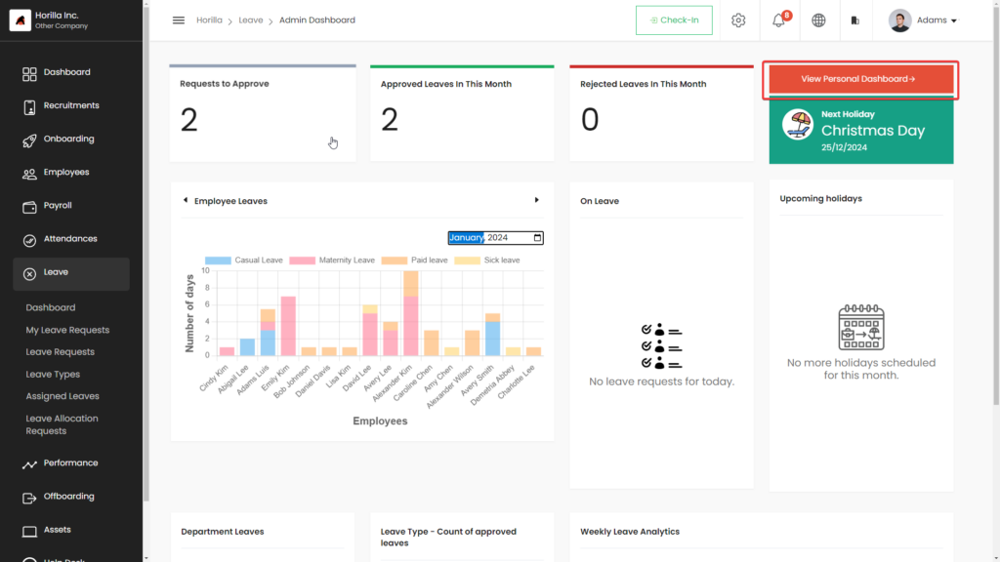

This image displays the admin user dashboard, featuring crucial information such as pending requests to approve, approved leaves for the current month, and rejected leaves for the same period. It also includes graphical representations depicting employee and department leaves, making it effortless to grasp what’s happening within the company. The dashboard serves as a central hub where administrators can quickly understand the leave landscape, enabling efficient decision-making and oversight. With clear visuals and categorized data, it streamlines the process of managing leaves, helping administrators stay informed about leave trends and statuses in the organization at a glance.

### Personal Dashboard
The “View Personal Dashboard” button, located in the top right corner of the screen, grants users access to their individual dashboard. This personalized dashboard provides essential leave information tailored to each user, including their leave balances, upcoming leave requests, and leave approval statuses. By clicking on this button, users can easily navigate to their own dashboard, where they can review their leave history, plan future absences, and track the status of their pending leave requests. It’s like having a dedicated space where users can manage their leave-related activities and stay updated on their time-off status, all in one convenient place.

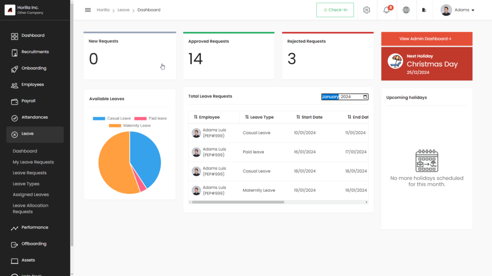

In the image, you’ll find detailed personal information for employees. It showcases key counts such as “New Requests,” “Approved Requests,” and “Rejected Requests.” Additionally, there’s a graphical display illustrating available leave across different types. This allows employees to see at a glance how much leave they have left in each category. Furthermore, there’s a quick list view of their recent requests, making it easy to track the status of their leave applications. This personalized dashboard offers employees a comprehensive overview of their leave history and current status, empowering them to manage their time off efficiently and effectively.

## My Leave Request
The “My Leave Request” view lets employees access details about their assigned leave types, including available days, carry forward days, and total days for each type. By clicking on a leave type, employees can request leave by providing the necessary details. They can also see a list of their submitted leave requests, allowing updates or deletions before approval or cancellation. This feature streamlines leave management, reducing the need for managers to handle changes. It empowers employees to manage their leave independently, promoting autonomy and efficiency. Ultimately, it lightens the administrative load on managers and enhances employees’ ability to handle their leave requests effectively.

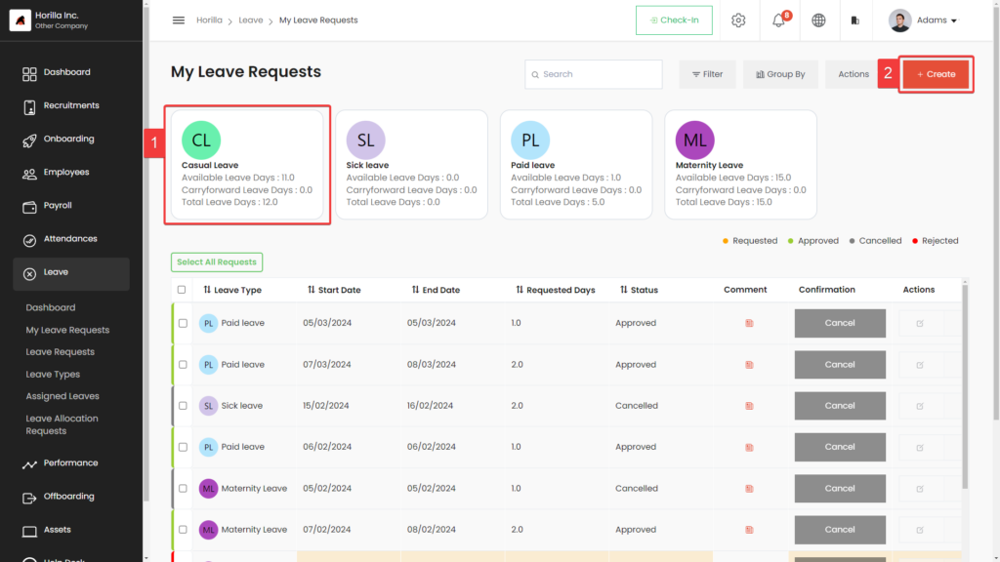

### User request creation
In the employee’s leave view, all assigned leave types are shown in cards. Clicking on a specific card (marked as 1 in the image) opens a request form modal for that leave type. Employees can swiftly create a leave request by filling out the required details in the form. Alternatively, they can use the create button at the top right corner (marked as 2  in the image) to initiate a request. This feature enables a quick and efficient process for requesting time off. It simplifies the procedure, making it easy for employees to manage their leave without hassle. With just a few clicks, employees can submit their leave requests, enhancing overall workflow and productivity.

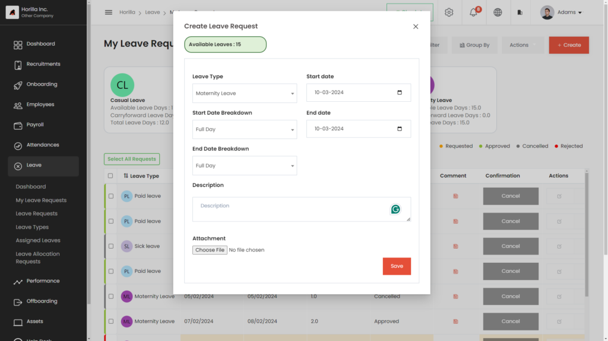

# Leave Request

The leave request view is a vital tool for handling all leave requests in a company. Admins and reporting managers can access and manage leave requests submitted by their team members, approving or canceling them as required. They can also create, update, or delete leave requests as needed. To create a new request, simply click “Create Leave Request,” fill in the required details like leave dates and type (e.g., vacation, sick leave), and click “Submit.” This view streamlines leave management, providing all necessary information for admins and managers to efficiently handle leave requests, ensuring smooth operations within the company.

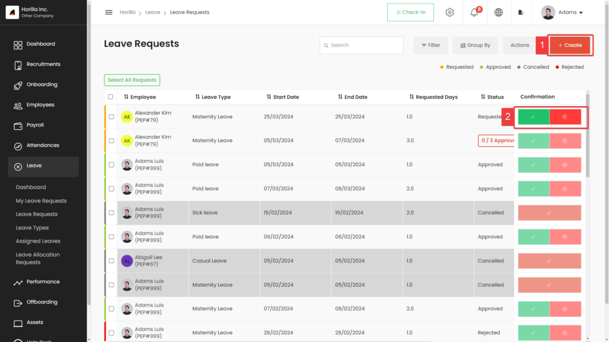

### Leave Request Create Button
The “create” button (marked as 1 in the image) allows an admin or reporting manager to initiate a leave request on behalf of an employee. This feature provides great convenience as it eliminates the need for individual employees to create their own leave requests, especially when they are unable to do so themselves. The admin or reporting manager can easily input the necessary details such as the type of leave, the duration, and the reason for the leave. This feature also streamlines the leave request process, making it more efficient and organized. Overall, the “create” button is a valuable tool that simplifies leave management and helps ensure that employee requests are promptly addressed.

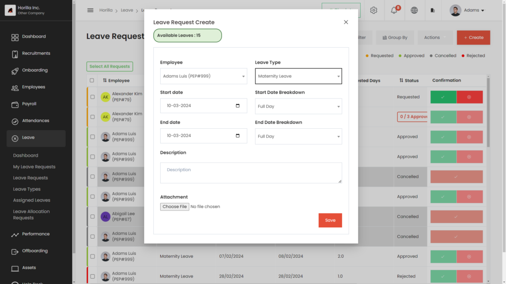

### Leave Request Approve/Reject Button
The approve/reject button (marked as 2 in the image) empowers managers to accept or decline leave requests made by users. When a user submits a leave request, the manager can review it and then choose to either approve or reject it using this button. Approving means the leave request is accepted, allowing the user to take the requested time off. Rejecting means the leave request is denied, and the user is expected to work during the requested period. This button gives managers control over the leave request process, ensuring that all requests are carefully considered and appropriately handled to maintain productivity and fairness within the team.

### One Request View
The one request view offers a comprehensive look into an employee’s leave request. By clicking on the employee’s name, admins or reporting managers gain access to a detailed overview, including a thorough description of the leave request. This feature allows managers to verify the request’s content accurately, aiding in informed decision-making regarding approval or cancellation. By consolidating all necessary information into one view, the process is streamlined, eliminating the need to navigate through multiple screens. This efficient functionality saves time and enhances productivity, ensuring that leave requests are handled promptly and effectively within the organization.

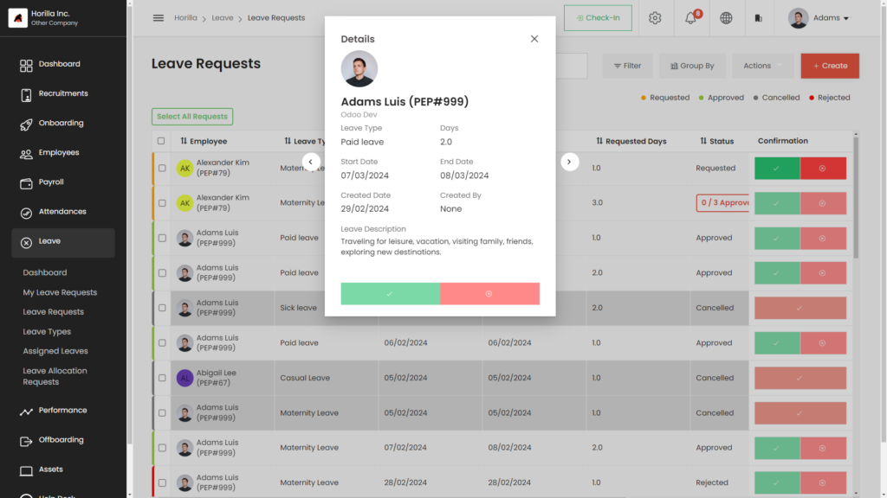

## Leave Type
This interface manages company leave types, displayed in an easy-to-navigate card view. Users can add new leave types by clicking the create button. It also allows updating and deleting existing types, facilitating adjustments and removal of outdated entries. Additionally, users can assign leave types to employees, crucial for handling leave requests accurately. This ensures each employee receives the appropriate leave type based on their job role and employment status. The interface streamlines the process, providing a comprehensive solution for organizing and adapting leave types, ultimately contributing to effective leave management within the company.

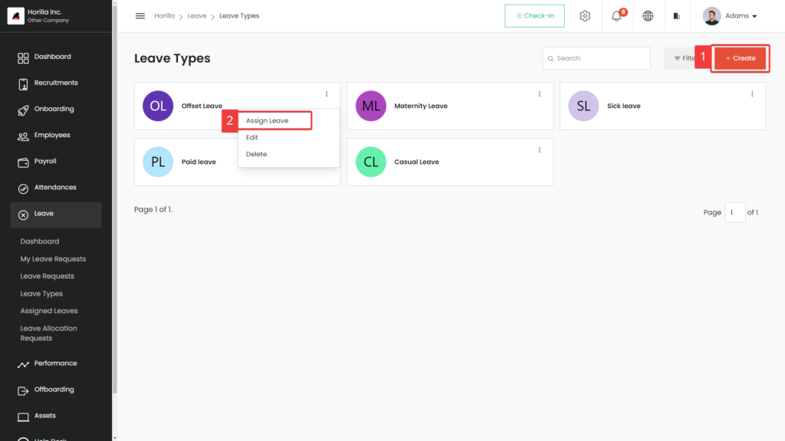

###  Leave Type Create Button
The button (marked as 1 in the image) is used to create new types of leaves within leave management software. When the user clicks on this button, a new form will appear where the user can enter the details of the new leave type they wish to create. The form will typically ask for information such as the name of the new leave type, the number of days allowed, whether it is a paid or unpaid leave and any other relevant information. Once the user has entered all the required information and submitted the form, the new leave type will be created and added to the list of available leave types within the leave management system.

###  Leave Type Create Button
The button (marked as 1 in the image) is used to create new types of leaves within leave management software. When the user clicks on this button, a new form will appear where the user can enter the details of the new leave type they wish to create. The form will typically ask for information such as the name of the new leave type, the number of days allowed, whether it is a paid or unpaid leave and any other relevant information. Once the user has entered all the required information and submitted the form, the new leave type will be created and added to the list of available leave types within the leave management system.

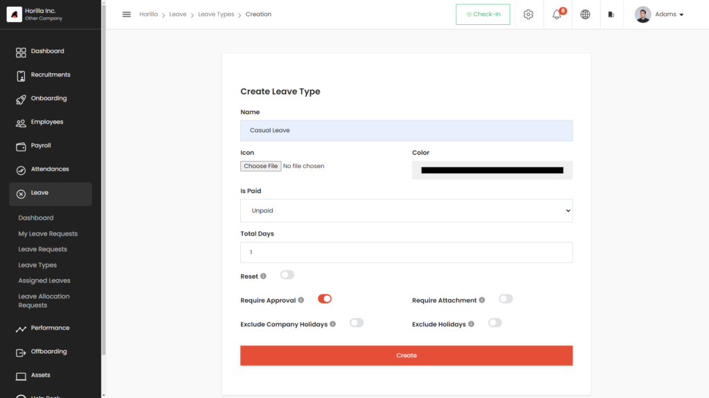

### Leave Assign One:
The “Leave Type View” allows users to view all types of leaves in a card format. By clicking the three dots at the top right of the card, users can access various options such as edit, delete, and assign. Clicking on “Assign” (marked as 2 in the image) allows users to assign that specific leave type to employees in the company directly from the leave type view. This feature provides an easy and efficient way to manage and assign leave types to employees without having to navigate to a separate section of the system.

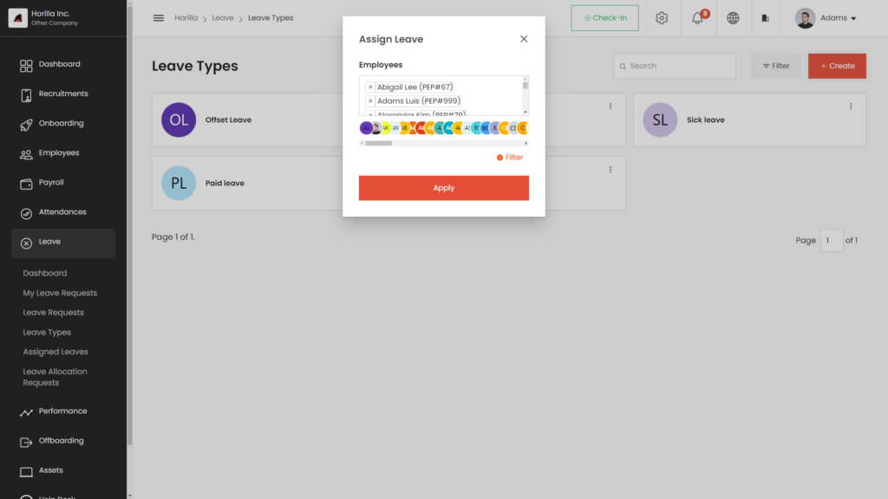

## Assigned Leave
This view gives a summary of assigned leave types for all employees, showing which leave types each employee has. Users can assign multiple leave types to multiple employees simultaneously using the “assign” button. They can also update available leave days and carry forward leave days for assigned leave types. These tasks are conveniently managed within this view, making it efficient for handling employee leave types. It simplifies the process, allowing users to oversee and update leave types for all employees in one place, thereby streamlining leave management and ensuring accuracy in allocating leave benefits across the organization.

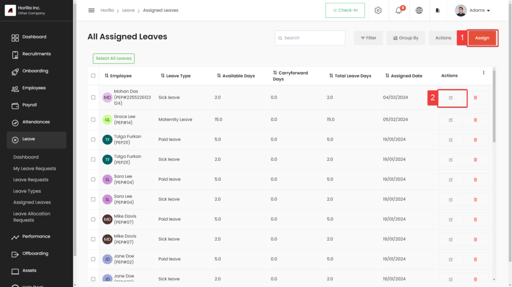

### Assign Button
The button in the assigned view (marked as 1 in the image) simplifies assigning multiple leave types to multiple employees simultaneously. This feature is especially valuable for organizations with many employees and diverse leave types. Instead of manually assigning each leave type to each employee, HR or management staff can select multiple leave types and employees all at once. This saves considerable time and effort, optimizing resource utilization. By streamlining the process, the button enhances efficiency in managing leaves, ensuring that employees receive the appropriate leave types promptly. It’s a practical tool that makes leave management more effective and less time-consuming for HR teams and managers alike.

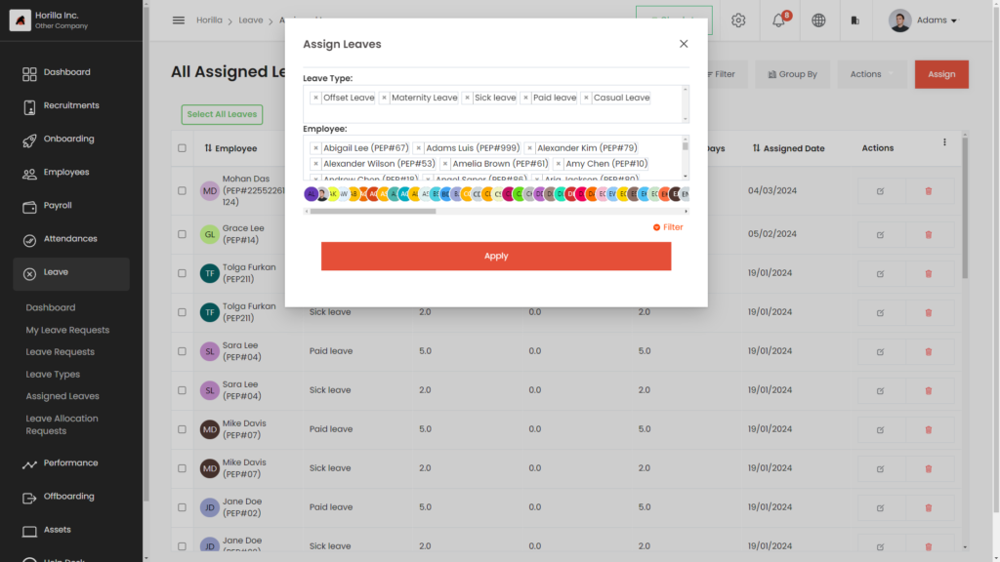

### Available Leave Update Button
The update button is for adjusting available and carry-forward leave days (marked as 2 in the image)  for a specific leave type assigned to an employee. Clicking it automatically adjusts the employee’s leave entitlements based on HR or management changes. This ensures employees have an accurate count of available leave days for that type, aiding in better planning. By using the update button, the system keeps track of any alterations made to leave entitlements, maintaining transparency and fairness. It’s a simple yet effective way for employees to stay informed about their available leave days, helping them make informed decisions about taking time off when needed.

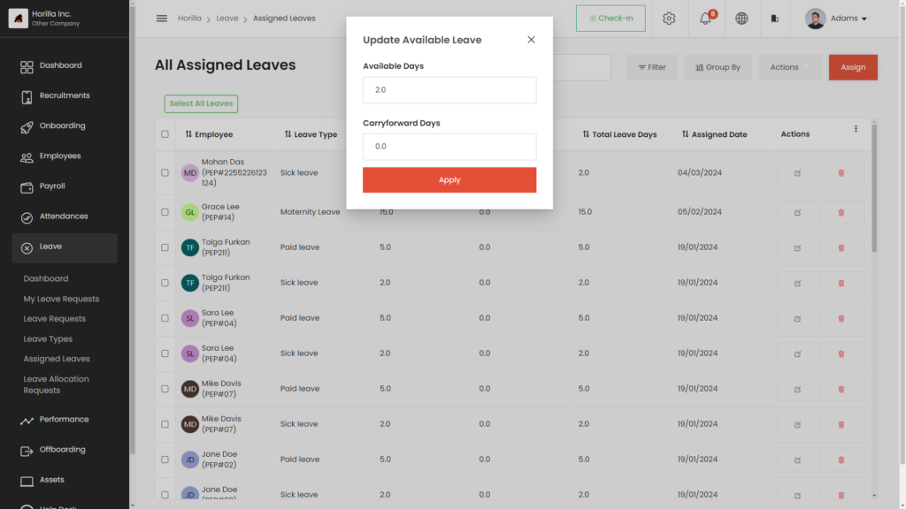

## Leave Allocation Request
Leave Allocation Request is a process where employees request additional leave days beyond their initial entitlement. It’s a formal procedure where employees submit a request to their manager or HR department, outlining the reasons for needing extra leave and specifying the duration required. The request may include details such as the type of leave needed and any supporting documents if necessary. Managers or HR personnel review the request and decide whether to approve or deny it based on company policies and the employee’s circumstances. This process ensures fairness and transparency in managing additional leave requests within the organization.

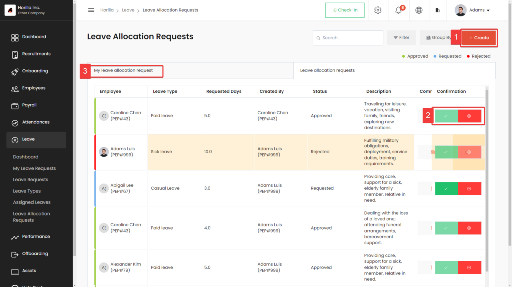

### Leave Allocation Request Create Button
The “Leave Allocation Request Create” button is a feature that allows employees as well as managers to initiate the process of requesting additional leave days. By clicking this button (marked as 1 in the image), employees can access a form where they input details such as the reason for needing extra leave, the duration required, and any supporting information. This button serves as the starting point for employees to formally request additional leave beyond their standard entitlement. Once the form is completed, it is submitted for review by their manager or the HR department. The button streamlines the process, making it convenient for employees to request additional leave when necessary.

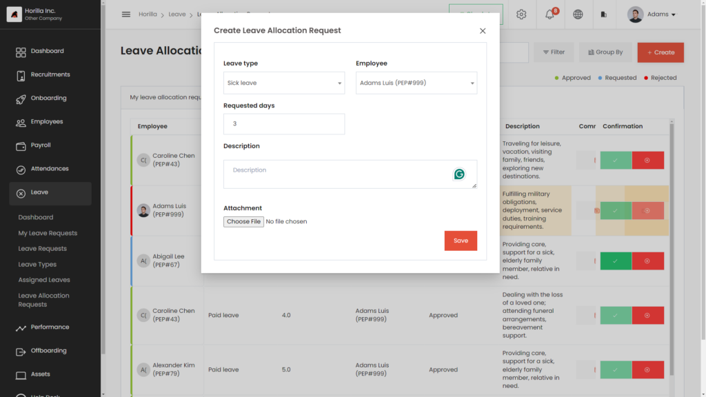

### Leave Allocation Request Approve/Reject Button
The “Leave Allocation Request Approve/Reject” button enables managers or HR personnel to make decisions on employees’ requests (marked as 2 in the image)  for additional leave days. When an employee submits a request for extra leave, the manager or HR department reviews it. Using this button, they can either approve the request, granting the employee the additional leave days they asked for, or reject it, denying the request. This button provides managers with a simple way to respond to leave allocation requests, ensuring that decisions are made promptly and transparently. It streamlines the process, allowing for efficient handling of additional leave requests within the organization.

### My Leave Allocation Request
The “My Leave Allocation Request” (marked as 3 in the image) list view displays all the requests I’ve made for additional leave days. It provides a comprehensive overview of the requests I’ve submitted, including details like the reason for the request and the duration of leave needed. This view allows me to track the status of each request, whether it’s pending, approved, or rejected. I can easily see which requests have been processed and which ones are still awaiting review. The list view simplifies the process of managing my leave allocation requests, making it convenient for me to stay informed about the status of my requests.

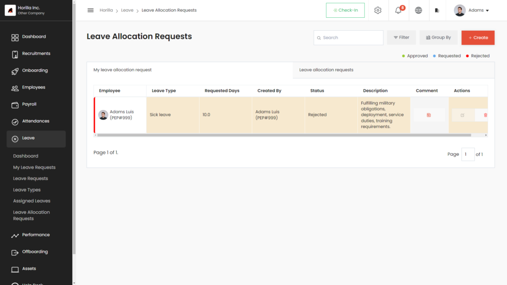