# Offboarding
Offboarding is the process of managing an employee’s departure from a company. It involves various tasks and procedures aimed at ensuring a smooth transition for both the departing employee and the organization. In the context of HR software, offboarding features facilitate and streamline these tasks.

Horilla helps organizations manage departures more effectively, minimize disruptions, and protect the company’s interests while also ensuring a positive experience for departing employees.

   
    <iframe   iframe width="1128" height="634" src="https://www.youtube.com/embed/YaSJ08WAhOI" title="How to Manage Employee Offboarding in Horilla HRMS | Free HR Software | Horilla Offboarding Software" frameborder="0" allow="accelerometer; autoplay; clipboard-write; encrypted-media; gyroscope; picture-in-picture; web-share" referrerpolicy="strict-origin-when-cross-origin" allowfullscreen></iframe>

## Exit Process View
In the Exit process view, Horilla organizes employees based on their offboarding stage and lists tasks required to be completed during the process giving an easy and effective visualization. Managers can track each employee’s progress and ensure tasks are completed on time. Once the employee has completed the offboarding process, Horilla automatically blocks the employee’s credentials.

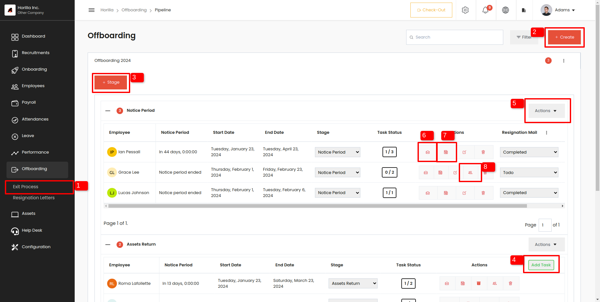

To get Exit process view
- Open the **‘Offboarding’** tab: Navigate to the designated “Offboarding” tab within the Horilla sidebar, providing a central hub for all offboarding-related activities.
- Access **“Exit Process”**: Within the menu options presented, locate and select the “Exist Process” (1 from image.1)  feature, guiding users to the Offboarding view.

### Stage Create Button 
The “Stage Create” button (3 from image.1) on the view (marked as 1 on the image) allows the HR manager to create new stages for managing the offboarding process. HR can define each stage and assign a stage manager, customizing the process to their needs. This feature simplifies employee management by enabling tailored organization of stages. Additionally, it centralizes all stages and associated employees in one place, making it easy to track progress.

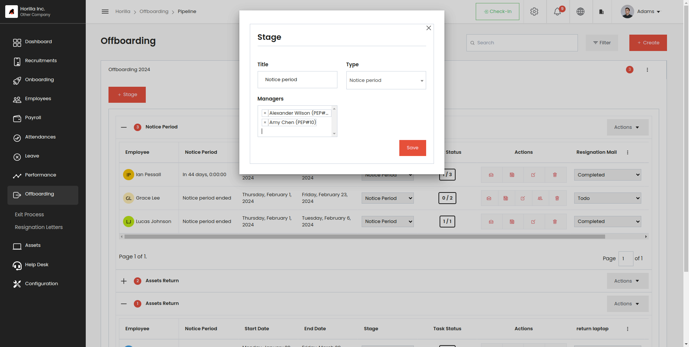

### Task Create Button
The offboarding task create button (4 from image.1) is placed on each task, allowing HR to add new tasks to every stage. They can also specify which employees should follow the task. This ensures that tasks are properly assigned and visible within the stage, monitors the status of the tasks, and updates them according to progress. Horilla centralizes all offboarding tasks, ensuring nothing falls through the cracks. It streamlines the process, preventing delays or missed steps.

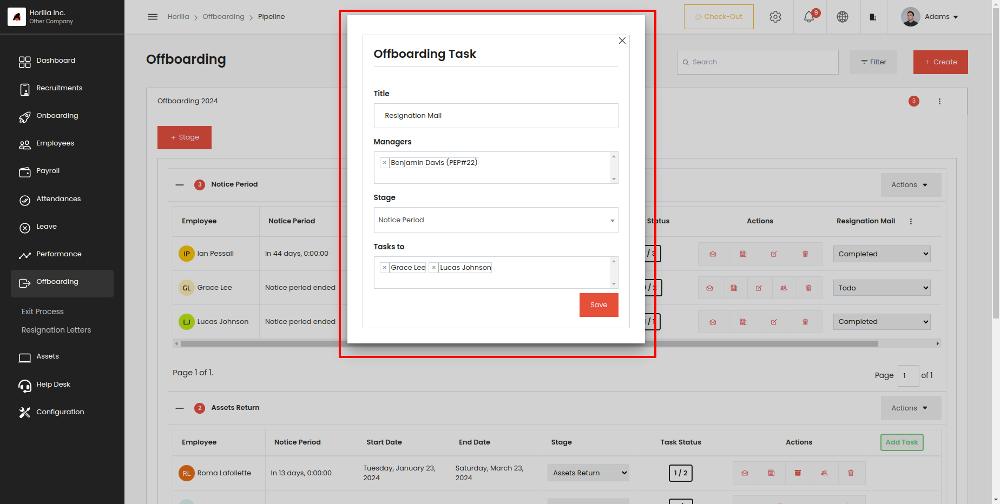

Add Employee option in ‘Actions’ Dropdown button
HR can add employees when they are leaving the company, ensuring that they go through all stages and tasks of the offboarding process. This simplifies all offboarding procedures, as the HR person only needs to add the employee in the offboarding system, and Horilla will facilitate a seamless and effective monitoring of the exit procedures.

To access the ‘Add Employee’ option, open the ‘Actions’ dropdown menu (5 from image.1). There, you can find the ‘Add Employee’ option. Clicking on this option will open a form for adding the employee to the offboarding stage.

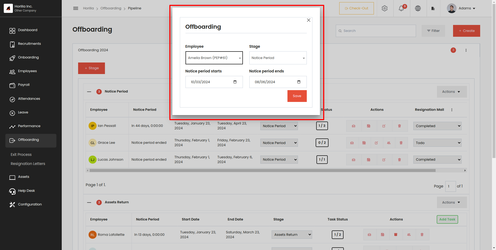

### Send Mail
By clicking on ‘Send Mail’ (6 from image.1), you can send an email to the employee to officially inform them about the offboarding details. Horilla assists you in creating the email using predefined mail templates. After submitting the mail creation form, Horilla automatically sends the email to the employee.

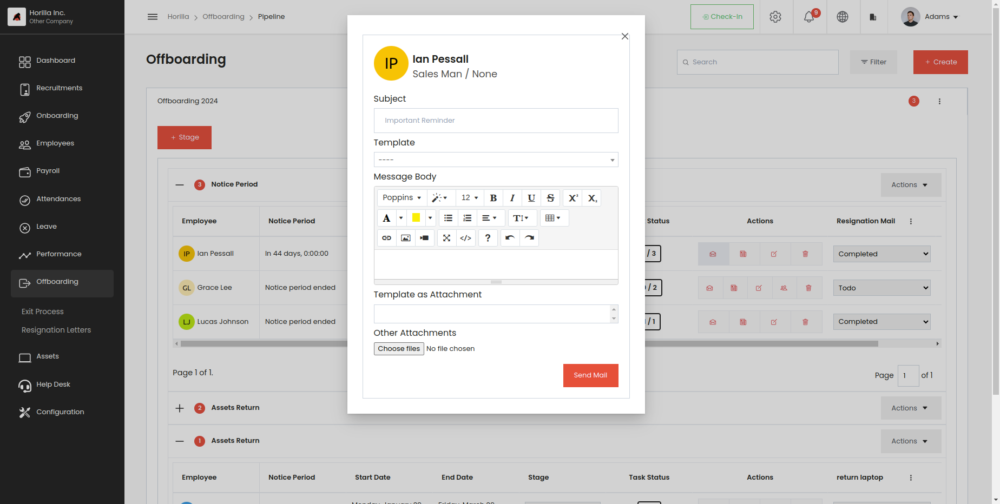

### Add Note
By clicking on Note’ (7 from image.1), you can pass messages to the employee. Horilla will notify the employee about the note

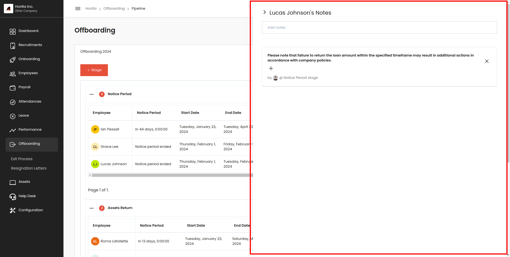

### Replace the employee’s authorities
If the employee holds any authority or role within the company, Horilla will display these details during offboarding. HR can then replace the employee’s role with another employee in the company. 

An additional button (8 from image.1) will be visible on that particular employee’s button group. By clicking on it, a pop-up form will appear, providing information about the employee’s roles. HR can then select another employee to replace them on that form.

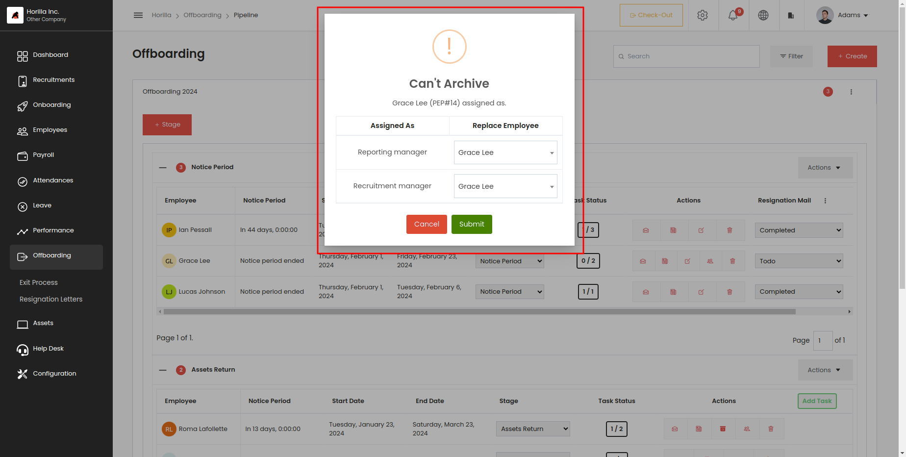

## Resignation Letters
To display and manage resignation letters in the sidebar, you need to enable the resignation request feature ( image.7) in the settings. 

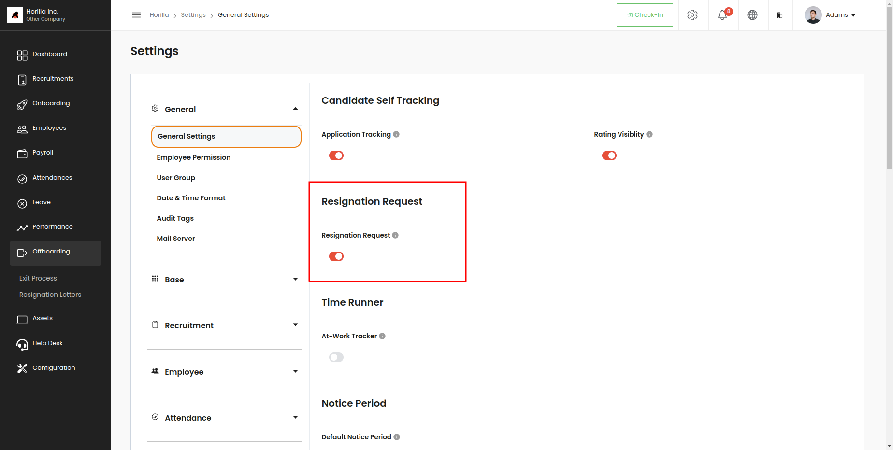

Once enabled, resignation letters will be available under Offboarding, and a ‘Resignation’ tab (2 from image.8) will be added to the profile view of each employee. This allows employees to submit their resignation directly on Horilla by creating a resignation letter.

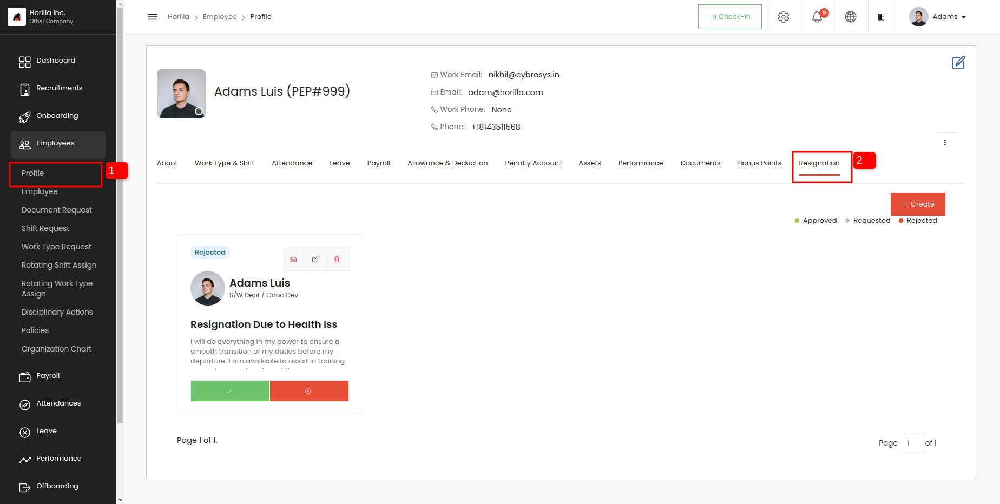

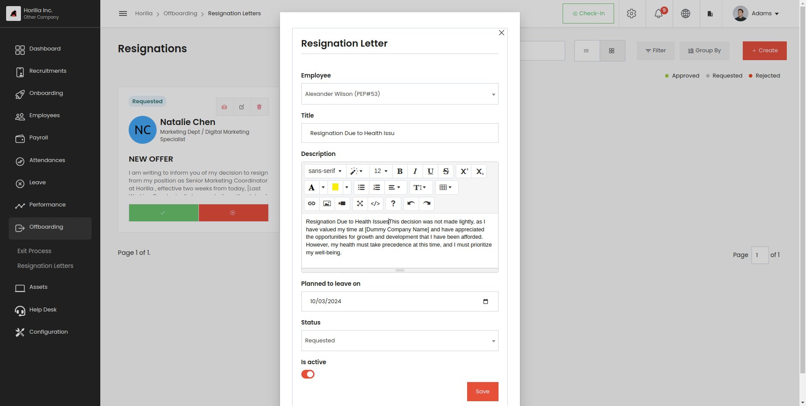

Resignation letters can be created by HR personnel by specifying the employee’s name and the planned last working day. HR can then review and take action on the resignation request by using the ‘Approve’ or ‘Reject’ buttons provided.

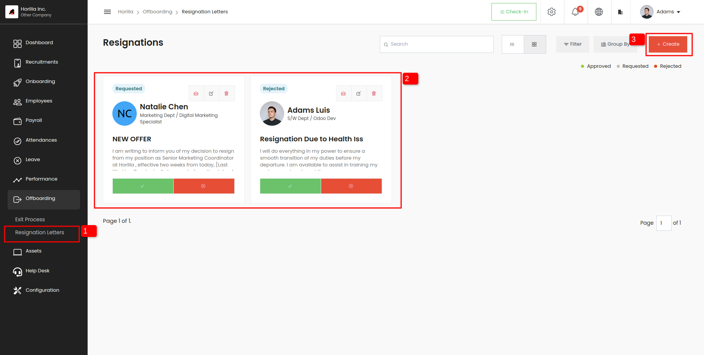

This feature streamlines the resignation process, allowing for easy submission, review, and management of resignation letters directly within Horilla.
