# Performance Management System
A Performance Management System (PMS) within Horilla HR software is a comprehensive tool designed to streamline and optimize the process of managing employee performance. By centralizing Objectives, performance evaluation, feedback, and development planning. Horilla HRMS helps HR teams to efficiently track progress, provide timely feedback, and foster a culture of continuous improvement. With customizable features and data analytics capabilities, PMS empowers organizations to align individual performance with overarching business objectives, driving productivity, engagement, and ultimately, organizational success.

    <iframe width="840" height="500" src="https://www.youtube.com/embed/6OXNrZhFkeY" title="What is Performance Management System Software? | Performance Management System in Horilla" frameborder="0" allow="accelerometer; autoplay; clipboard-write; encrypted-media; gyroscope; picture-in-picture; web-share" referrerpolicy="strict-origin-when-cross-origin" allowfullscreen></iframe>

## Objectives
The objectives of a Performance Management System (PMS) encompass several key goals aimed at enhancing employee performance and aligning it with organizational objectives.

In Horilla HRMS, objectives are categorized into two main groups: self objectives and all objectives. For regular employees, the Self Objectives tab displays the objectives assigned to them, allowing them to focus on their individual goals and progress. On the other hand, the All Objectives tab is designed for HR or managerial personnel, providing them with a comprehensive overview of all objectives across the organization. This tab enables HR and managers to monitor and manage objectives at a broader level, facilitating strategic decision-making and alignment with organizational goals. The Horilla Objective view offers a holistic perspective on objectives, simplifying monitoring and management processes for enhanced efficiency and effectiveness.

1. Self Objectives
   - The “Self Objective” tab (2 from image.1) is a section in a performance management system where individual employees can track, and measure their objectives or goals.
2. All Objectives
   - The “All Objective” (3 from image.1) is a section in a performance management system that managers can use to track, measure, and assess the performance of employees in the organization.

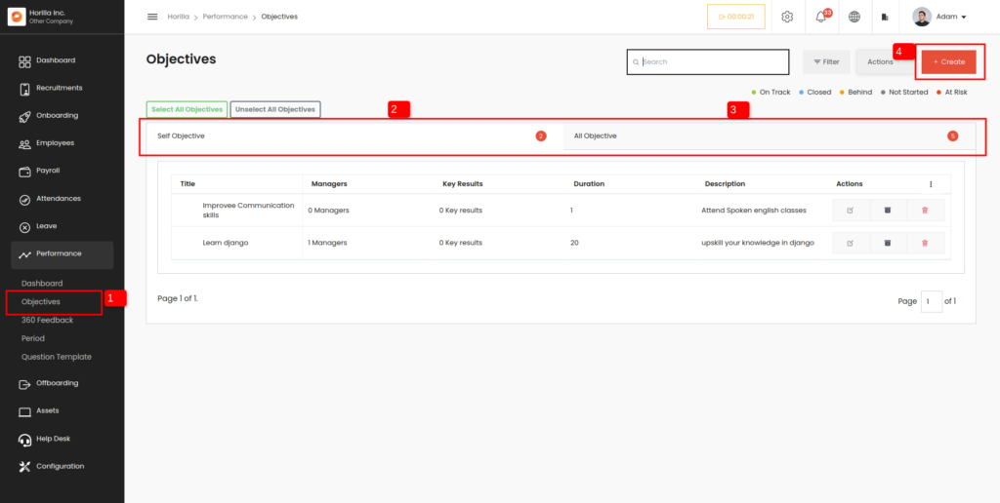

From the Performance submenu, you can access objectives, (1 from image.1). This provides an overall view of the objectives, allowing for easier monitoring and management.

###  Create Button
HR Can use the “create” button (4 from image.1) to generate new objectives and assign them to the employees who need to achieve them.

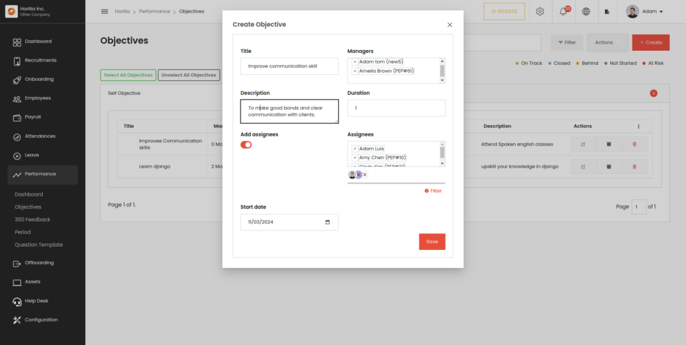

### Detailed View of Objectives
Clicking on an objective will display a view that shows all the assigned employees under that objective, along with the status and progress of each key result for each employee. Additionally, it provides an overview of the overall progress of each employee toward that objective.

Employees can update their progress by inputting the current value (1 from image.3). Then, Horilla automatically compares this value with the target value and updates the progress (2 from image.3) of both the key result and the overall objective. When the task is completed, employees can achieve a progress percentage of 100%.

### Add Key Results for the Employee’s Objective
Managers can add key results for employees, which then become associated with their respective objectives. This allows managers to monitor the progress of key results and overall objectives in a single, consolidated view, ensuring timely tracking and management of employee performance.

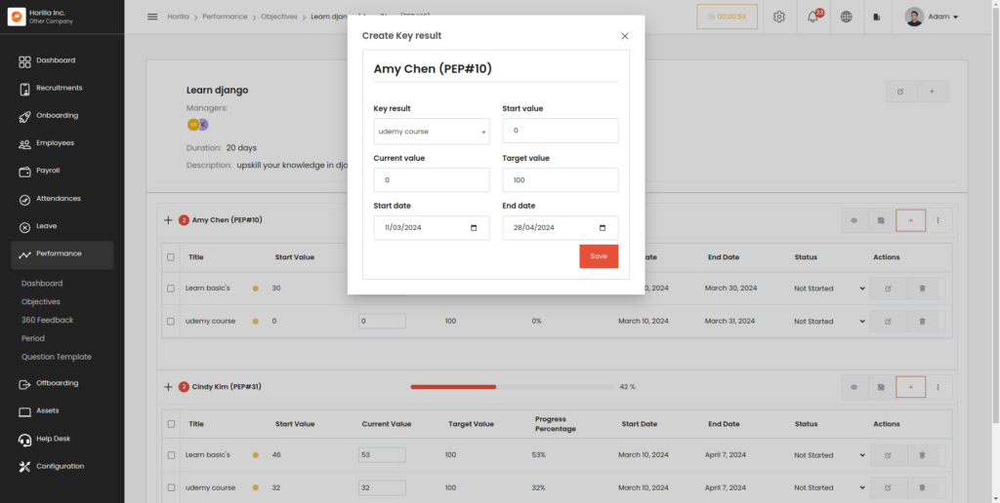

### Activities
By clicking on the activity button, an activity box will appear, displaying all the changes and their details made to the objective. Additionally, users can provide comments or notes to the assignee within this activity box, facilitating communication and collaboration regarding the objective.

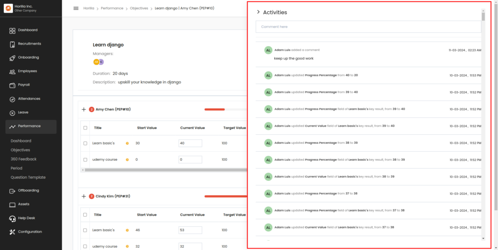

## 360° Feedback
360-degree feedback is a multi-rater assessment tool that collects feedback from various sources about an employee’s performance, including peers, supervisors, subordinates, self, and even clients or customers. It offers a comprehensive view of an individual’s strengths, weaknesses, and areas for development, providing a well-rounded perspective on their performance. Horilla HR Software facilitates the administration, collection, and analysis of this feedback, allowing organizations to gain valuable insights into employee performance, foster self-awareness and growth, and make informed decisions about training, development, and performance management.

###  Feedback View
The 360 feedback option on the Performance submenu redirects the user to the feedback view, where feedback is categorized and organized into Self Feedback, Requested Feedback, All Feedback, and Anonymous Feedback. The All Feedback tab is exclusively accessible to responsible managers, displaying all feedback except for anonymous submissions. This ensures managers have comprehensive visibility into feedback while respecting the anonymity of contributors.

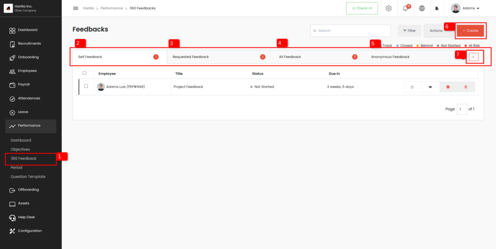

- Self-feedback
  * This tab (2 from image.6) shows the feedback provided by the individual who is receiving the feedback.
- Requested feedback
  * This tab (3 from image.6) shows feedback that has been requested by the individual from their colleagues, peers, or superiors.
- All feedback
  * The all feedback tab (4 from image.6) shows all of the feedback that has been collected, including self-feedback and requested feedback from others.
- Anonymous feedback
  * The anonymous feedback tab (5 from image.6) shows all the anonymous feedback related to the employee.

### Create Button
By clicking the create button (6 from image.6), users access a form to generate feedback. Here, they can specify subordinates, supervisors, colleagues, and all necessary details. Once the feedback is created, Horilla automatically displays it on the requested feedback tab of the mentioned employees and notifies them accordingly. This streamlined process facilitates easy and seamless feedback collection from all relevant parties.

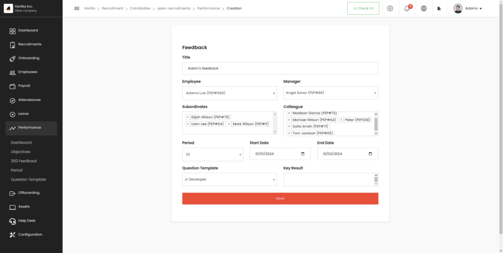

### Feedback Answer
Feedback can be provided by completing the questions created by the employee.

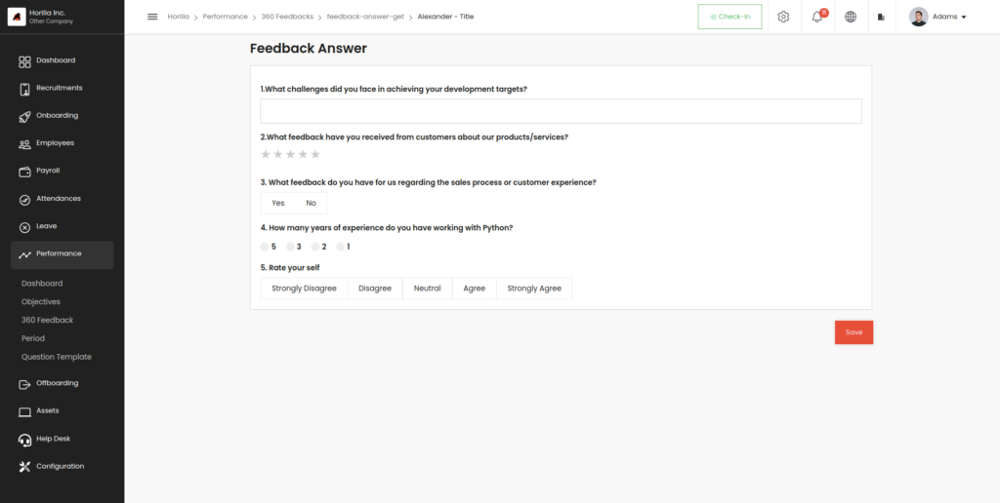

Once feedback is submitted, Horilla notifies the creator and provides access to view the responses. This enables the creators to evaluate themselves based on the feedback received.

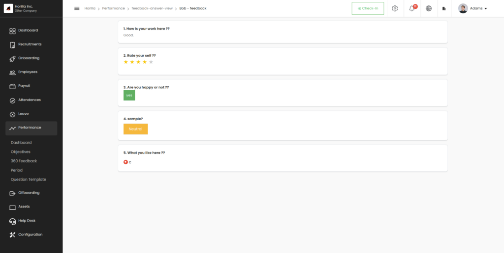

### Anonymous feedback
Anonymous feedback serves several important purposes in organizations. Firstly, it encourages honest input from employees, as they feel more comfortable expressing their thoughts and concerns without fear of reprisal. This enables organizations to gather valuable insights into employee experiences, perceptions, and areas for improvement that may otherwise go unnoticed. Secondly, anonymous feedback promotes trust and transparency within the workplace. Horilla HRMS provides all privacy on the anonymous feedback.

Employees can anonymously provide feedback on any topic by utilizing the dedicated create button (7 from image.6) on the anonymous feedback tab. The anonymous creation form includes a “Based on” field where employees can specify the subject or context of their feedback.

1. General: Feedback related to all

2. Employee: Feedback about an individual

3. Department: feedback about a department

4. Job position: Feedback about a particular job position.

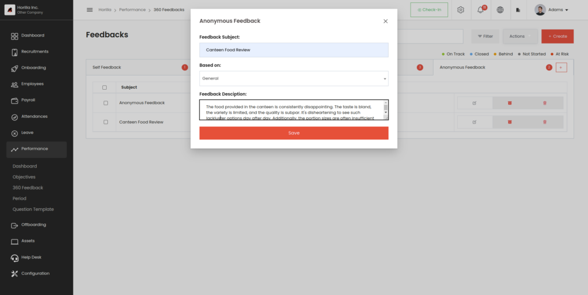

Horilla HRMS will display the feedback to the responsible employee(s) without revealing any details about the creator, ensuring anonymity and confidentiality.

## Period
In summary, this view provides a centralized way to manage and track periods, which can be used to automate certain HR and performance management tasks. By setting the start and end dates for each period, you can ensure that feedback and OKRs are aligned with your organization’s goals and objectives. The update and delete buttons make it easy to make changes to existing periods or remove them as needed. Overall, this view can help streamline your HR and performance management processes by providing a clear framework for setting and managing periods.

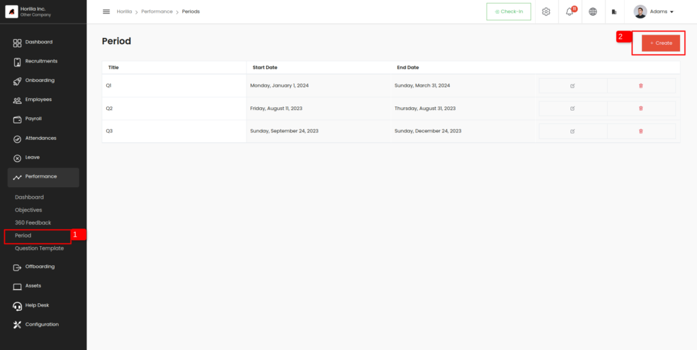

## Question Template
Here you can create your question template and add questions based on your specific needs or requirements. A question template provides a structure or framework for asking questions in a particular context, such as during feedback. By creating your template, you can tailor the questions to suit your specific goals.

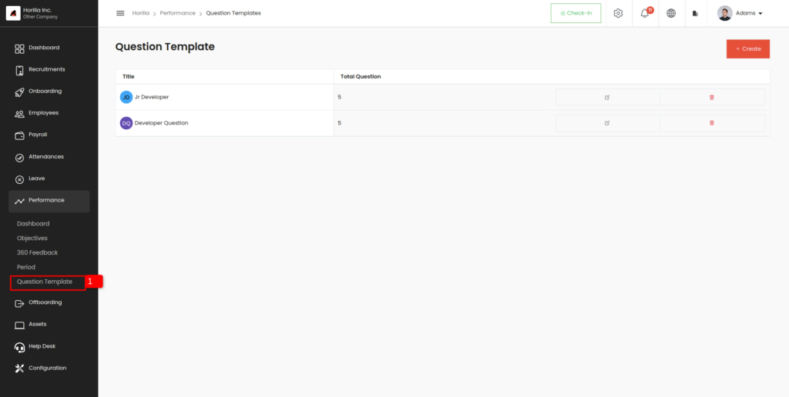

Horilla HR Software offers various types of questions designed for ease of use and enhanced visual representation, catering to diverse feedback needs and preferences.

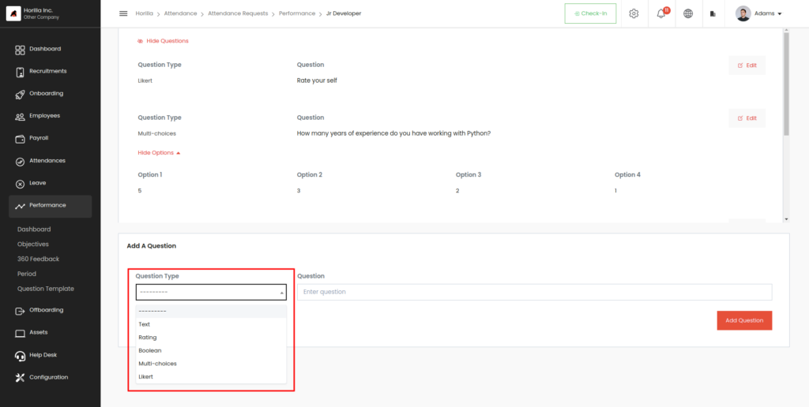

Creators can select from different question types such as Text, Rating, Boolean, Multi-choice, and Likert, allowing them to tailor questions according to their specific requirements and preferences within Horilla HR Software.