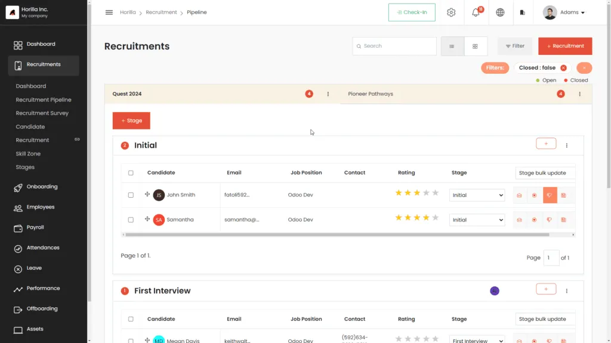
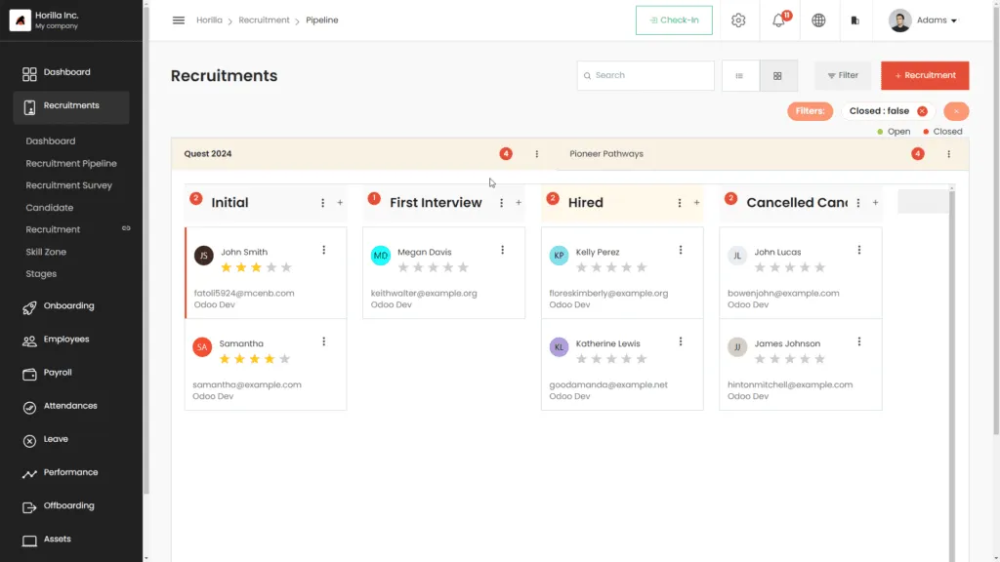
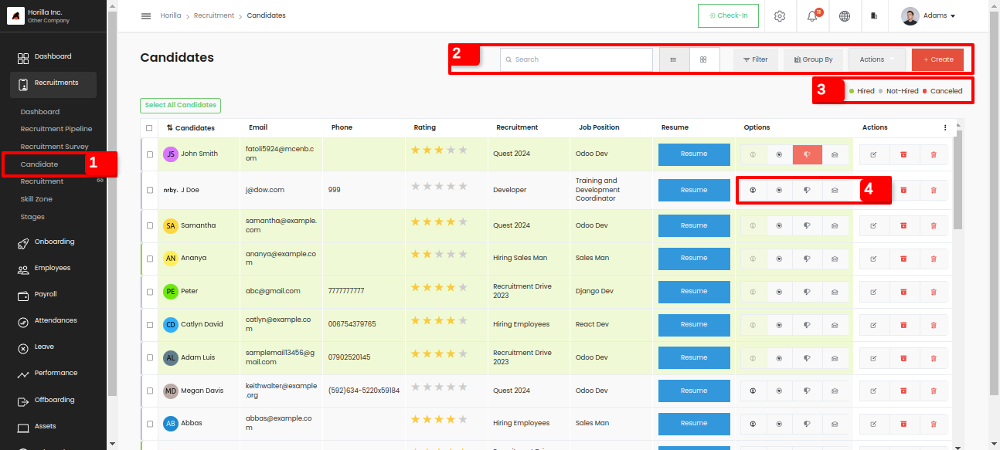
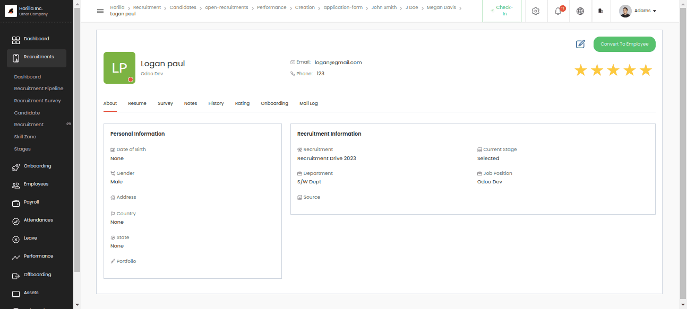
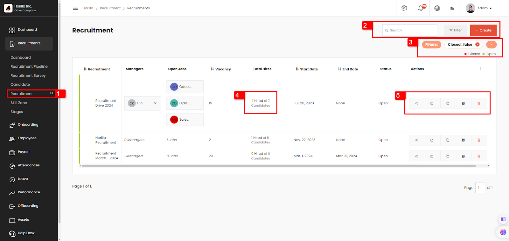
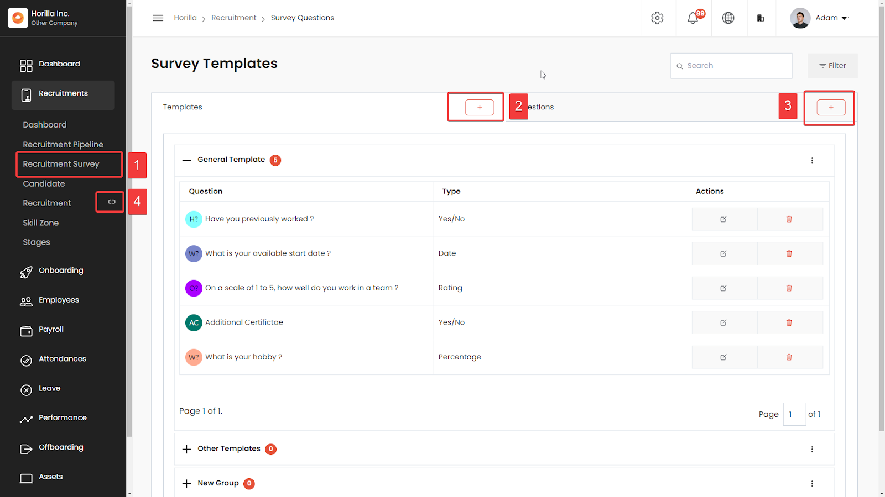
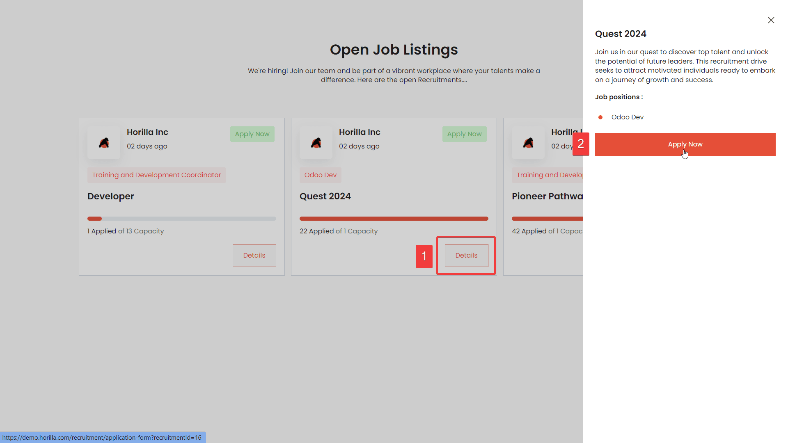
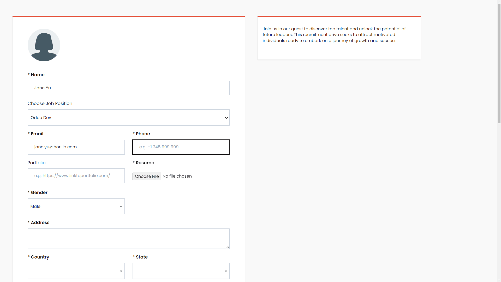
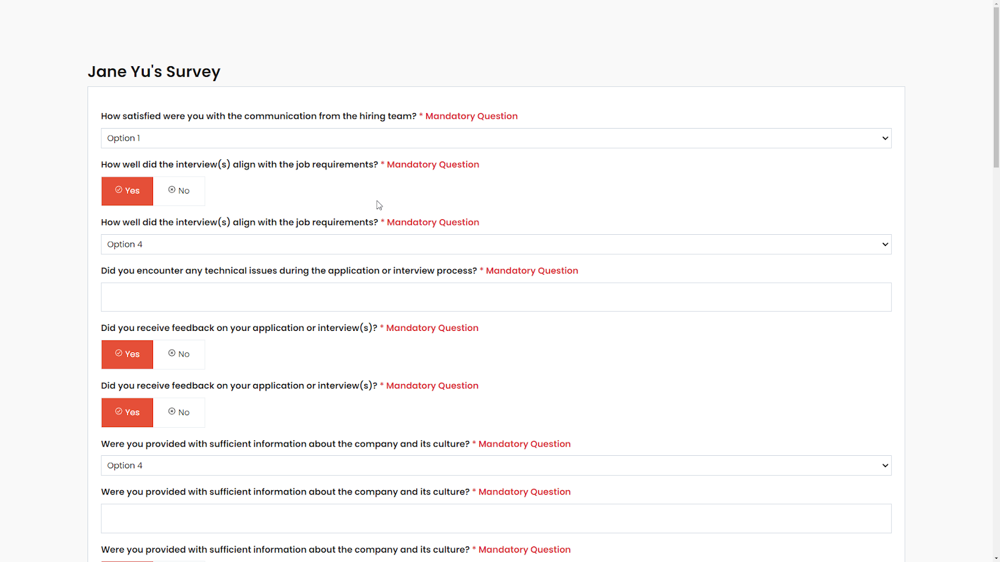
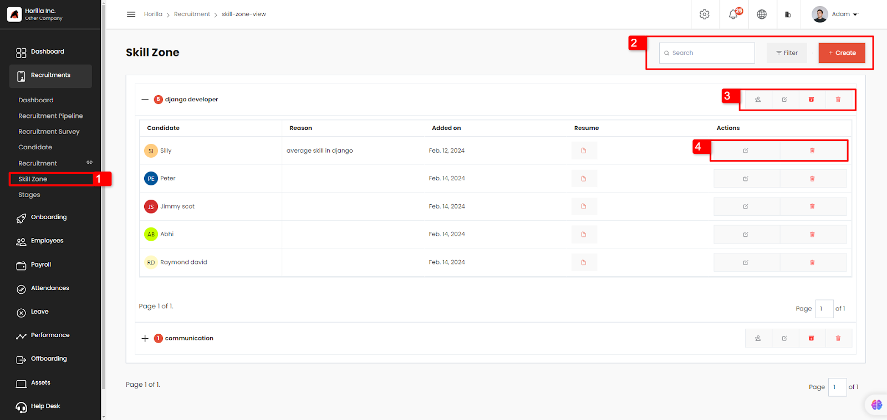

# Recruitment
The recruitment module allows HR professionals to create and manage job postings, receive and review resumes, manage interviews, and track candidate progress throughout the hiring process.

  <iframe width="840" height="500" src="https://www.youtube.com/embed/RXdB7fnbbV0" title="How Does Recruitment Process Works in Horilla HR Software? #opensource" frameborder="0" allow="accelerometer; autoplay; clipboard-write; encrypted-media; gyroscope; picture-in-picture; web-share" referrerpolicy="strict-origin-when-cross-origin" allowfullscreen></iframe>

The recruitment module allows HR professionals to:
- Create and manage job postings
- Receive and review resumes
- Manage interviews
- Track candidate progress throughout the hiring process.
- Skill zone management.
- etc...

## Pipeline

By creating recruitment, users can add stages to manage candidates or applicants. Managers can be assigned to handle stages and recruitment tasks, receiving certain permissions to work with the pipeline and complete the hiring process. The best way to create recruitment is from the pipeline view, which includes both a tabular structure and a kanban structure.

---

### Recruitment Process

In Horilla, recruitment is done under a specific job position. When creating a recruitment, a job position must be selected, along with relevant details like the number of vacancies, assigned managers, etc. After creating the recruitment, stages can be added to it. Once the hiring process is complete, the recruitment can be closed via the edit option in the recruitment tabs.

---

### Stage

Stages can be created related to the recruitment or the job position selected. Stages may vary depending on the job position. Managers can add candidates to stages and update their statuses as necessary.

---

### Candidate Stage Update

The candidate's stage can be updated by:
1. Selecting the new stage from a dropdown in the candidate row.
2. Dragging the candidate to the next stage.

---

### Send Mail, Note, and Resume

In the candidate row, the button group provides:
- **Mailbox icon**: Sends acknowledgment mail to the candidate.
- **Newspaper icon**: Adds remark notes for candidate requirements throughout the hiring process. Clicking the eye icon reveals all remarks related to the candidate.
- **Document icon**: Redirects to the resume page for viewing candidate details.

---

### Application Form

Candidates can register through the application form at `/recruitment/application-form`, or this URL can be shared with them. By filling out the form, candidates automatically register for the initial recruitment stage.

---

### Hire Candidate

When a candidate is moved to the `hired` stage, their onboarding process can start in Horilla.

## Kanban View

Kanban is recommended when many applicants are in the hiring process. Here, all pipeline functions, like notes and send-mail, are available in the three-dot menu.

## Candidate Directory

The Candidate section (marked as 1 under the recruitment menu) displays all candidates from all recruitments in both kanban and list views. Key features:
- **Navbar (marked as 2)**: Search bar, filter, and group-by options.
- **Action button**: Export, bulk archive, and unarchive options. A create button allows adding a candidate.
- **Quick filters (marked as 3)**: For easy filtration.
- **List view options (marked as 4)**:
  - **Convert to employee**: Quickly converts a candidate to an employee with all available details.
  - **Skill Zone**: For candidates who may be relevant for future positions.
  - **Reject candidate**: With reason and description; reasons can be set up in `Settings -> Recruitment -> Candidate reject reason`.
  - **Send mail**: Allows admins to email candidates.

Clicking on a candidate row redirects to the individual candidate view.

## Candidate Individual View

The candidate individual view offers:
- **Edit button**: To update candidate details.
- **Convert to employee button**: Available until the candidate is converted.
- **Star rating**: Indicates ratings from stage managers or other recruiters.
- **Tabs**:
  - **About**: Candidate’s personal and recruitment details.
  - **Resume**: Candidate's resume view.
  - **Survey**: Displays candidate’s responses to survey questions asked during application.
  - **Notes**: Allows managers to add notes for future reference.
  - **History**: Maintains a record of candidate activity.
  - **Rating**: Displays ratings given by employees.
  - **Mail log**: Shows details of emails sent to the candidate.

## Recruitment View

All active recruitments are viewable here. By selecting the “Recruitment” tab (marked as 1), administrators can:
- Access recruitment management options.
- Search, filter, or create new recruitments (marked as 2).
- Use quick filters for sorting, with colored borders for visual cues.
- View in accordion style, allowing expanded recruitment details.
- Edit, duplicate, archive, delete, or share recruitments using buttons in the action column (marked as 5).
- View "Total Hires" and "Total Applicants" in the respective columns (marked as 4).

## Stage View

The Stages feature enables easy navigation through recruitment stages. Accessible via the stages option in the recruitment menu (marked as 1), it provides a user-friendly interface with indicators for each stage, list view, and search functionality from the navbar (marked as 2). Stages can be customized to align with the organization’s workflow.

## Recruitment Survey and Application

The Recruitment Survey feature gathers applicant information via the application form. HR managers can organize questions into template groups for streamlined inquiries. The “Add Question” option (marked as 3) allows for adding questions, and new template groups (e.g., “Personal Questionnaire Group”) can be created using the option marked as 2. Open job positions are accessible via option marked as 4

The open recruitment platform can be publicly accessed via the company website or social media platforms after sharing. Once shared, applicants can access the open jobs and follow a simple two-step process to apply(step 1 and two). Following these steps,

applicants can easily fill in their information and access the customized survey or questionnaire created for the recruitment process.

Once the application survey is completed the registration process also completes.

## Skill Zone

The Skill Zone view, accessible by permission, allows users to:
- Search, filter, or create Skill Zone categories (marked as 2).
- Edit, archive, delete, or add candidates to Skill Zone categories using the action buttons (marked as 3).
- View detailed candidate information by expanding accordions.

Actions (marked as 4) let users edit, delete, or view candidate resumes.

---
