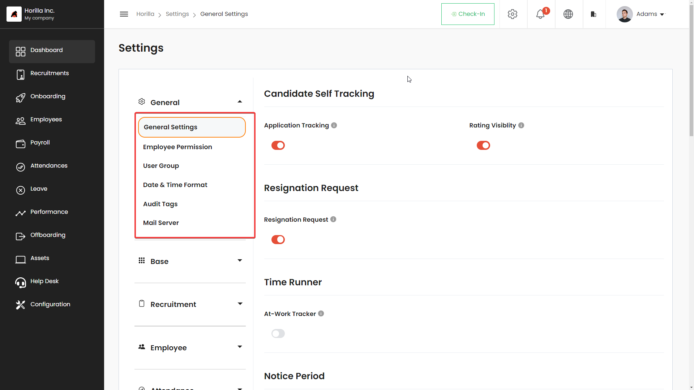
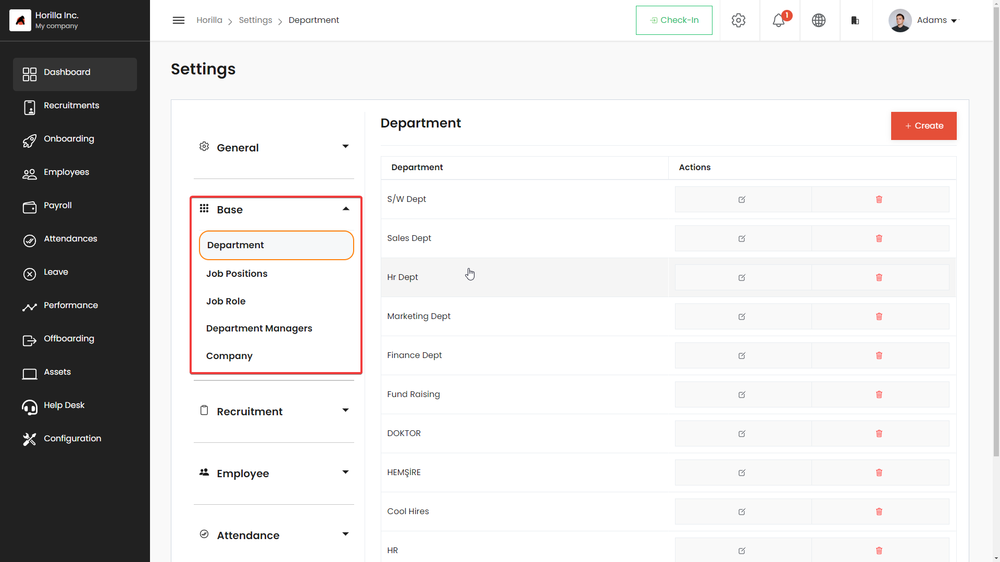
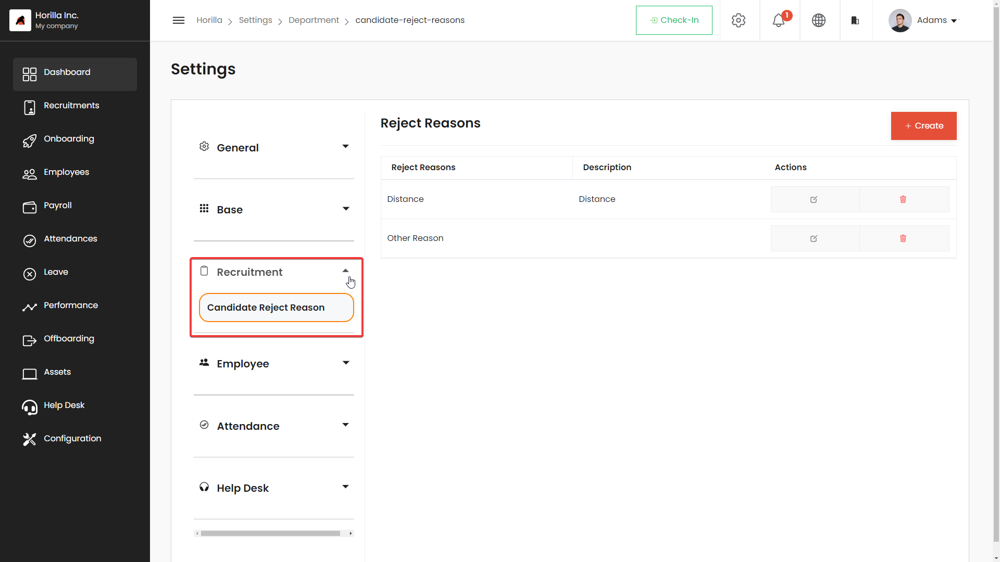
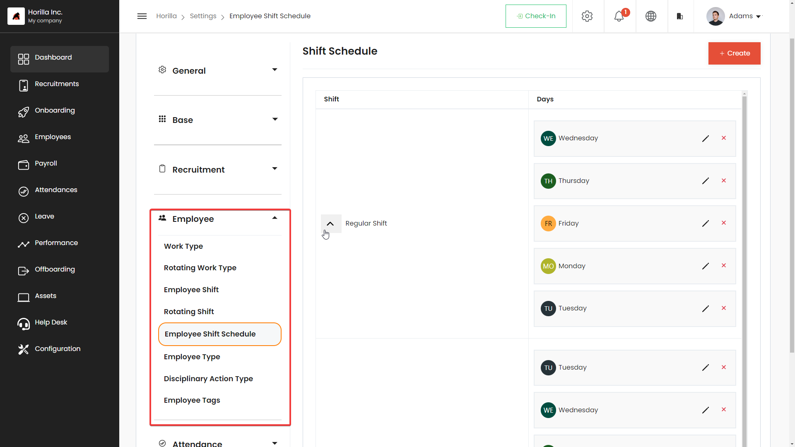
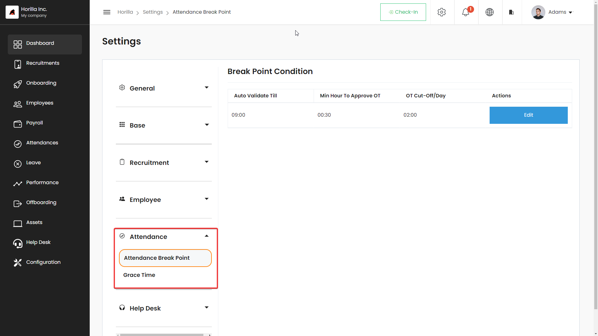
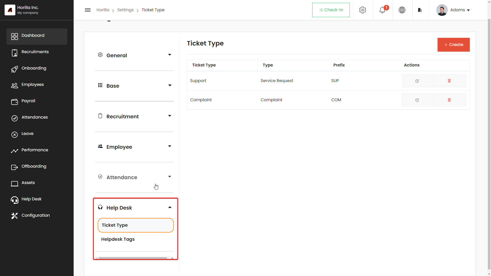

# Settings
Horilla’s comprehensive HRMS extends its functionality through a robust Settings feature, offering HR professionals a centralized hub to customize and optimize their HR management experience. Within the Settings feature, users can delve into various key aspects, including:

General Settings:

The General Settings section serves as the gateway to optional features that enhance the overall HR management process. This includes the ability to enable or disable specific functionalities based on the organization’s preferences and general options like date time formats, mail server etc…

1. User Permissions and User Groups:
User Permissions: Within the Settings feature, administrators have granular control over user permissions. This includes defining who can access specific modules, perform certain actions.
User Groups: To streamline user management, administrators can create and manage user groups. User groups simplify the assignment of permissions by allowing administrators to define access levels and functionalities for entire groups, reducing the manual effort of individually configuring permissions.

2. Date and Time Configuration:
Administrators can customize date and time formats based on regional preferences within the Settings feature. This ensures that the HRMS interface displays dates and times in a manner that is familiar and relevant to the organization’s location or global operations.
Additionally, date and time configuration includes the ability to set up specific work hours, time zones, and public holidays. This functionality ensures accurate tracking of employee attendance, leave, and other time-sensitive activities.

3. Mail Server Configuration:
Horilla’s Settings feature extends to mail server configuration, allowing administrators to seamlessly integrate email communication within the HRMS.

Administrators can input SMTP (Simple Mail Transfer Protocol) server details, enabling functionalities such as email notifications, automated alerts, and communication with candidates or employees directly from the HRMS platform.
Security measures, such as SSL/TLS encryption for email communication, can also be configured within the mail server settings to ensure the confidentiality and integrity of sensitive HR-related correspondence.

## Base Configuration:

The “Base” configuration section in Horilla’s Settings is the foundational pillar upon which the entire HR management infrastructure is built. This section encompasses critical elements that collectively define the organizational structure, user roles, and key attributes necessary for effective HR operations. Here’s an in-depth exploration of each component:

1. Company:
Nestled within the “Base” configuration, the “Company Details” module is the starting point for establishing a coherent organizational identity. Administrators can meticulously input essential information such as the official company name, upload the corporate logo for visual representation, and provide the physical address. This goes beyond mere aesthetics, forming the cornerstone for a standardized and professional company profile within the HRMS. The information entered here resonates across the HR platform, ensuring a consistent identity for both internal users and external stakeholders.

2. Department:
Description: The “Department Management” feature within the “Base” configuration introduces a systematic approach to organizational structure. Administrators wield the power to create, organize, and manage distinct departments, each with a unique identifier and a designated head. This functionality is pivotal for delineating reporting lines, facilitating efficient team management, and fostering a clear understanding of the organizational hierarchy. Categorizing employees into specific departments not only streamlines communication and collaboration but also enhances the overall organizational workflow.

3. Job Positions:
The “Job Positions” section empowers administrators to define and oversee the various designations available within the organization. This involves specifying position titles, outlining the associated responsibilities, and establishing hierarchical relationships if applicable. The clarity provided by well-defined job positions is instrumental during recruitment processes, enabling HR professionals to match candidate skills with organizational needs accurately. This feature ensures a systematic and transparent approach to building the workforce, aligning

## Job Roles:
The “Job Roles” configuration allows administrators to customize and define specific roles within the organization. Job roles go beyond mere titles by assigning distinct responsibilities, permissions, and access levels to individuals occupying those roles. This feature enhances user management by streamlining access to relevant modules and functionalities based on job responsibilities.

## Recruitment Settings:

The Recruitment Settings within Horilla’s HRMS offer a comprehensive suite of tools to streamline and optimize the hiring process. A notable addition to this feature is the:

1. Candidate Reject Reason:
Description: The “Candidate Reject Reason” functionality empowers HR professionals to enhance transparency and communication in the recruitment process. When a candidate is rejected, administrators can now select and provide specific reasons for the rejection from a predefined list or through custom input. This feature ensures a detailed and standardized documentation of rejection factors, enabling valuable insights into recruitment trends, improving the quality of feedback to candidates, and assisting in refining future hiring strategies.

## Employee Settings:

The “Employee” settings in Horilla’s HRMS provide administrators with powerful tools to manage and customize various aspects of employee information and work arrangements. Notable features within this section include:

1. Work Types:
The “Work Types” feature enables administrators to define and categorize different work arrangements within the organization. Common examples include “Work from Home,” “Field Work,” and “Office Work.” This customization allows for accurate tracking of employees’ activities and provides valuable insights into work patterns. Administrators can configure and manage various work types to align with the diverse nature of roles within the organization.

2. Employee Shifts and Shift Schedules:
Within the “Employee” settings, administrators can establish and manage employee shifts and shift schedules. This includes defining specific shifts (e.g., morning, afternoon, night) and creating schedules that assign employees to these shifts. The flexibility in configuring shifts and schedules ensures that the HRMS adapts to the organization’s operational requirements, facilitating efficient workforce management.

3. Disciplinary Actions Types:
The “Disciplinary Actions Types” feature empowers administrators to document and categorize various disciplinary actions that may be taken against employees. This includes predefined actions such as verbal warnings, written warnings, and suspensions. By standardizing disciplinary actions, HR professionals can maintain a clear record of employee conduct, ensuring fair and consistent application of policies across the organization.

4. Rotating Shift Types:
Description: The “Rotating Shift Types” functionality adds a layer of flexibility to work arrangements. Administrators can configure rotating shift types that allow employees to experience different work environments or responsibilities over a specified period. This feature caters to organizations with dynamic work structures, promoting adaptability and skill diversification among employees.

## Attendance Settings:

The “Attendance Settings” in Horilla’s HRMS streamline attendance management with a focus on precision and flexibility. The key features within this section include:

1. Grace Time Feature:
The “Grace Time” feature allows administrators to define a specific window during which employees can mark their attendance without being marked as late. This feature accommodates slight delays or early arrivals, ensuring fairness in attendance tracking.

2. Attendance Break Point:
The comprehensive “Attendance Break Point” consolidates various condition settings essential for precise attendance management:
Minimum Hours for Attendance Approval: Administrators can set the minimum threshold for hours worked to qualify for attendance approval.

Maximum Allowed Overtime: Define the maximum permissible overtime hours an employee can work before additional approval is required.
Attendance Validation Conditions: Establish specific conditions, such as the number of breaks allowed or total hours within a given time frame, to validate attendance records.

## Help Desk – Ticket Type:

The “Ticket Type” option in the Help Desk feature is a vital component that categorizes and classifies the nature of support requests or inquiries submitted by employees. This feature is designed to enhance the efficiency and organization of the help desk system.

In conclusion, Horilla’s HRMS stands out as a comprehensive and flexible solution for HR professionals seeking to streamline and optimize their management processes. The robust Settings feature serves as a centralized hub, offering customization options across various critical aspects, including General Settings, Base Configuration, Recruitment Settings, Employee Settings, and Attendance Settings.

The General Settings provide administrators with the ability to tailor the HRMS according to organizational preferences, enabling precise control over user permissions, user groups, date and time configurations, and mail server settings. The Base Configuration lays the foundation for effective HR operations, allowing administrators to define company details, department structures, job positions, and job roles.

Recruitment Settings enhance transparency and communication in the hiring process through features like Candidate Reject Reason, facilitating improved feedback to candidates and refining future hiring strategies. Employee Settings empower administrators to manage work arrangements, shifts, disciplinary actions, and rotating shift types, promoting flexibility and adaptability within the workforce.

The Attendance Settings focus on precision and flexibility, offering features like Grace Time and Attendance Break Point to ensure accurate attendance management. Additionally, the Help Desk feature with Ticket Type classification enhances the efficiency and organization of employee support requests.

Horilla’s HRMS, with its user-friendly interface and comprehensive settings, caters to the diverse needs of HR professionals, providing a powerful tool for efficient and organized HR management.