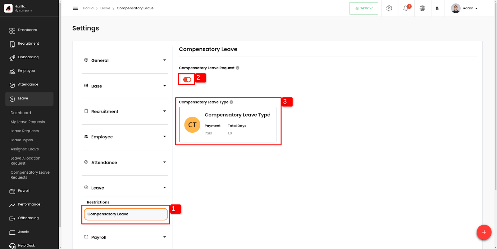
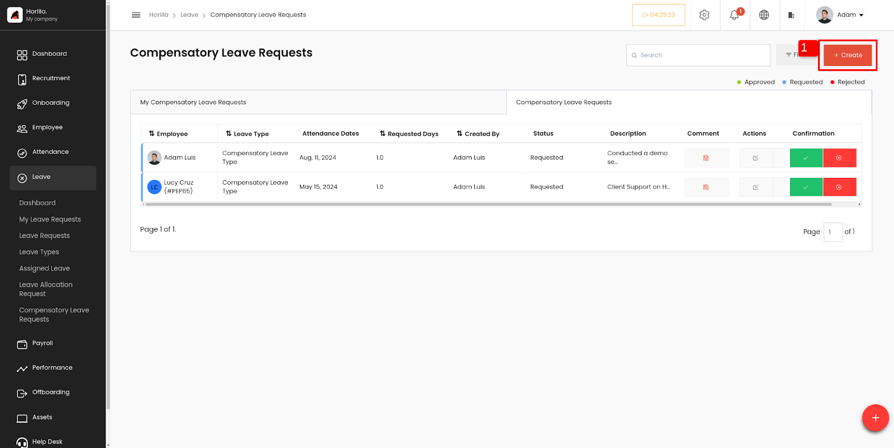
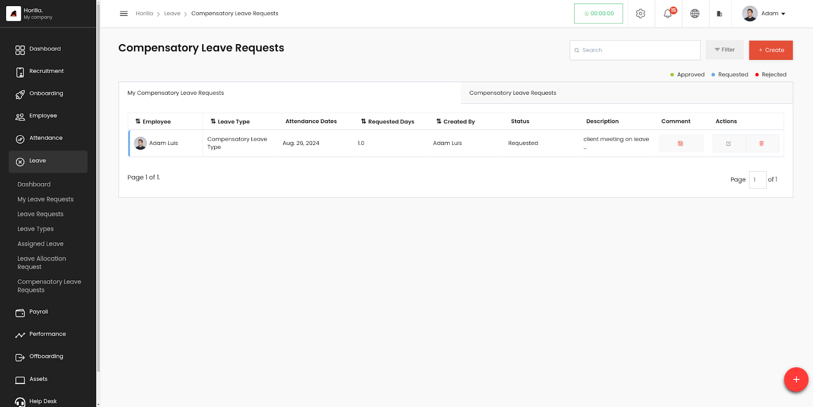

# **Leave**

Leave management is a critical module that tracks employee time off, including sick, vacation, and other types of leave. The leave management software module enables managers to manage and approve employee leave requests, track employee attendance, and monitor leave balances. This module automates leave-related tasks, including leave requests, approvals, and notifications, ensuring that organizations comply with their leave policies and regulations. Automating leave management, Improves efficiency, reduces paperwork, and saves time and money for organizations.

## **Dashboard**

* A leave dashboard serves as a control center for viewing important leave information in one spot.  
* Presents leave statuses graphically using visual formats like charts or graphs.  
* Displays information such as:  
  * Approved leave  
  * Pending leave  
  * Denied leave  
* Allows users to quickly grasp their leave situation without searching through text or emails.  
* Acts as a hub for a glance at leave status.  
* Provides a visual summary of leave status, making it convenient and straightforward to manage time off.

### **Admin Dashboard**

* The admin user dashboard provides a comprehensive overview of leave management within the organization.  
* Key information displayed includes:  
  * **Pending requests to approve** (marked as 1 in the image)  
  * **Approved leaves** (marked as 2 in the image)  
  * **Rejected leaves** (marked as 3 in the image)  
* Graphical representations illustrate:  
* Employee leave data  
* Department leave statistics  
* The dashboard functions as a central hub, allowing administrators to:  
  * Quickly understand the current leave landscape  
  * Make efficient decisions regarding leave approvals and rejections  
  * Gain insights into leave trends and statuses within the company  
* Clear visuals and categorized data enhance the ease of leave management and oversight.

### **Personal Dashboard**

* The "View Personal Dashboard" button is located in the top right corner of the screen.  
* Grants users access to their personalized dashboard.  
* The dashboard provides essential leave information tailored to each user, including:  
  * Leave balances  
  * Upcoming leave requests  
  * Leave approval statuses  
* Allows users to:  
  * Review their leave history  
  * Plan future absences  
  * Track the status of pending leave requests  
* Provides a dedicated space for managing leave-related activities.  
* Keeps users updated on their time-off status, all in one convenient place.

* The image displays detailed personal information for employees, including:  
  * **New Requests** (marked as 1 in the image)  
  * **Approved Requests** (marked as 2 in the image)  
  * **Rejected Requests** (marked as 3 in the image)  
* Features a graphical display of **Available Leave** (marked as 4 in the image) across different leave types, showing remaining leave for each type.  
* Includes a quick list view of recent leave requests (marked as 5 in the image), allowing employees to track the status of their applications.  
* Located in the top right corner, employees can access further options or manage their leave.  
* Provides a comprehensive overview of leave history and current status.  
* Empower employees to manage their time off efficiently and effectively.

## **My Leave Request**

* The "My Leave Request" view provides details about assigned leave types, including:  
  * Available days  
  * Carry forward days  
  * Total days for each type  
* Clicking on a leave type allows employees to request leave by providing the necessary details.  
* Employees can view a list of their submitted leave requests.  
* They can update or delete requests before they are approved or canceled.  
* Streamlines leave management by reducing the need for managers to handle changes.  
* Empower employees to manage their leave independently, promoting autonomy and efficiency.  
* Lightens the administrative load on managers and enhances employees' ability to handle leave requests effectively.

### **User request creation**

* In the employee's leave view, all assigned leave types are displayed in cards.  
* Clicking on a specific card (marked as 1 in the image) opens a request form modal for that leave type.  
* Employees can swiftly create a leave request by filling out the required details in the form.  
* Alternatively, they can use the create button at the top right corner (marked as 2 in the image) to initiate a request.  
* This feature enables a quick and efficient process for requesting time off.  
* Simplifies the procedure, making it easy for employees to manage their leave without hassle.  
* Enhances overall workflow and productivity by allowing employees to submit leave requests with just a few clicks.

## **Leave Request** 

* The leave request view is a crucial tool for managing all leave requests in a company.  
* Admins and reporting managers can:  
  * Access and manage leave requests submitted by their team members  
  * Approve or cancel leave requests as required  
  * Create, update, or delete leave requests as needed  
* To create a new request:  
  * Click "Create Leave Request"  
  * Fill in the required details, such as leave dates and type (e.g., vacation, sick leave)  
  * Click "Submit"  
* Streamlines leave management by providing all necessary information in one place.  
* Ensures efficient handling of leave requests, contributing to smooth operations within the company.

### **Leave Request Create Button**

* The “create” button (marked as 1 in the image) allows an admin or reporting manager to initiate a leave request on behalf of an employee.  
* Provides convenience by eliminating the need for individual employees to create their own leave requests.  
* Useful for situations where employees are unable to create their own requests.  
* Admins or reporting managers can input necessary details, such as:  
  * Type of leave  
  * Duration  
  * Reason for leave  
* Streamlines the leave request process, making it more efficient and organized.  
* Simplifies leave management and ensures that employee requests are promptly addressed.

### **Leave Request Approve/Reject Button** 

* The approve/reject button (marked as 2 in the image) allows managers to accept or decline leave requests made by users.  
* When a user submits a leave request, the manager can:  
  * Review the request  
  * Choose to either approve or reject it using this button  
* Approving the request means the leave is accepted, allowing the user to take the requested time off.  
* Rejecting the request means the leave is denied, and the user is expected to work during the requested period.  
* Provides managers with control over the leave request process.  
* Ensures all requests are carefully considered and handled appropriately to maintain productivity and fairness within the team.

### **One Request View**

* The one request view provides a comprehensive overview of an employee's leave request.  
* By clicking on the employee's name, admins or reporting managers can access detailed information.  
* This view includes a thorough description of the leave request, ensuring all relevant details are visible.  
* Managers can accurately verify the request's content, aiding in decision-making for approval or cancellation.  
* All necessary information is consolidated into a single view, streamlining the process.  
* This functionality eliminates the need to navigate through multiple screens.  
* The efficient design saves time and enhances productivity.  
* Ensures leave requests are handled promptly and effectively within the organization.

## **Leave Type**

* The interface manages company leave types, presented in an easy-to-navigate card view.  
* Users can add new leave types by clicking the create button.  
* Allows updating and deleting existing leave types to facilitate adjustments and remove outdated entries.  
* Users can assign leave types to employees, ensuring accurate handling of leave requests.  
* Ensures that each employee receives the appropriate leave type based on their job role and employment status.  
* Streamlines the leave management process with a comprehensive solution for organizing and adapting leave types.  
* Contributes to effective leave management within the company.

### **Leave type create button**

* The button (marked as 1 in the image) is used to create new types of leaves within a leave management system.  
* When clicked, a new form appears for entering details of the new leave type.  
* The form typically requests information such as:  
  * Name of the new leave type  
  * Number of days allowed  
  * Whether it is a paid or unpaid leave  
  * Any other relevant information  
* The new leave type is created after entering all required information and submitting the form.  
* The new leave type is then added to the list of available leave types within the system.

### **Leave assign one**: 

* The “Leave Type View” displays all types of leaves in a card format.  
* Users can click the three dots at the top right of each card to access options like edit, delete, and assign.  
* Selecting “Assign” (marked as 2 in the image) allows users to directly assign that specific leave type to employees from the leave type view.  
* This feature enables easy and efficient management and assignment of leave types.  
* Eliminates the need to navigate to a separate section of the system for assigning leave types.

## **Assigned leave**

* This view provides a summary of assigned leave types for all employees, showing each employee's leave types.  
* Users can simultaneously assign multiple leave types to multiple employees using the "assign" button.  
* The view allows updating of available leave days and carryforward leave days for assigned leave types.  
* These tasks are managed conveniently within the same view, enhancing efficiency.  
* Simplifies the process of overseeing and updating leave types for all employees in one place.  
* Streamlines leave management and ensure accuracy in allocating leave benefits across the organization.

### **Assign button**

* The button in the assigned view (marked as 1 in the image) simplifies the process of assigning multiple leave types to multiple employees simultaneously.  
* This feature is valuable for organizations with many employees and diverse leave types.  
* Allows HR or management staff to select and assign multiple leave types and employees at once.  
* Saves considerable time and effort by avoiding the need to manually assign each leave type to each employee.  
* Optimizes resource utilization and streamlines the leave management process.  
* Enhances efficiency by ensuring employees receive the appropriate leave types promptly.  
* A practical tool that makes leave management more effective and less time-consuming for HR teams and managers.

### **Available leave update button**

* The update button is used for adjusting available and carry-forward leave days for a specific leave type assigned to an employee (marked as 2 in the image).  
* Clicking the button automatically adjusts the employee’s leave entitlements based on changes made by HR or management.  
* Ensures employees have an accurate count of available leave days for better planning.  
* Helps the system keep track of any alterations made to leave entitlements, maintaining transparency and fairness.  
* Aids employees in staying informed about their available leave days.  
* Supports employees in making informed decisions about taking time off when needed.  
* Provides a simple and effective way to manage leave entitlements within the organization.

## **Leave Allocation Request**

* **Leave Allocation Request** is a process where employees request additional leave days beyond their initial entitlement.  
* Employees formally submit a request to their manager or HR department, outlining the reasons for needing extra leave and specifying the duration required.  
* The request may include details such as:  
  * Type of leave needed  
  * Any supporting documents, if necessary  
* Managers or HR personnel review the request to determine whether to approve or deny it based on company policies and the employee's circumstances.  
* Ensures fairness and transparency in managing additional leave requests within the organization.  
* Helps maintain consistent leave management practices across the company.

### **Leave Allocation Request Create Button**

* The "Leave Allocation Request Create" button allows employees and managers to initiate a request for additional leave days.  
* Clicking the button (marked as 1 in the image) opens a form for employees to input details of their request.  
* The form typically includes:  
  * Reason for needing extra leave  
  * Duration required  
  * Any supporting information  
* Serves as the starting point for formally requesting additional leave beyond standard entitlement.  
* Once the form is completed, it is submitted for review by the manager or HR department.  
* Streamlines the process, making it convenient for employees to request additional leave when necessary.  
* Enhances the efficiency of handling leave requests within the organization.

### **Leave Allocation Request Approve/Reject Button**

* The "Leave Allocation Request Approve/Reject" button allows managers or HR personnel to make decisions on employees' requests for additional leave days.  
* The button (marked as 2 in the image) is used after an employee submits a request for extra leave.  
* Managers or HR review the request and can either:  
  * Approve the request, granting the additional leave days  
  * Reject the request, denying the additional leave days  
* Provides a straightforward way for managers to respond to leave allocation requests.  
* Ensures decisions are made promptly and transparently.  
* Streamlines the process for efficient handling of additional leave requests within the organization.  
* Enhances the overall efficiency and fairness of leave management.

### **My Leave Allocation Request**

* The "My Leave Allocation Request" list view displays all requests made for additional leave days.  
* Provides a comprehensive overview of submitted requests, including:  
  * Reason for the request  
  * Duration of leave needed  
* Allows tracking of the status of each request (pending, approved, or rejected).  
* Enables easy visibility of which requests have been processed and which are still awaiting review.  
* Simplifies the management of leave allocation requests.  
* Makes it convenient to stay informed about the status of requests.

## **Compensatory Leave Request**

* **Compensatory Leave Request**: Employees can request additional leave days as compensation for working on holidays or designated leave days. This process ensures that employees are properly credited for their extra work by converting their holiday attendance into leave days.  
* **Submitting a Request**: Employees can formally submit a request to their manager or HR department to convert their holiday attendance into compensatory leave.   
* **Reviewing the Request**: Managers or HR personnel will review the request, taking into account company policies and the employee’s specific situation. They will then either

* **Enabling Compensatory Leave**:   
  * Go to **Settings \> Leave \> Compensatory Leave**.  
  * Once enabled, a new leave type for compensatory leave will be automatically generated. HR can customize this leave type according to company policy.

### **Compensatory leave request Create Button**

* **Create Button:** On the Compensatory Leave Request page, employees and managers can initiate a new request by clicking the "Create" button. This opens a form where the employee can enter the details  
* The form typically includes:  
  * Employee \- The employee requesting for leave.  
  * Attendance \- Holiday attendance record of the employee.  
  * Description \- Additional details about the request.  
* Once the form is completed, it is submitted for review by the manager or HR department.

### **Compensatory leave request Approve/Reject Button**

* Managers or HR personnel can review and decide on the compensatory leave requests using the "Approve" or "Reject" buttons. A reason for rejection can be provided to maintain transparency.  
* Managers or HR review the request and can either:  
  * Approve the request: Granting the leave as Compensatory leave.  
  * Reject the request: Providing a reason for the rejection to help the employee understand the decision.  
* Ensures decisions are made promptly and transparently.

### **My Compensatory Leave Request**

* Employees can track their requests under the "My Compensatory Leave Request" list view. This section displays:  
* This view is especially for normal employees for tracking their submitted compensatory leave requests, including:  
  * The status of each request (Approved or Rejected).  
  * Reason for rejection.  
  * Any comments from HR for formal communication.

This streamlined process ensures that compensatory leave requests are handled efficiently and transparently, benefiting both employees and the organization.
