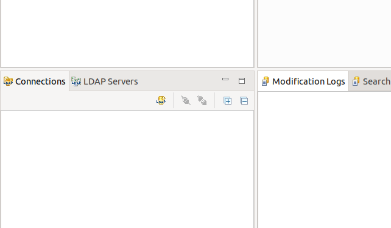
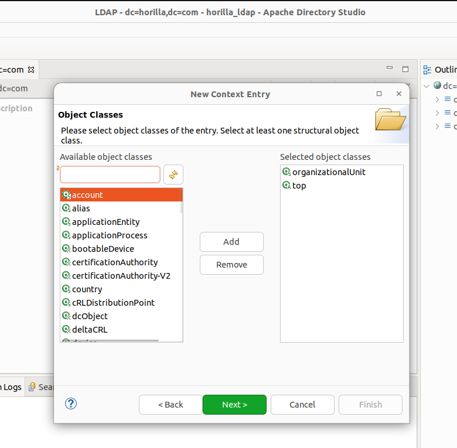
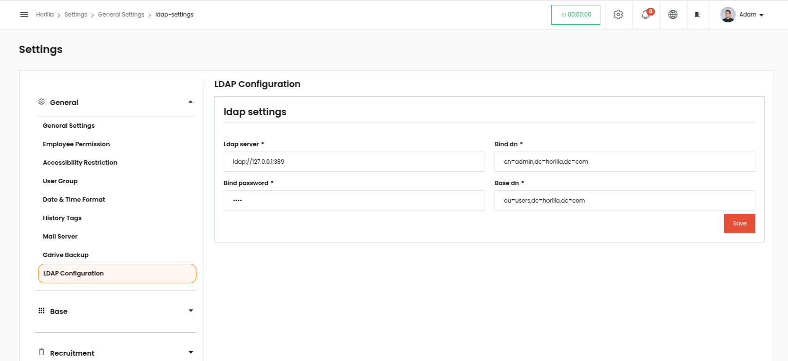

# **LDAP Configuration from Django Project, and Data Transfer**

In today's interconnected systems, managing user data across multiple platforms can be challenging. LDAP (Lightweight Directory Access Protocol) offers a centralized directory system to streamline authentication and user management. Integrating LDAP with a Django project not only enhances security but also ensures a unified and scalable user management system. This blog walks you through the step-by-step process of setting up an LDAP server using slapd, configuring it with Django, and enabling seamless data transfer between the Django database and the LDAP directory. Whether you're importing existing users into LDAP or syncing LDAP users back into Django, this guide will provide you with practical implementation strategies and tested code examples.

## 1. **LDAP: Lightweight Directory Access Protocol**

### **1.1 Required Modules**

1. **django-auth-ldap**: This package provides LDAP authentication for Django.  
2. **python-ldap**: A Python library to interact with LDAP servers.

   
```bash
pip install django-auth-ldap  
```
```bash
pip install python-ldap 
```
```bash
pip install ldap3
```


3. **Installing LDAP in Horilla project**

To install LDAP in the project, need to add the `horilla_ldap` in the **INSTALLED_APPS**.
In your code,
**horilla \-\> settings.py**  find the **INSTALLED_APPS** and add `horilla_ldap` at top.

```bash
#horilla/settings.py

INSTALLED_APPS = [
   "horilla_ldap",
   ....
   ....
   ....
]
```


### **1.2 Step-by-Step Guide to Setting Up `slapd`**

When you set up `slapd` (OpenLDAP server daemon), you create a directory structure and define an admin user who will manage the LDAP directory. Here’s how you go about it.

#### **Step 1: Install `slapd` and `ldap-utils`**

To install the LDAP server and necessary tools, open your terminal and run:


```bash
sudo apt update
```
```bash
sudo apt install slapd ldap-utils
```

* **`slapd`**: This is the core LDAP server that runs and manages the LDAP directory.  
* **`ldap-utils`**: A set of utilities (e.g., `ldapadd`, `ldapsearch`) for managing and querying the LDAP directory.

#### **Step 2: Configure `slapd`**

Once installed, configure the LDAP server by running:

```bash
sudo dpkg-reconfigure slapd
```


During this configuration, you’ll be prompted for various details that will set up the LDAP directory structure and the admin user credentials.

1. **Specify the Domain Name**:  
   * You’ll be asked to provide a domain name. For example, if you enter `horilla.com`, this sets the **base DN** of your directory to `dc=horilla,dc=com`.  
2. **Organization Name**:  
   * Enter your organization’s name, which will be stored as part of the LDAP directory information.  
3. **Admin DN and Password**:  
   * You’ll be prompted to set up the **Admin Distinguished Name (DN)** and password.

   The admin DN often defaults to `cn=admin,dc=yourdomain,dc=com`, based on the domain you entered. For example:

   `cn=admin,dc=horilla,dc=com`

   * Set a secure password for this admin user, which will allow you to bind to the LDAP server with admin privileges.  
4. **Database Type**:  
   * The setup will likely ask you to confirm the database backend. OpenLDAP typically uses the MDB (Memory-Mapped Database) by default, which is a reliable choice for production use.  
5. **Database Settings**:  
   * If prompted to remove the database when the package is purged, confirm as per your preference.  
   * Allow the LDAP database to be readable by non-root users if you need broader access permissions on your server.  
6. **LDAP and TLS Configuration**:  
   * You can enable or disable TLS (encryption) for LDAP connections. For a basic setup, you can skip TLS configuration.

#### **Step 3: Start and Enable `slapd`**

Once configured, start the LDAP server and ensure it runs automatically on system boot:


```bash
sudo systemctl start slapd sudo systemctl enable slapd
```

You can check that the service is active and running with:


```bash
sudo systemctl status slapd
```


#### **Step 4: Test the Admin DN and Password**

With `slapd` running, you can verify the setup by attempting to authenticate using the admin DN and password you created. Run the following command to confirm:


```bash
ldapwhoami -x -D "cn=admin,dc=horilla,dc=com" -w your_password
```
   

Replace `your_password` with the actual password you set. If the connection is successful, this command should return:

`dn: cn=admin,dc=horilla,dc=com`

   

This output confirms that the LDAP server is configured, running, and accessible with the admin DN.

### **Summary:**

* **Install** `slapd` and `ldap-utils` to set up and manage your LDAP directory.  
* **Configure** the LDAP directory structure, including the domain, organization name, and admin DN/password.  
* **Start and enable** `slapd` to ensure the LDAP server is running.  
* **Verify the admin DN** by binding with the credentials you set, confirming access to the LDAP directory.

## **2. Configuration in Apache Directory Studio**

First, you need to set up the Apache Directory Studio with the following details,

Make sure that    our project is running.



Clicking the connection LDAP icon will get a form to create a LDAP connection setup. Then the form will appear for configuration.


Here you can give any Connection name, and complete the form with the Host name and the port is **default 389 for LDAP serve**r, and by clicking the **Check Network Parameter** button after filling the form is shows a successful connection box. Then click the **Next** button. The next window looks like this,


Here, provide the bind DN as per your bind DN set-up earlier while configuring the slapd `cn=admin` need to be added for the default sections. And check it by clicking the **Check Authentication** button. And after the successful authentication, you can see that a LDAP connection is created at the bottom left corner with the connection name that we gave.


Now we need to set up the organizational unit in our Root DSE. There is Root DSE folder and inside that our bind DN appears, right click on that here `dc=horilla,dc=com` then  **New \-\> New Context Entry**


Click the **Next** button,



Search **OrganizationalUnit** and click the **Add** button then it will be visible in the right side box, and click the **Next**


Now we need to give the name to the organizational unit that we created along with our bind DN,

ou means organizational unit here ou name is users along with the bind DN so, `ou=users,dc=horilla,dc=com` which is known as the **Base DN.** Clicking the **Next** button window will appear looks like,


Just click the **Finish** button. And an Organizational unit will be created under the bind DN.


 So now we can chek how to transfer the users from our Horilla DB to the LDAP DB and vice-versa. 

### **2.1 LDAP Connection Settings in Horilla.**

We need to set the `Ldap Server`, `Base DN`, `Bind DN` and `Password` in Horilla.

Choose the Settings menu and you can see the **LDAP Configuration** under the **General settings.**

**Settings \-\> General \-\> LDAP Configuration**



Fill up the forms with the required details, the password that we entered while configuring the slapd. And complete it by clicking the **Save** button.

### **2.2 Transfer the users.**

After setting all the connections successfully we can transfer the data of users from the Horilla to LDAP and if you have a LDAP DB you can transfer the users to the Horilla from the LDAP.

Enter the management commands in your terminal,

**For transfer users from Horilla to LDAP**

```bash
python3 manage.py import_users_to_ldap
```


Just close the connection and open it again, then you can see all the users are available under the organizational unit,


And also, 

**For transfer users from LDAP to HORILLA**

```bash
python3 manage.py import_ldap_users
```

