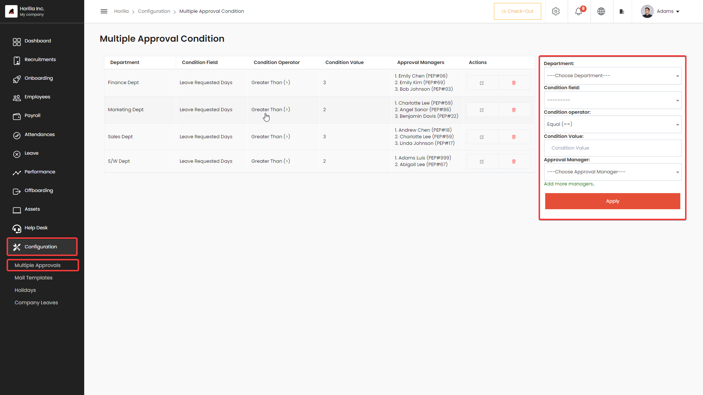
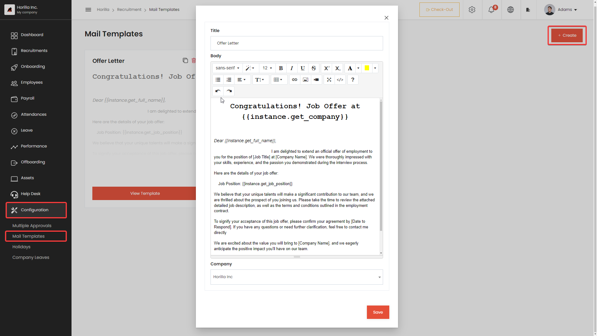
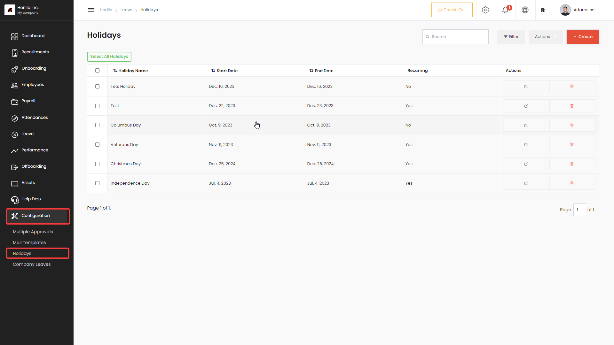
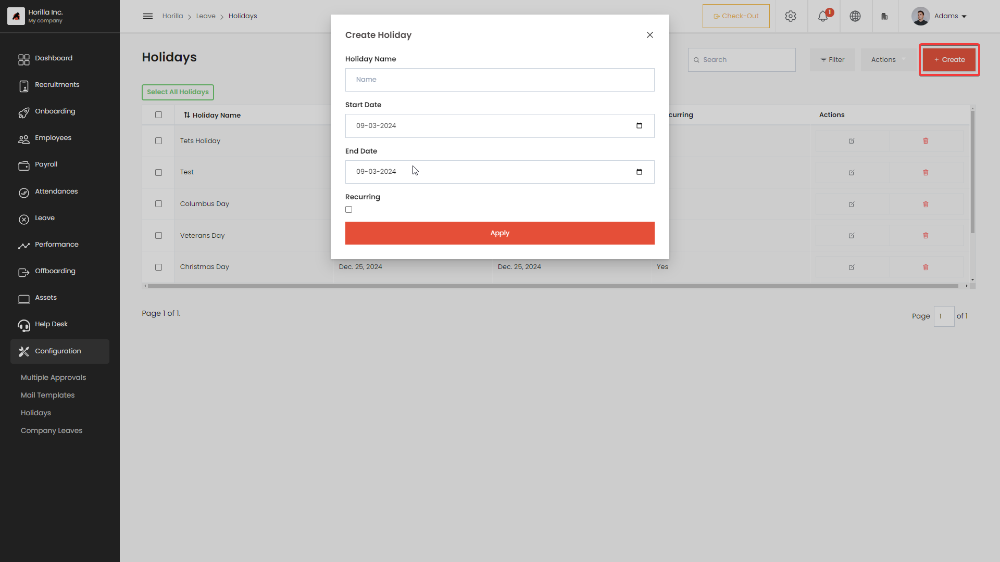
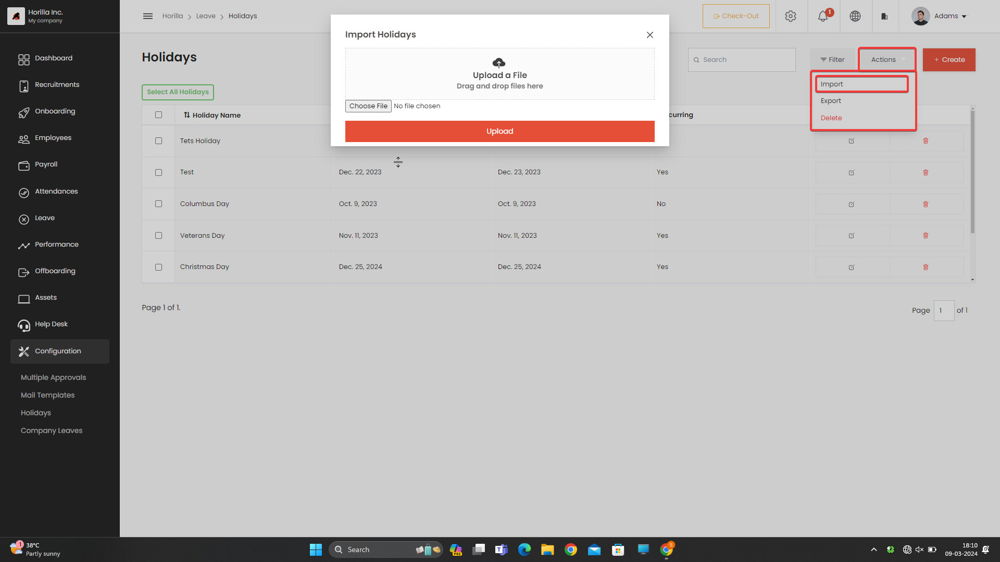

# Configuration
Horilla HRMS (Human Resource Management System) offers a comprehensive set of configuration features designed to enhance organizational efficiency and streamline HR processes. These features are strategically crafted to provide flexibility and customization, empowering organizations to tailor their HR management according to specific needs. Three key configuration features that stand out in Horilla HRMS include Multiple Approval Conditions, Mail Templates, and Holidays.

## Multiple Approval Conditions
The Horilla HRMS Multiple Approval Conditions feature helps organizations create detailed rules for approving requests. Normally, requests go to the reporting manager, but with this feature, you can add more layers of approval based on specific conditions, like the number of leave days or project-related criteria.

## Mail Templates
The Mail Template feature in the Horilla HRMS web application empowers users with a robust and user-friendly tool for managing a variety of email templates. Specifically designed to streamline communication within the HR domain, this feature allows for the creation, editing, and utilization of customizable email templates for diverse scenarios, including recruitment processes, onboarding procedures, and general employee correspondence

## Holidays
The ‘Holidays’ is a user interface that displays all the holidays in a company in a single list format. It allows users to easily view and keep track of upcoming holidays in the organization. Additionally, the view provides users with the ability to create new holidays by filling out relevant information such as the holiday name, start date, end date, and recurring holiday. This functionality makes it convenient for administrators to add new holidays to the list and keep the holiday schedule up-to-date. Users can also import and export the list of holidays in .xlsx format. Overall, the Holiday view is a useful tool for managing holidays in a company and ensuring that everyone is aware of upcoming holidays

**Holiday create button :** The “create” button is a function that allows users to generate and add new holidays to the company’s holidays list. This feature can be useful for companies that want to add new holidays to their existing list, such as local or regional holidays, or to update their holiday calendar to reflect changes in the company’s policies or government regulations. By clicking on the “create” button, users can fill out the required information for the new holiday, including the name, date, and any additional details or notes. Once the information is entered, the new holiday will be added to the company’s holidays list and can be viewed by all employees. Overall, the “create” button provides an easy and efficient way for companies to manage their holidays list and ensure that all employees are informed of upcoming holidays.

**Holiday action button :** The ‘Action’ dropdown button includes three options that allow users to import holidays in xlsx format, avoiding the need to create numerous holidays individually using the ‘Create’ option. Additionally, it provides options to export holidays and perform bulk deletion of holidays.

